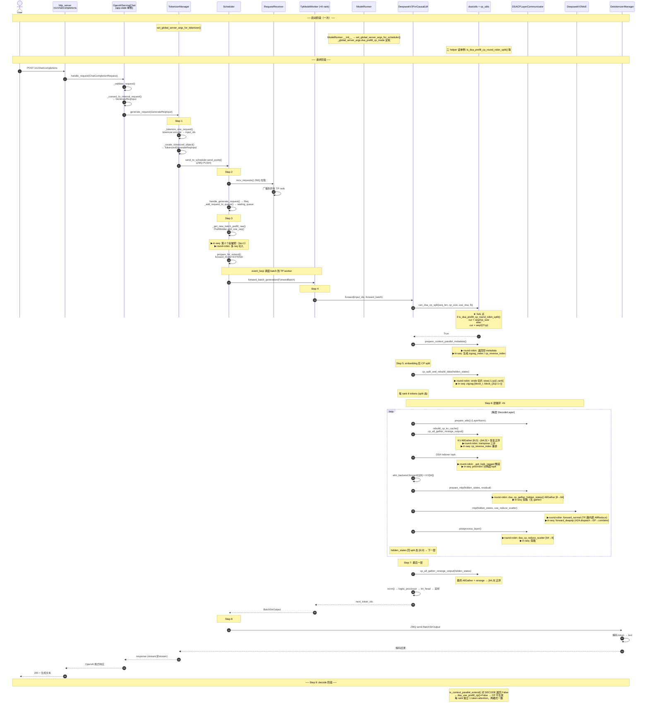

> SGLang DSA Prefill Context Parallel 完整流程（GLM 5.2 DSA）
>
> **适用模型**：GLM 5.2 DSA（`GlmMoeDsaForCausalLM`，[glm4_moe.py:1481](https://github.com/sgl-project/sglang/blob/d8487bad06eb305bcb1f1efcd5d89072b15bf0ec/python/sglang/srt/models/glm4_moe.py#L1481)）。
> 该类继承 `DeepseekV2ForCausalLM`，**走 V2 代码路径**（`deepseek_v2.py`），MoE 层为 `DeepseekV2MoE`（[deepseek_v2.py:511](https://github.com/sgl-project/sglang/blob/d8487bad06eb305bcb1f1efcd5d89072b15bf0ec/python/sglang/srt/models/deepseek_v2.py#L511)），
> 不是非 DSA 的 `Glm4MoeSparseMoeBlock`。本文只讲 GLM 5.2 DSA 路径，不含 DeepSeek V4。
>
> **两种 split 模式**（[server_args.py:1861-1875](https://github.com/sgl-project/sglang/blob/d8487bad06eb305bcb1f1efcd5d89072b15bf0ec/python/sglang/srt/server_args.py#L1861-L1875)）：
>
> | 模式 | 启动参数 | 自动配置 | MoE 后端 |
> |------|---------|---------|---------|
> | `round-robin-split` | `--dsa-prefill-cp-mode round-robin-split` | `enable_dp_attention=True`, `moe_dense_tp_size=1` | **TP-only**（`moe_a2a_backend=none`, `ep_size=1`） |
> | `in-seq-split` | `--dsa-prefill-cp-mode in-seq-split` | 上述 + 强制 `moe_a2a_backend=deepep`, `ep_size=tp_size` | **DeepEP（EP）** |
>
> 两种模式在启动参数解析阶段与 MoE 后端绑定，不可解耦。本文统一按 Step 0→9 描述，分歧点以
> **▶ round-robin-split** / **▶ in-seq-split** 内联标注。
>
> 注：`--enable-nsa-prefill-context-parallel` / `--nsa-prefill-cp-mode` 为已废弃别名
> （`DeprecatedStoreTrueAction`，[server_args.py:6820](https://github.com/sgl-project/sglang/blob/d8487bad06eb305bcb1f1efcd5d89072b15bf0ec/python/sglang/srt/server_args.py#L6820) / `DeprecatedAliasStoreAction`，[server_args.py:6835](https://github.com/sgl-project/sglang/blob/d8487bad06eb305bcb1f1efcd5d89072b15bf0ec/python/sglang/srt/server_args.py#L6835)），
> 推荐用 `--enable-dsa-prefill-context-parallel` / `--dsa-prefill-cp-mode`。

---

#### 进程拓扑与总执行逻辑

`Engine` 类（[engine.py:178](https://github.com/sgl-project/sglang/blob/d8487bad06eb305bcb1f1efcd5d89072b15bf0ec/python/sglang/srt/entrypoints/engine.py#L178)）是总指挥，编排**三进程模型**（注释见 [engine.py:182-189](https://github.com/sgl-project/sglang/blob/d8487bad06eb305bcb1f1efcd5d89072b15bf0ec/python/sglang/srt/entrypoints/engine.py#L182-L189)）：HTTP server + Engine + TokenizerManager 在主进程，Scheduler / DetokenizerManager 是子进程，用 ZMQ IPC 互连。

```
                        sglang.launch_server (CLI)
                                  │
                                  ↓
                         Engine(...)        engine.py:178  ← 总系统执行逻辑
                                  │
        ┌─────────────────────────┼──────────────────────────────┐
        │                         │                              │
   [主进程]                  [子进程 × tp_size]              [子进程]
   HTTP server (FastAPI)     run_scheduler_process          run_detokenizer_process
   + TokenizerManager        → Scheduler.run_event_loop     → DetokenizerManager
        │                    (每 TP rank 一个)               (解码)
        │                         │                              │
        │   ZMQ PUSH (ipc://)     │                              │
        └─────────→ waiting_queue  │                              │
                     + 组 batch    │ forward                      │
                                   │                              │
                                   └── ZMQ PUSH (BatchStrOutput) ─┘
                                                                   │
                                   ZMQ ←──────────────────────────┘
                                   ↓
                              回主进程 TokenizerManager → HTTP 返回用户
```

**Scheduler 子进程的启动调用链**：

1. 主进程 `Engine._launch_scheduler_processes()`（[engine.py:583](https://github.com/sgl-project/sglang/blob/d8487bad06eb305bcb1f1efcd5d89072b15bf0ec/python/sglang/srt/entrypoints/engine.py#L583)）按 TP/PP rank 循环，每 rank 用 `multiprocessing.Process` spawn 一个子进程：
   ```python
   # engine.py:627-641
   proc = mp.Process(
       target=run_scheduler_process_func,      # ← 子进程入口
       args=(server_args, port_args, gpu_id, tp_rank, ...),
   )
   ```
   `tp_size=8` → 8 个 Scheduler 子进程。DP 模式由 `DataParallelController` 代为 spawn（[data_parallel_controller.py:567](https://github.com/sgl-project/sglang/blob/d8487bad06eb305bcb1f1efcd5d89072b15bf0ec/python/sglang/srt/managers/data_parallel_controller.py#L567)）。

2. 子进程入口 `run_scheduler_process()`（[scheduler.py:3958](https://github.com/sgl-project/sglang/blob/d8487bad06eb305bcb1f1efcd5d89072b15bf0ec/python/sglang/srt/managers/scheduler.py#L3958)）：
   ```python
   def run_scheduler_process(server_args, port_args, gpu_id, tp_rank, ...):
       scheduler = Scheduler(...)              # 建 Scheduler
       pipe_writer.send(scheduler.get_init_info())  # 回报主进程
       scheduler.run_event_loop()              # 阻塞跑循环
   ```

3. `Scheduler.run_event_loop()`（[:1405](https://github.com/sgl-project/sglang/blob/d8487bad06eb305bcb1f1efcd5d89072b15bf0ec/python/sglang/srt/managers/scheduler.py#L1405)）→ `dispatch_event_loop()`（[:3870](https://github.com/sgl-project/sglang/blob/d8487bad06eb305bcb1f1efcd5d89072b15bf0ec/python/sglang/srt/managers/scheduler.py#L3870)）按配置选 `event_loop_normal` / `event_loop_overlap` / pp / disagg 变体，进入 `while True` 循环（见下文 Step 4 调用链）。

> 一句话：`scheduler.py` 的 `Scheduler` 在**每个 TP rank 一个的子进程**里跑，由主进程 `Engine` 用 `mp.Process` spawn，入口 `run_scheduler_process` → `run_event_loop`。总系统逻辑在 [engine.py:178](https://github.com/sgl-project/sglang/blob/d8487bad06eb305bcb1f1efcd5d89072b15bf0ec/python/sglang/srt/entrypoints/engine.py#L178) `Engine` 类。

---

#### 全流程总览（Step 0→9，单 prefill 请求，cp_size=8）

```
 ┌─────────────────────────────────────────────────────────────────┐
 │ Step 0  启动：CLI --dsa-prefill-cp-mode → ServerArgs 字段       │
 │         __post_init__ 派生 MoE 后端 → 写 _global_server_args 单例 │
 │         (set_global_server_args_for_scheduler, model_runner.py:512)│
 └─────────────────────────────────────────────────────────────────┘
                                   ↓
 ┌─────────────────────────────────────────────────────────────────┐
 │ Step 1  POST /v1/chat/completions                               │
 │         → OpenAIServingChat.handle_request → GenerateReqInput   │
 │         → TokenizerManager.generate_request                     │
 │         → tokenize → TokenizedGenerateReqInput                  │
 │         → ZMQ PUSH 发 Scheduler          (tokenizer_manager.py:552)│
 └─────────────────────────────────────────────────────────────────┘
                                   ↓ ZMQ
 ┌─────────────────────────────────────────────────────────────────┐
 │ Step 2  Scheduler.recv_requests 拉取 → 广播 TP rank             │
 │         handle_generate_request → Req → waiting_queue           │
 └─────────────────────────────────────────────────────────────────┘
                                   ↓
 ┌─────────────────────────────────────────────────────────────────┐
 │ Step 3  event_loop → get_next_batch_to_run → 组 batch           │
 │         PrefillAdder.add_one_req 判能否加入                     │
 │         ▶ round-robin: 多 req 可入 (multi-batch)                │
 │         ▶ in-seq:     can_run_list>=1 拒第 2 个 (bs=1)          │
 │         prepare_for_extend → forward_mode=EXTEND                │
 └─────────────────────────────────────────────────────────────────┘
                                   ↓ run_batch
 ┌─────────────────────────────────────────────────────────────────┐
 │ Step 4  TpModelWorker.forward_batch_generation                  │
 │         → ModelRunner.forward → _forward_raw → self.model.forward│
 │         = DeepseekV2ForCausalLM.forward (deepseek_v2.py:2633)   │
 │         can_dsa_cp_split 判 fork:                               │
 │           ★ if is_dsa_prefill_cp_round_robin_split():           │
 │               ▶ round-robin: cur = seq // cp                    │
 │               ▶ in-seq:     cur = seq // (2*cp)                 │
 │         prepare_context_parallel_metadata:                      │
 │           ▶ round-robin: 返回空 metadata                        │
 │           ▶ in-seq:     生成 zigzag_index / cp_reverse_index    │
 └─────────────────────────────────────────────────────────────────┘
                                   ↓ self.model(...)
 ┌─────────────────────────────────────────────────────────────────┐
 │ Step 5  DeepseekV2Model.forward (deepseek_v2.py:2337)           │
 │         embedding [64, D]                                       │
 │         cp_split_and_rebuild_data → 每 rank 8 tokens (split 态)  │
 │           ▶ round-robin: stride 切片 view(-1,cp)[:,rank]        │
 │           ▶ in-seq:     zigzag [block_r, block_{2cp-1-r}]       │
 └─────────────────────────────────────────────────────────────────┘
                                   ↓ 层循环 ×N
 ┌─────────────────────────────────────────────────────────────────┐
 │ Step 6  每层 DeepseekV2DecoderLayer (deepseek_v2.py:2054)       │
 │                                                                 │
 │   ┌─ Self-Attention (DSA MLA) ──────────────────────────────┐  │
 │   │  Q [8,D]  →  rebuild_cp_kv_cache                         │  │
 │   │             cp_all_gather_rerange_output → KV [64,D]     │  │
 │   │             ▶ round-robin: transpose 三步恢复正序        │  │
 │   │             ▶ in-seq:     cp_reverse_index 重排          │  │
 │   │  DSA Indexer topk:                                       │  │
 │   │    ▶ round-robin: _get_topk_ragged 整段                  │  │
 │   │    ▶ in-seq:     prev/next 分两段 topk                   │  │
 │   │  attn_backend.forward(Q[8] × KV[64]) → [8,D] (split)     │  │
 │   └──────────────────────────────────────────────────────────┘  │
 │                                   ↓                             │
 │   ┌─ MLP / MoE ─────────────────────────────────────────────┐  │
 │   │  prepare_mlp:                                             │  │
 │   │    ▶ round-robin: dsa_cp_gather_hidden_states AllGather  │  │
 │   │                    [8,D] → [64,D]                         │  │
 │   │    ▶ in-seq:     旁路 (无 gather)                         │  │
 │   │  MoE:                                                     │  │
 │   │    ▶ round-robin: forward_normal (TP, 跳内部 AllReduce)   │  │
 │   │    ▶ in-seq:     forward_deepep (A2A dispatch→EP→combine) │  │
 │   │  postprocess_layer:                                       │  │
 │   │    ▶ round-robin: dsa_cp_reduce_scatter [64,D] → [8,D]    │  │
 │   │    ▶ in-seq:     旁路                                     │  │
 │   └──────────────────────────────────────────────────────────┘  │
 │                                   ↓                             │
 │   hidden_states [8,D] (split) → 下一层                          │
 └─────────────────────────────────────────────────────────────────┘
                                   ↓ 最后一层后
 ┌─────────────────────────────────────────────────────────────────┐
 │ Step 7  DeepseekV2Model.forward 末尾                            │
 │                                                                 │
 │         各 rank [8,D] (split)                                   │
 │              └──── AllGather + rerange ────→ [64, D] (正序)     │
 │                                                   ↓             │
 │                                             norm() (V2 已 norm) │
 │                                                   ↓             │
 │   → DeepseekV2ForCausalLM.forward: logits_processor → lm_head   │
 │                                                   ↓             │
 │                                             采样 → next_token_ids│
 └─────────────────────────────────────────────────────────────────┘
                                   ↓ 返回调用链
 ┌─────────────────────────────────────────────────────────────────┐
 │ Step 8  process_batch_result → req.output_ids.append           │
 │         send_to_detokenizer.send_output (BatchStrOutput)        │
 │         → DetokenizerManager 解码 → TokenizerManager → HTTP     │
 └─────────────────────────────────────────────────────────────────┘
                                   ↓
 ┌─────────────────────────────────────────────────────────────────┐
 │ Step 9  后续 decode: ForwardMode.DECODE                         │
 │         is_context_parallel_extend()=False → CP 不生效          │
 │         每 rank 独立 1 token attention (完整 KV cache)          │
 │         两模式行为一致，直到 EOS 或 max_new_tokens              │
 └─────────────────────────────────────────────────────────────────┘
```

> 纵向箭头 = 数据/控制流；▶ 标两模式分歧点；★ 标 round-robin vs in-seq 的 fork 判定。各 Step 详见下文。

---

#### 模块层次树（DSA Prefill CP 相关）

仅列本文流程涉及的模块（非全仓库）。根为 `python/sglang/srt/`，★ 标记 CP 流程核心文件。按**职责分层**组织：配置层 → 协议入口层 → 调度核心层 → forward 执行层 → 分布式与算子层 → 模型层，对应数据流自上而下。

```
python/sglang/srt/
│
# ────────── 配置层（启动期：CLI 解析、模式派生、全局单例）──────────
├── server_args.py ★              # ServerArgs: CLI 解析 + 模式派生（0a/0b）
│                                 #   + 全局单例 _global_server_args (get/set_global_server_args)
├── configs/
│   └── model_config.py           # is_deepseek_dsa() 判 DSA 架构
└── environ.py                    # SGLANG_* env var（CP 流程不读，仅总开关别名）
│
# ────────── 协议入口层（主进程：HTTP → 内部请求格式）──────────
├── entrypoints/
│   ├── http_server.py            # /v1/chat/completions 路由 → openai_serving_chat
│   │                             #   + Engine 总指挥 (engine.py:178)
│   └── openai/
│       ├── serving_base.py       # handle_request(): 校验→转内部格式→分流 stream/非stream
│       └── serving_chat.py       # _convert_to_internal_request() → GenerateReqInput
│
# ────────── 调度核心层（Scheduler 子进程：收请求、组 batch、起 forward）──────────
├── managers/
│   ├── io_struct.py ★            # [IPC 消息体] TokenizedGenerateReqInput / BatchStrOutput
│   ├── tokenizer_manager.py ★    # [主进程] generate_request(): tokenize→构造→ZMQ 发 Scheduler
│   ├── detokenizer_manager.py    # [子进程] 解码输出 token → 文本
│   ├── scheduler.py ★            # [子进程] Scheduler: run_event_loop→recv_requests→组 batch→run_batch
│   ├── schedule_batch.py         #   └ Req / batch 构造，prepare_for_extend()
│   ├── schedule_policy.py        #   └ PrefillAdder: 能否加入 batch（in-seq 强制 bs=1）
│   ├── tp_worker.py ★            # [子进程] TpModelWorker.forward_batch_generation() → 模型 forward
│   ├── communicator.py           #   └ 进程间通信编排
│   └── scheduler_components/
│       ├── request_receiver.py   #       └ recv_requests() ZMQ 拉取 + 广播 TP rank
│       ├── ipc_channels.py       #       └ ZMQ socket 建立
│       └── output_sender.py      #       └ 结果回传
│
# ────────── forward 执行层（单步 forward：batch 包装 + 模型调用 + CUDA graph）──────────
├── model_executor/
│   ├── forward_batch_info.py     # ForwardBatch + is_context_parallel_extend()
│   ├── model_runner.py ★         # ModelRunner.forward→_forward_raw→self.model.forward
│   │                             #   + set_global_server_args_for_scheduler() (启动写单例)
│   └── cuda_graph_runner.py      # CUDA graph（CP 禁用 piecewise，Step 0）
│
# ────────── 分布式与算子层（CP 切分、通信、attention、MoE）──────────
├── distributed/
│   └── parallel_state.py         # attn_tp_size / moe_tp_size / cp_size 推导
│
├── layers/
│   ├── dp_attention.py           # [CP 元信息] get_attention_cp_rank() / get_attention_cp_size()
│   ├── communicator.py           # [MLP 通信模式] _compute_mlp_mode(): round-robin→FULL, in-seq→SCATTERED
│   ├── communicator_dsa_cp.py ★  # [层间通信] DSACPLayerCommunicator: MLP 前 AllGather / 后 ReduceScatter
│   ├── attention/
│   │   ├── dsa/
│   │   │   ├── utils.py ★        # [模式判定 + split] is_dsa_prefill_cp_round_robin_split()
│   │   │   │                     #   / can_dsa_cp_split() / dsa_cp_round_robin_split_data()
│   │   │   └── dsa_indexer.py ★  # [稀疏索引] DSA topk: in-seq prev/next 分段
│   │   └── dsa_backend.py        #   └ DSA attention backend
│   ├── utils/
│   │   └── cp_utils.py ★         # [CP 工具] prepare_context_parallel_metadata()
│   │                             #   / cp_split_and_rebuild_* / cp_all_gather_rerange_output()
│   │                             #   / get_cp_padding_align_size()
│   └── moe/
│       ├── token_dispatcher/
│       │   └── deepep.py         # [EP 通信] DeepEPBuffer: in-seq 路径 A2A dispatch/combine
│       └── utils.py              #   └ should_skip_post_experts_all_reduce()
│
# ────────── 模型层（GLM 5.2 DSA → V2 主路径 forward）──────────
└── models/
    ├── deepseek_v2.py ★          # V2 主路径: DeepseekV2ForCausalLM.forward (CP 元数据)
    │                             #   / DeepseekV2Model.forward (CP split + 层循环)
    │                             #   / DeepseekV2MoE / rebuild_cp_kv_cache
    └── glm4_moe.py               # GlmMoeDsaForCausalLM(DeepseekV2ForCausalLM) 入口
```

**层次职责对应数据流**：

| 层 | 职责 | 对应 Step |
|---|---|---|
| 配置层 | 启动期定 mode、写全局单例 | Step 0 |
| 协议入口层 | HTTP 收请求 → `GenerateReqInput` | Step 1 |
| 调度核心层 | tokenize → 组 batch → 起 forward | Step 1-3 |
| forward 执行层 | batch 包装 → 调模型 forward | Step 4 |
| 分布式与算子层 | CP split / KV AllGather / MoE 通信 / attention | Step 4-6 |
| 模型层 | V2 forward 主体（embedding + 层循环 + 最终 gather + logits） | Step 5-7 |

---

#### 运行时时序图（单 prefill 请求，cp_size=8）



---

#### Step 0: 参数初始化与校验

`ServerArgs.__post_init__()`（[server_args.py:887](https://github.com/sgl-project/sglang/blob/d8487bad06eb305bcb1f1efcd5d89072b15bf0ec/python/sglang/srt/server_args.py#L887)）在 [server_args.py:1000](https://github.com/sgl-project/sglang/blob/d8487bad06eb305bcb1f1efcd5d89072b15bf0ec/python/sglang/srt/server_args.py#L1000) 调 `_handle_context_parallelism()`（[server_args.py:3218](https://github.com/sgl-project/sglang/blob/d8487bad06eb305bcb1f1efcd5d89072b15bf0ec/python/sglang/srt/server_args.py#L3218)）校验：

- `attn_cp_size > 1`（例：tp_size=8, dp_size=1 时由 0a 块派生 `attn_cp_size = tp_size // dp_size = 8`，[server_args.py:1882](https://github.com/sgl-project/sglang/blob/d8487bad06eb305bcb1f1efcd5d89072b15bf0ec/python/sglang/srt/server_args.py#L1882)），校验 `tp_size % attn_cp_size == 0` 且 `tp_size % (dp_size * attn_cp_size) == 0`（[:3234-3239](https://github.com/sgl-project/sglang/blob/d8487bad06eb305bcb1f1efcd5d89072b15bf0ec/python/sglang/srt/server_args.py#L3234-L3239)）
- `enable_dsa_prefill_context_parallel = True`（字段 [server_args.py:803](https://github.com/sgl-project/sglang/blob/d8487bad06eb305bcb1f1efcd5d89072b15bf0ec/python/sglang/srt/server_args.py#L803)）
- `dsa_prefill_cp_mode ∈ ["in-seq-split", "round-robin-split"]`（choices 常量 [server_args.py:275](https://github.com/sgl-project/sglang/blob/d8487bad06eb305bcb1f1efcd5d89072b15bf0ec/python/sglang/srt/server_args.py#L275)，字段定义 [server_args.py:804](https://github.com/sgl-project/sglang/blob/d8487bad06eb305bcb1f1efcd5d89072b15bf0ec/python/sglang/srt/server_args.py#L804)）
- `enable_prefill_context_parallel` 与 `enable_dsa_prefill_context_parallel` 互斥

##### 0a. 模式自动配置（关键差异）

`_handle_model_specific_adjustments()` 的 DSA-CP 子块（[server_args.py:1857-1893](https://github.com/sgl-project/sglang/blob/d8487bad06eb305bcb1f1efcd5d89072b15bf0ec/python/sglang/srt/server_args.py#L1857-L1893)）：

```python
if self.enable_dsa_prefill_context_parallel:
    if self.dsa_prefill_cp_mode == "in-seq-split":
        # TODO Supports moe_dense_tp_size != 1, kv cache dtype = "fp8",
        #      moe_a2a_backend non-deepep and cross-machine operation.
        self.enable_dp_attention = True
        self.moe_dense_tp_size = 1
        self.moe_a2a_backend = "deepep"   # ★ 强制 DeepEP
        self.ep_size = self.tp_size        # ★ 强制 ep_size = tp_size = 8
        logger.warning("For in-seq split mode, ... batch_size == 1")
    else:                                  # round-robin-split
        self.enable_dp_attention = True
        self.moe_dense_tp_size = 1
        assert self.dp_size == 1, "For round-robin split mode, dp attention is not supported."
        # 注：不自动设 moe_a2a_backend / ep_size，保留默认 none / 1 → TP-only MoE
    assert self.tp_size <= 8, "Context parallel only supports single machine ..."
    self.attn_cp_size = self.tp_size // self.dp_size
    self.disable_piecewise_cuda_graph = True
```

由此推导并行参数（`attn_tp_size = tensor_model_parallel_size // attn_cp_size // attn_dp_size`，[parallel_state.py:1931](https://github.com/sgl-project/sglang/blob/d8487bad06eb305bcb1f1efcd5d89072b15bf0ec/python/sglang/srt/distributed/parallel_state.py#L1931)）：

```
attn_tp_size = tp_size // attn_cp_size // attn_dp_size = 8 // 8 // 1 = 1   # attention 权重不切分
```

- **▶ round-robin-split**：`moe_tp_size = 8 // 1 // 1 = 8`（expert 权重按 TP 切 8 份，每卡全 256 expert 的 1/8 权重）
- **▶ in-seq-split**：`moe_tp_size = 8 // 8 // 1 = 1`（expert 权重不切分，每卡 32 个完整 expert，EP 模式）

两模式 attention 侧完全相同（`attn_tp_size=1`，每卡持完整 attention 权重独立计算），差异仅在 MLP/MoE 部分。

##### 0b. 运行时如何按参数选择模式（关键）

模式在**启动时定死、请求时只读**，不在请求路径上重新决策：

1. **CLI 解析** → `ServerArgs` 字段 `dsa_prefill_cp_mode`（[server_args.py:804](https://github.com/sgl-project/sglang/blob/d8487bad06eb305bcb1f1efcd5d89072b15bf0ec/python/sglang/srt/server_args.py#L804)，choices 见常量 [server_args.py:275](https://github.com/sgl-project/sglang/blob/d8487bad06eb305bcb1f1efcd5d89072b15bf0ec/python/sglang/srt/server_args.py#L275)）赋值 `"round-robin-split"` / `"in-seq-split"`。
2. **`__post_init__` + 0a 派生** → mode 与 MoE 后端绑定死（in-seq 强制 `moe_a2a_backend="deepep"`/`ep_size=tp_size`；round-robin 不强制），不可解耦。
3. **写进进程级单例**：scheduler 进程在 `ModelRunner.__init__` 调 `set_global_server_args_for_scheduler(server_args)`（[model_runner.py:512](https://github.com/sgl-project/sglang/blob/d8487bad06eb305bcb1f1efcd5d89072b15bf0ec/python/sglang/srt/model_executor/model_runner.py#L512)），tokenizer 进程调 `set_global_server_args_for_tokenizer`（[tokenizer_manager.py:253](https://github.com/sgl-project/sglang/blob/d8487bad06eb305bcb1f1efcd5d89072b15bf0ec/python/sglang/srt/managers/tokenizer_manager.py#L253)，实为同一函数别名，[server_args.py:7896](https://github.com/sgl-project/sglang/blob/d8487bad06eb305bcb1f1efcd5d89072b15bf0ec/python/sglang/srt/server_args.py#L7896)）。二者都赋值模块级变量 `_global_server_args`（[server_args.py:7888-7903](https://github.com/sgl-project/sglang/blob/d8487bad06eb305bcb1f1efcd5d89072b15bf0ec/python/sglang/srt/server_args.py#L7888-L7903)），进程内常驻：
   ```python
   _global_server_args: Optional[ServerArgs] = None
   def set_global_server_args_for_scheduler(server_args):
       global _global_server_args
       _global_server_args = server_args       # 启动时写一次
   def get_global_server_args() -> ServerArgs:
       if _global_server_args is None:
           raise ValueError("Global server args is not set yet!")
       return _global_server_args              # 请求时只读
   ```
4. **请求到达**：代码不查 CLI、不查 env var、不查请求体，直接 `get_global_server_args().dsa_prefill_cp_mode` 读单例。**第一次触发模式判定**是 forward 入口门槛 `can_dsa_cp_split()`（[dsa/utils.py:175](https://github.com/sgl-project/sglang/blob/d8487bad06eb305bcb1f1efcd5d89072b15bf0ec/python/sglang/srt/layers/attention/dsa/utils.py#L175)，见 Step 4a）里的 `if is_dsa_prefill_cp_round_robin_split():` —— 这就是 round-robin vs in-seq 的 fork 点，返回 True 全程走 round-robin 分支，否则走 in-seq。后续每层每步调同一组 helper 读同一单例，结果必然一致。

读取入口三个 helper（[dsa/utils.py:67-82](https://github.com/sgl-project/sglang/blob/d8487bad06eb305bcb1f1efcd5d89072b15bf0ec/python/sglang/srt/layers/attention/dsa/utils.py#L67-L82)）：

```python
# dsa/utils.py:67-82
def is_dsa_enable_prefill_cp():
    return get_global_server_args().enable_dsa_prefill_context_parallel   # 总开关

def is_dsa_prefill_cp_in_seq_split():
    return (is_dsa_enable_prefill_cp()
            and get_global_server_args().dsa_prefill_cp_mode == "in-seq-split")

def is_dsa_prefill_cp_round_robin_split():
    return (is_dsa_enable_prefill_cp()
            and get_global_server_args().dsa_prefill_cp_mode == "round-robin-split")
```

后续每个分歧点都调上述 helper，而非各自重新解析参数：

| 分歧点 | 判定调用 | 位置 |
|--------|---------|------|
| CP split 门槛（seq 怎么切） | `is_dsa_prefill_cp_round_robin_split()` | [dsa/utils.py:175](https://github.com/sgl-project/sglang/blob/d8487bad06eb305bcb1f1efcd5d89072b15bf0ec/python/sglang/srt/layers/attention/dsa/utils.py#L175) `can_dsa_cp_split()` |
| padding 对齐大小 | `is_dsa_prefill_cp_round_robin_split()` | [cp_utils.py:73](https://github.com/sgl-project/sglang/blob/d8487bad06eb305bcb1f1efcd5d89072b15bf0ec/python/sglang/srt/layers/utils/cp_utils.py#L73) `get_cp_padding_align_size()` |
| hidden_states split（stride vs zigzag） | `is_dsa_prefill_cp_round_robin_split()` | [cp_utils.py:145](https://github.com/sgl-project/sglang/blob/d8487bad06eb305bcb1f1efcd5d89072b15bf0ec/python/sglang/srt/layers/utils/cp_utils.py#L145) `cp_split_and_rebuild_data()` |
| KV AllGather 后恢复顺序 | `is_dsa_prefill_cp_round_robin_split()` | [cp_utils.py:310](https://github.com/sgl-project/sglang/blob/d8487bad06eb305bcb1f1efcd5d89072b15bf0ec/python/sglang/srt/layers/utils/cp_utils.py#L310) `cp_all_gather_rerange_output()` |
| DSA indexer topk（是否分 prev/next） | `is_dsa_prefill_cp_round_robin_split()` | [dsa_indexer.py:1484](https://github.com/sgl-project/sglang/blob/d8487bad06eb305bcb1f1efcd5d89072b15bf0ec/python/sglang/srt/layers/attention/dsa/dsa_indexer.py#L1484) `_get_topk_ragged()` CP 分支 |
| MLP 通信模式（FULL vs SCATTERED） | `moe_a2a_backend == "deepep"`（由 0a 强制设） | [communicator.py:378](https://github.com/sgl-project/sglang/blob/d8487bad06eb305bcb1f1efcd5d89072b15bf0ec/python/sglang/srt/layers/communicator.py#L378) `_compute_mlp_mode()` |
| multi-batch 拒绝（batch_size==1） | `is_dsa_prefill_cp_in_seq_split()` | [schedule_policy.py:845](https://github.com/sgl-project/sglang/blob/d8487bad06eb305bcb1f1efcd5d89072b15bf0ec/python/sglang/srt/managers/schedule_policy.py#L845) `PrefillAdder.add_one_req()` |

> 注意 MLP 那一行：in-seq 模式在 0a 强制把 `moe_a2a_backend="deepep"`，所以 `_compute_mlp_mode()` 判的是 **`moe_a2a_backend`**（间接由 mode 决定），而非直接判 `dsa_prefill_cp_mode`。其余 6 处都直接读 mode helper。

> **▶ in-seq-split 限制**：`batch_size == 1`（单序列 extend，根因见 Step 3a，`PrefillAdder.add_one_req` 在组 batch 阶段拦截；启动期 `logger.warning` 亦提示，[server_args.py:1868](https://github.com/sgl-project/sglang/blob/d8487bad06eb305bcb1f1efcd5d89072b15bf0ec/python/sglang/srt/server_args.py#L1868)）；不支持 FP8 KV cache 等（TODO，[server_args.py:1862](https://github.com/sgl-project/sglang/blob/d8487bad06eb305bcb1f1efcd5d89072b15bf0ec/python/sglang/srt/server_args.py#L1862)）。round-robin-split 无此约束，支持 multi-batch。

每个 `TpModelWorker` 通过 `get_attention_cp_rank()`（[dp_attention.py:338](https://github.com/sgl-project/sglang/blob/d8487bad06eb305bcb1f1efcd5d89072b15bf0ec/python/sglang/srt/layers/dp_attention.py#L338)）/ `get_attention_cp_size()`（[dp_attention.py:342](https://github.com/sgl-project/sglang/blob/d8487bad06eb305bcb1f1efcd5d89072b15bf0ec/python/sglang/srt/layers/dp_attention.py#L342)）获取 CP rank（0~7）与 CP size（8）。

---

#### Step 1: HTTP 请求到达 TokenizerManager

用户 → `POST /v1/chat/completions`（[http_server.py:1510](https://github.com/sgl-project/sglang/blob/d8487bad06eb305bcb1f1efcd5d89072b15bf0ec/python/sglang/srt/entrypoints/http_server.py#L1510)）→ `openai_v1_chat_completions()` → `OpenAIServingChat.handle_request()` 内部构造 `GenerateReqInput`，最终调 `tokenizer_manager.generate_request()`（[http_server.py:557](https://github.com/sgl-project/sglang/blob/d8487bad06eb305bcb1f1efcd5d89072b15bf0ec/python/sglang/srt/entrypoints/http_server.py#L557)）。

`TokenizerManager.generate_request()`（[tokenizer_manager.py:552](https://github.com/sgl-project/sglang/blob/d8487bad06eb305bcb1f1efcd5d89072b15bf0ec/python/sglang/srt/managers/tokenizer_manager.py#L552)）串起 tokenize → 构造 → 发送三步：

```python
# tokenizer_manager.py:589-597 (单请求路径)
# Tokenize the request and send it to the scheduler
if obj.is_single:
    tokenized_obj = await self._tokenize_one_request(obj)   # ① tokenize
    ...
    self._send_one_request(tokenized_obj)                    # ②+③ 构造+发送
    async for response in self._wait_one_response(obj, request):
        yield response
```

1. **tokenize 得 `input_ids`**：`_tokenize_one_request()`（[tokenizer_manager.py:747](https://github.com/sgl-project/sglang/blob/d8487bad06eb305bcb1f1efcd5d89072b15bf0ec/python/sglang/srt/managers/tokenizer_manager.py#L747)）→ 内部调 `_tokenize_texts()`（[tokenizer_manager.py:660](https://github.com/sgl-project/sglang/blob/d8487bad06eb305bcb1f1efcd5d89072b15bf0ec/python/sglang/srt/managers/tokenizer_manager.py#L660)，纯文本走 `self.tokenizer.encode(...)`，[tokenizer_manager.py:733](https://github.com/sgl-project/sglang/blob/d8487bad06eb305bcb1f1efcd5d89072b15bf0ec/python/sglang/srt/managers/tokenizer_manager.py#L733)）→ `_create_tokenized_object()`（[tokenizer_manager.py:1045](https://github.com/sgl-project/sglang/blob/d8487bad06eb305bcb1f1efcd5d89072b15bf0ec/python/sglang/srt/managers/tokenizer_manager.py#L1045)）把 `input_ids` 包成 `array("q", input_ids)`（[tokenizer_manager.py:1055](https://github.com/sgl-project/sglang/blob/d8487bad06eb305bcb1f1efcd5d89072b15bf0ec/python/sglang/srt/managers/tokenizer_manager.py#L1055)）。
2. **构造 `TokenizedGenerateReqInput`**（[io_struct.py:733](https://github.com/sgl-project/sglang/blob/d8487bad06eb305bcb1f1efcd5d89072b15bf0ec/python/sglang/srt/managers/io_struct.py#L733)）：在 `_create_tokenized_object()` 内 `TokenizedGenerateReqInput(input_text, input_ids_arr, mm_inputs, sampling_params, ...)`（[tokenizer_manager.py:1083](https://github.com/sgl-project/sglang/blob/d8487bad06eb305bcb1f1efcd5d89072b15bf0ec/python/sglang/srt/managers/tokenizer_manager.py#L1083)），字段含 `input_ids: Optional[array[int]]`（[io_struct.py:737](https://github.com/sgl-project/sglang/blob/d8487bad06eb305bcb1f1efcd5d89072b15bf0ec/python/sglang/srt/managers/io_struct.py#L737)）、`sampling_params`、`stream` 等。
3. **ZMQ 发给 Scheduler**：`_send_one_request()`（[tokenizer_manager.py:1262](https://github.com/sgl-project/sglang/blob/d8487bad06eb305bcb1f1efcd5d89072b15bf0ec/python/sglang/srt/managers/tokenizer_manager.py#L1262)）调 `self.send_to_scheduler.send_pyobj(tokenized_obj)`（[tokenizer_manager.py:1268](https://github.com/sgl-project/sglang/blob/d8487bad06eb305bcb1f1efcd5d89072b15bf0ec/python/sglang/srt/managers/tokenizer_manager.py#L1268)）。`send_to_scheduler` 是 `init_ipc_channels()` 里建的 ZMQ PUSH socket，连 `scheduler_input_ipc_name`（[tokenizer_manager.py:368-376](https://github.com/sgl-project/sglang/blob/d8487bad06eb305bcb1f1efcd5d89072b15bf0ec/python/sglang/srt/managers/tokenizer_manager.py#L368-L376)）。批量路径走 `_send_batch_request()`（[tokenizer_manager.py:1271](https://github.com/sgl-project/sglang/blob/d8487bad06eb305bcb1f1efcd5d89072b15bf0ec/python/sglang/srt/managers/tokenizer_manager.py#L1271)）包成 `BatchTokenizedGenerateReqInput` 再发。

> 多 tokenizer worker 场景（`tokenizer_worker_num > 1`）由 `multi_tokenizer_mixin.py:569` 的 `TokenizerWorker(TokenizerManager)` 接管，但 tokenize→构造→ZMQ 发送三步逻辑一致。

---

#### Step 2: Scheduler 接收请求

承接 Step 1：`TokenizerManager._send_one_request()` 把 `TokenizedGenerateReqInput` 经 ZMQ PUSH 发到 `scheduler_input_ipc_name`。Scheduler 侧由 `RequestReceiver.recv_requests()`（[request_receiver.py:65](https://github.com/sgl-project/sglang/blob/d8487bad06eb305bcb1f1efcd5d89072b15bf0ec/python/sglang/srt/managers/scheduler_components/request_receiver.py#L65)）从该 ZMQ socket 拉取请求，广播到所有 TP rank。`handle_generate_request()`（[scheduler.py:1899](https://github.com/sgl-project/sglang/blob/d8487bad06eb305bcb1f1efcd5d89072b15bf0ec/python/sglang/srt/managers/scheduler.py#L1899)）构造 `Req` 对象，`_add_request_to_queue()`（[scheduler.py:2157](https://github.com/sgl-project/sglang/blob/d8487bad06eb305bcb1f1efcd5d89072b15bf0ec/python/sglang/srt/managers/scheduler.py#L2157)）加入 `waiting_queue`。

---

#### Step 3: Scheduler 组 Batch

`get_next_batch_to_run()`（[scheduler.py:2405](https://github.com/sgl-project/sglang/blob/d8487bad06eb305bcb1f1efcd5d89072b15bf0ec/python/sglang/srt/managers/scheduler.py#L2405)）每轮调度先合并上一轮 prefill 残留到 `running_batch`，再调 `get_new_batch_prefill()`（[scheduler.py:2533](https://github.com/sgl-project/sglang/blob/d8487bad06eb305bcb1f1efcd5d89072b15bf0ec/python/sglang/srt/managers/scheduler.py#L2533)）→ `_get_new_batch_prefill_raw()`（[scheduler.py:2553](https://github.com/sgl-project/sglang/blob/d8487bad06eb305bcb1f1efcd5d89072b15bf0ec/python/sglang/srt/managers/scheduler.py#L2553)）从 `waiting_queue` 贪心装填新 prefill batch。batch size 即 `can_run_list` 最终长度，由 `PrefillAdder.add_one_req()`（[schedule_policy.py:845](https://github.com/sgl-project/sglang/blob/d8487bad06eb305bcb1f1efcd5d89072b15bf0ec/python/sglang/srt/managers/schedule_policy.py#L845)）逐个请求裁定：能装就 append 进 `can_run_list`，装不动就 break。**两类上限任一耗尽即停**。

**请求数上限**（`waiting_queue` 循环 [scheduler.py:2649](https://github.com/sgl-project/sglang/blob/d8487bad06eb305bcb1f1efcd5d89072b15bf0ec/python/sglang/srt/managers/scheduler.py#L2649)，每加一个 req 前查）：

| 上限 | 来源 | 超了动作 |
|------|------|----------|
| `get_num_allocatable_reqs` | `pp_max_micro_batch_size - running_bs`，clamp 到 `req_to_token_pool.available_size()`（[scheduler.py:2528](https://github.com/sgl-project/sglang/blob/d8487bad06eb305bcb1f1efcd5d89072b15bf0ec/python/sglang/srt/managers/scheduler.py#L2528)） | `batch_is_full=True` |
| `prefill_max_requests` | `--prefill-max-requests`，`add_one_req` 头部 `len(can_run_list) >= x`（[schedule_policy.py:863](https://github.com/sgl-project/sglang/blob/d8487bad06eb305bcb1f1efcd5d89072b15bf0ec/python/sglang/srt/managers/schedule_policy.py#L863)） | 返回 `OTHER` |
| DSA in-seq CP | `is_dsa_prefill_cp_in_seq_split() and len(can_run_list) >= 1`（[schedule_policy.py:860](https://github.com/sgl-project/sglang/blob/d8487bad06eb305bcb1f1efcd5d89072b15bf0ec/python/sglang/srt/managers/schedule_policy.py#L860)） | 返回 `OTHER`（见下文 + 3a） |

**token 预算上限**（每加一个 req，`_update_prefill_budget`（[schedule_policy.py:600](https://github.com/sgl-project/sglang/blob/d8487bad06eb305bcb1f1efcd5d89072b15bf0ec/python/sglang/srt/managers/schedule_policy.py#L600)）扣 `extend_input_len + max_new_tokens + page_size`，[schedule_policy.py:612](https://github.com/sgl-project/sglang/blob/d8487bad06eb305bcb1f1efcd5d89072b15bf0ec/python/sglang/srt/managers/schedule_policy.py#L612)，`ceil_paged_tokens` 按 page 对齐）：

| 预算 | 含义 | 耗尽返回 |
|------|------|----------|
| `rem_total_tokens`（[schedule_policy.py:515](https://github.com/sgl-project/sglang/blob/d8487bad06eb305bcb1f1efcd5d89072b15bf0ec/python/sglang/srt/managers/schedule_policy.py#L515)） | KV pool available + evictable − running req 占用 | `NO_TOKEN`（KV 满，设 `batch_is_full`） |
| `rem_input_tokens`（[schedule_policy.py:588](https://github.com/sgl-project/sglang/blob/d8487bad06eb305bcb1f1efcd5d89072b15bf0ec/python/sglang/srt/managers/schedule_policy.py#L588)） | `max_prefill_tokens` 每轮上限 | `OTHER` |
| `rem_chunk_tokens`（[schedule_policy.py:595](https://github.com/sgl-project/sglang/blob/d8487bad06eb305bcb1f1efcd5d89072b15bf0ec/python/sglang/srt/managers/schedule_policy.py#L595)） | `chunked_prefill_size` 每轮 chunk 上限 | `OTHER` |

`budget_state()`（[schedule_policy.py:581](https://github.com/sgl-project/sglang/blob/d8487bad06eb305bcb1f1efcd5d89072b15bf0ec/python/sglang/srt/managers/schedule_policy.py#L581)）汇总上述剩余。特例：`can_run_list` 空时第一个 req 强制接收（条件 [schedule_policy.py:893-897](https://github.com/sgl-project/sglang/blob/d8487bad06eb305bcb1f1efcd5d89072b15bf0ec/python/sglang/srt/managers/schedule_policy.py#L893-L897)，注释 "always accept the first prefill request" 在 [:900](https://github.com/sgl-project/sglang/blob/d8487bad06eb305bcb1f1efcd5d89072b15bf0ec/python/sglang/srt/managers/schedule_policy.py#L900)），避免队列饿死。

> 一句话：prefill batch size = `waiting_queue` 顺序贪心装，直到请求数 cap（`max_running_requests` / `prefill_max_requests` / `pp_max_micro_batch_size` / DSA in-seq bs=1）或 token 预算 cap（`max_prefill_tokens` / `chunked_prefill_size` / KV pool）之一耗尽。

DSA in-seq 的 `bs=1` 即其中一项请求数上限。`PrefillAdder.__init__` 读一次全局单例缓存字段 `self.dsa_prefill_cp_in_seq_split = is_dsa_prefill_cp_in_seq_split()`（[schedule_policy.py:489](https://github.com/sgl-project/sglang/blob/d8487bad06eb305bcb1f1efcd5d89072b15bf0ec/python/sglang/srt/managers/schedule_policy.py#L489)），组 batch 时检查 `can_run_list` 长度：

```python
# schedule_policy.py:857-861
# TODO support cp with multiple requests
# Enabling context parallelism currently presents precision issues;
# therefore, the prefill-batch setting is temporarily set to 1.
if (self.dsa_prefill_cp_in_seq_split) and len(self.can_run_list) >= 1:
    return AddReqResult.OTHER      # 已收 1 个，第 2 个起拒入 batch
```

判的是 `can_run_list` 长度（本 batch 已收几个），不看请求内容。第 1 个进，第 2 个起返回 `OTHER` 留 `waiting_queue` 等下个 batch → prefill batch_size 上限 1。round-robin 不触发此 if，可收多个（multi-batch）。

- **▶ round-robin-split**：支持 multi-batch，`PrefillAdder` 可加多个请求
- **▶ in-seq-split**：强制 `batch_size == 1`（[schedule_policy.py:845-861](https://github.com/sgl-project/sglang/blob/d8487bad06eb305bcb1f1efcd5d89072b15bf0ec/python/sglang/srt/managers/schedule_policy.py#L845-L861)），第 2 个起被拒（zigzag prev/next 分段 topk 的多 batch 支持有精度问题，[dsa_indexer.py:1497](https://github.com/sgl-project/sglang/blob/d8487bad06eb305bcb1f1efcd5d89072b15bf0ec/python/sglang/srt/layers/attention/dsa/dsa_indexer.py#L1497) `# TODO support mutil-batch`）

组好 batch 后，`prepare_for_extend()`（[schedule_batch.py:1823](https://github.com/sgl-project/sglang/blob/d8487bad06eb305bcb1f1efcd5d89072b15bf0ec/python/sglang/srt/managers/schedule_batch.py#L1823)）设置 `forward_mode = ForwardMode.EXTEND`，构建 `input_ids` / `extend_seq_lens` 等 tensor，交给 event_loop 起 forward（见 Step 4）。

##### 3a. 为什么 in-seq 必须 bs=1（根因）

in-seq 把每 rank 的 Q 按 zigzag 分 **prev / next 两段**分别做 sparse topk（[dsa_indexer.py:1501-1526](https://github.com/sgl-project/sglang/blob/d8487bad06eb305bcb1f1efcd5d89072b15bf0ec/python/sglang/srt/layers/attention/dsa/dsa_indexer.py#L1501-L1526)）。这个“分段 topk”的多 batch 聚合**未实现**，硬上多 batch 会算在错的 KV 范围上 → 精度崩。三处证据：

1. **metadata 侧数据齐**：`prepare_context_parallel_metadata()` 用 `for s in range(bs)` 把每个 seq 的 prev/next 段长都填进 list（[cp_utils.py:620-633](https://github.com/sgl-project/sglang/blob/d8487bad06eb305bcb1f1efcd5d89072b15bf0ec/python/sglang/srt/layers/utils/cp_utils.py#L620-L633)），`kv_len_prev_list` / `actual_seq_q_prev_list` 等长度 = bs。**多 seq 的段长数据是有的**。

2. **indexer 消费侧只取 `[0]`**：DSA indexer 硬编码读第 0 个 seq 的元数据：
   ```python
   # dsa_indexer.py:1488-1495
   kv_len_prev = forward_batch.attn_cp_metadata.kv_len_prev_list[0]      # ★ 只取 seq 0
   kv_len_next = forward_batch.attn_cp_metadata.kv_len_next_list[0]      # ★
   actual_seq_q_prev = ...actual_seq_q_prev_list[0]                      # ★
   actual_seq_q_next = ...actual_seq_q_next_list[0]                      # ★
   ```
   bs>1 时 seq 1+ 的 prev/next 段长被丢弃，topk 在 seq 0 的 KV 范围上算所有 seq 的 Q → 越界/错位。

3. **Q 按“对半切”分 prev/next，不分 seq**：
   ```python
   # dsa_indexer.py:1501-1506
   q_fp8_prev, q_fp8_next = torch.split(q_fp8, (q_fp8.shape[0] + 1) // 2, dim=0)
   ```
   整批 Q 简单按行数对半，假设“前半 = prev、后半 = next”。单 seq 时 prev/next 等长成立；多 seq 时各 seq 的 prev/next 边界与这个全局对半点对不上，切错段。

注释 `# TODO prev, next, combined into a single call`（[dsa_indexer.py:1500](https://github.com/sgl-project/sglang/blob/d8487bad06eb305bcb1f1efcd5d89072b15bf0ec/python/sglang/srt/layers/attention/dsa/dsa_indexer.py#L1500)）也表明 prev/next 两次 topk 调用本应合并处理多 seq，目前未做。

**对比 round-robin**：不分 prev/next，整段 Q 走单路径 `_get_topk_ragged`（[dsa_indexer.py:733](https://github.com/sgl-project/sglang/blob/d8487bad06eb305bcb1f1efcd5d89072b15bf0ec/python/sglang/srt/layers/attention/dsa/dsa_indexer.py#L733)，内部 CP 分支也调 `cp_all_gather_rerange_output`，[:1721](https://github.com/sgl-project/sglang/blob/d8487bad06eb305bcb1f1efcd5d89072b15bf0ec/python/sglang/srt/layers/attention/dsa/dsa_indexer.py#L1721)），多 seq 自然聚合到 ragged offset，无分段边界问题 → multi-batch 无碍。

> 结论：bs=1 不是调度层的任意限制，是 in-seq zigzag 分段 topk 的**消费侧多 batch 逻辑未实现**的硬约束。metadata 已备多 seq 数据，但 indexer 消费侧（`[0]` 取值 + Q 对半切）只认单 seq，故 Scheduler 在组 batch 阶段提前拦截，避免 forward 时精度出错。

---

#### Step 4: CP 元数据准备（forward 入口）

Scheduler event_loop（[scheduler.py:1426](https://github.com/sgl-project/sglang/blob/d8487bad06eb305bcb1f1efcd5d89072b15bf0ec/python/sglang/srt/managers/scheduler.py#L1426) `event_loop_normal` / [:1453](https://github.com/sgl-project/sglang/blob/d8487bad06eb305bcb1f1efcd5d89072b15bf0ec/python/sglang/srt/managers/scheduler.py#L1453) `event_loop_overlap`，由 `dispatch_event_loop`（[:3870](https://github.com/sgl-project/sglang/blob/d8487bad06eb305bcb1f1efcd5d89072b15bf0ec/python/sglang/srt/managers/scheduler.py#L3870)）按是否 overlap 选择——overlap 走 [:3881-3882](https://github.com/sgl-project/sglang/blob/d8487bad06eb305bcb1f1efcd5d89072b15bf0ec/python/sglang/srt/managers/scheduler.py#L3881-L3882) `event_loop_overlap()`，否则 [:3884](https://github.com/sgl-project/sglang/blob/d8487bad06eb305bcb1f1efcd5d89072b15bf0ec/python/sglang/srt/managers/scheduler.py#L3884) `event_loop_normal()`）每轮循环：`recv_requests()` → `get_next_batch_to_run()` 组 batch → `run_batch(batch)`（[:1441](https://github.com/sgl-project/sglang/blob/d8487bad06eb305bcb1f1efcd5d89072b15bf0ec/python/sglang/srt/managers/scheduler.py#L1441)）。`run_batch()`（[scheduler.py:2972](https://github.com/sgl-project/sglang/blob/d8487bad06eb305bcb1f1efcd5d89072b15bf0ec/python/sglang/srt/managers/scheduler.py#L2972)）内调 `model_worker.forward_batch_generation(batch)`（[:3072](https://github.com/sgl-project/sglang/blob/d8487bad06eb305bcb1f1efcd5d89072b15bf0ec/python/sglang/srt/managers/scheduler.py#L3072)），`model_worker` 即 `TpModelWorker`。`TpModelWorker.forward_batch_generation()`（[tp_worker.py:447](https://github.com/sgl-project/sglang/blob/d8487bad06eb305bcb1f1efcd5d89072b15bf0ec/python/sglang/srt/managers/tp_worker.py#L447)）把 `ScheduleBatch` 转成 `ForwardBatch`（[tp_worker.py:460](https://github.com/sgl-project/sglang/blob/d8487bad06eb305bcb1f1efcd5d89072b15bf0ec/python/sglang/srt/managers/tp_worker.py#L460)），再委托 `ModelRunner` 执行模型 forward：

```python
# tp_worker.py:471-475  (TpModelWorker → ModelRunner)
if self.pp_group.is_last_rank:
    out = self.model_runner.forward(forward_batch, pp_proxy_tensors=pp_proxy_tensors)
```

`ModelRunner.forward()`（[model_runner.py:3247](https://github.com/sgl-project/sglang/blob/d8487bad06eb305bcb1f1efcd5d89072b15bf0ec/python/sglang/srt/model_executor/model_runner.py#L3247)）→ `_forward_raw()`（[:3294](https://github.com/sgl-project/sglang/blob/d8487bad06eb305bcb1f1efcd5d89072b15bf0ec/python/sglang/srt/model_executor/model_runner.py#L3294) → [:3342](https://github.com/sgl-project/sglang/blob/d8487bad06eb305bcb1f1efcd5d89072b15bf0ec/python/sglang/srt/model_executor/model_runner.py#L3342)）。`_forward_raw` 内分两条路径：

- **cuda graph 路径**：`graph_runner.replay()`（[:3378](https://github.com/sgl-project/sglang/blob/d8487bad06eb305bcb1f1efcd5d89072b15bf0ec/python/sglang/srt/model_executor/model_runner.py#L3378)）——DSA CP 在 Step 0 设了 `disable_piecewise_cuda_graph=True`，prefill 期此路径不走。
- **普通路径**：`self.model.forward(input_ids, positions, forward_batch, **kwargs)`（[:3181-3186](https://github.com/sgl-project/sglang/blob/d8487bad06eb305bcb1f1efcd5d89072b15bf0ec/python/sglang/srt/model_executor/model_runner.py#L3181-L3186)），`self.model` 即 `GlmMoeDsaForCausalLM`（继承 `DeepseekV2ForCausalLM`），故进入 `DeepseekV2ForCausalLM.forward()`（[deepseek_v2.py:2633](https://github.com/sgl-project/sglang/blob/d8487bad06eb305bcb1f1efcd5d89072b15bf0ec/python/sglang/srt/models/deepseek_v2.py#L2633)）。

调用链总览（Step 4→5 衔接）：

```
Scheduler event_loop_normal()                scheduler.py:1426  (while True 循环)
  ├─ request_receiver.recv_requests()        :1430
  ├─ get_next_batch_to_run()                 :1436  ← Step 3 组 batch
  └─ run_batch(batch)                        :1441 / scheduler.py:2972
       └─ model_worker.forward_batch_generation(batch)   :3072
            = TpModelWorker.forward_batch_generation()   tp_worker.py:447
                 ├─ ForwardBatch.init_new()              :460
                 └─ model_runner.forward()               :472
                      └─ ModelRunner._forward_raw()      model_runner.py:3342
                           ├─ [cuda graph] graph_runner.replay()  :3378  (CP prefill 不走)
                           └─ self.model.forward(...)             :3181
                                = DeepseekV2ForCausalLM.forward()  deepseek_v2.py:2633  ← Step 4 CP 元数据
                                │   ├─ can_dsa_cp_split()              dsa/utils.py:175
                                │   └─ prepare_context_parallel_metadata()  cp_utils.py:491
                                └─ self.model(...)            :2667
                                     = DeepseekV2Model.forward() deepseek_v2.py:2337 ← Step 5 CP split
                                          ├─ embed_tokens(input_ids)           L2348
                                          │     └─ nn.Embedding → torch.nn.functional.embedding  (本地)
                                          ├─ cp_split_and_rebuild_data(hidden) L2382  (CP 切)
                                          │     ├─ [round-robin] dsa_cp_round_robin_split_data  dsa/utils.py:98
                                          │     │     └─ input_.view(-1,cp_size)[:,cp_rank].contiguous()  (本地, 无通信)
                                          │     └─ [in-seq] torch.split + torch.cat(zigzag_index)  cp_utils.py:158-163  (本地, 无通信)
                                          ├─ for i in range(start, end):       L2409  ← ★★ N 层循环
                                          │   └→ DeepseekV2DecoderLayer.forward   deepseek_v2.py:2054
                                          │        ├─ prepare_attn          L2066
                                          │        ├─ self_attn             L2073
                                          │        ├─ prepare_mlp           L2088
                                          │        ├─ mlp                   L2118
                                          │        └─ postprocess_layer     L2132
                                          │
                                          │   ┌─ prepare_attn (communicator.py:509) ──────────────────────┐
                                          │   │  ├─ input_layernorm(hidden_states)  → RMSNorm (本地)     │
                                          │   │  └─ _communicate_simple_fn  (CP 下 _trivial, 无通信)     │
                                          │   └──────────────────────────────────────────────────────────┘
                                          │
                                          │   ┌─ self_attn = DeepseekV2AttentionMLA.forward ─────────────┐
                                          │   │  → dispatch_attn_forward_method  deepseek_v2.py:1669      │
                                          │   │  → [CP 强制] forward_absorb_prepare  forward_mla.py:137   │
                                          │   │     ① fetch_qkv_latent → q_b_proj/kv_b_proj               │
                                          │   │        └─ ReplicatedLinear/ColumnParallelLinear           │
                                          │   │           → torch.nn.functional.linear (本地 matmul)      │
                                          │   │     ② q_a_layernorm / kv_a_layernorm → RMSNorm            │
                                          │   │     ③ q_b_proj 展开 q + split                              │
                                          │   │     ④ ★ rebuild_cp_kv_cache  deepseek_v2.py:1874  ← CP KV AllGather
                                          │   │        ├─ latent_cache[..., :kv_lora_rank] = k_nope.squeeze(1)
                                          │   │        ├─ latent_cache[..., kv_lora_rank:] = k_pe.squeeze(1)  (本地)
                                          │   │        └─ cp_all_gather_rerange_output  cp_utils.py:310
                                          │   │             ├─ [round-robin] view+transpose+reshape (本地)
                                          │   │             └─ cp_all_gather_reorganized_into_tensor  cp_utils.py:215
                                          │   │                  └─ get_attention_cp_group().cp_all_gather_into_tensor_async
                                          │   │                       parallel_state.py:889
                                          │   │                        ├─ pynccl_comm.cp_all_gather_into_tensor(out, in, stream)
                                          │   │                        │    → sglang PyNccl ★ NCCL all-gather (跨 CP rank)
                                          │   │                        └─ [fallback] all_gather_into_tensor  parallel_state.py:821
                                          │   │                             ├─ [ROCm] ca_comm.all_gather_reg  :840 (Aiter)
                                          │   │                             ├─ pynccl_comm.all_gather       :859 (PyNccl)
                                          │   │                             └─ torch.distributed.all_gather_into_tensor  :861 ★
                                          │   │     ⑤ q absorb: bmm(q_nope, w_kc) → torch.bmm (本地)
                                          │   │     ⑥ RoPE: rotary_emb(positions, q_pe, k_pe) → triton/flashinfer rope kernel
                                          │   │  → forward_absorb_core  forward_mla.py:402
                                          │   │     ⑦ attn_mqa(q_nope_out, k_nope, k_nope, forward_batch, q_rope, k_rope)
                                          │   │        = RadixAttention.forward → attn_backend.forward_extend
                                          │   │          flashattention_backend.py:758
                                          │   │          ├─ [save_kv_cache] token_to_kv_pool.set_mla_kv_buffer  memory_pool.py:1875
                                          │   │          │    └─ set_mla_kv_buffer_triton  mla_buffer.py:84
                                          │   │          │         ├─ [大batch] jit_set_mla_kv_buffer (TMA bulk store, SM90+)
                                          │   │          │         └─ [小batch] set_mla_kv_buffer_kernel (Triton) ★
                                          │   │          └─ flash_attn_varlen_func  → flash-attn CUDA kernel ★ attention 计算
                                          │   │     ⑧ attn_output.view(-1, num_local_heads, kv_lora_rank)
                                          │   │     ⑨ v absorb: bmm(attn_output, w_vc) → torch.bmm (本地)
                                          │   │     ⑩ o_proj(attn_bmm_output) → RowParallelLinear
                                          │   │        └─ tensor_model_parallel_all_reduce  ★ TP all-reduce (跨 TP rank)
                                          │   │             └─ get_tp_group().all_reduce → PyNccl/torch.distributed → NCCL
                                          │   │  + DSA Indexer topk (prepare 前后):
                                          │   │     ├─ [round-robin] _get_topk_ragged  dsa_indexer.py:733
                                          │   │     │    └─ _get_q_k_bf16 → cp_all_gather_rerange_output (同 ④)
                                          │   │     └─ [in-seq] _get_topk_ragged_with_cp  dsa_indexer.py:960
                                          │   │          └─ torch.split(q_fp8, half) + 两段 topk → torch.topk (本地)
                                          │   └──────────────────────────────────────────────────────────┘
                                          │
                                          │   ┌─ prepare_mlp (communicator_dsa_cp.py) ───────────────────┐
                                          │   │  → _communicate_with_all_reduce_and_layer_norm_fn        │
                                          │   │     ├─ post_attention_layernorm(hidden, residual) → RMSNorm (本地) │
                                          │   │     └─ [round-robin] _gather_hidden_states_and_residual  │
                                          │   │          communicator_dsa_cp.py:171                       │
                                          │   │          └─ dsa_cp_gather_hidden_states  communicator_dsa_cp.py:55
                                          │   │               └─ attn_cp_all_gather_into_tensor  dp_attention.py:599
                                          │   │                    └─ get_attention_cp_group().all_gather_into_tensor
                                          │   │                         → PyNccl / torch.distributed ★ NCCL all-gather (MLP 前)
                                          │   │     [in-seq] _simple 旁路, 无 gather                       │
                                          │   └──────────────────────────────────────────────────────────┘
                                          │
                                          │   ┌─ mlp = DeepseekV2MoE.forward  deepseek_v2.py:808 ────────┐
                                          │   │  ├─ [round-robin] forward_normal  :927                   │
                                          │   │  │    ├─ gate_up_proj → torch.nn.functional.linear / fused SiLU │
                                          │   │  │    ├─ topk routing → torch.topk + softmax (本地)       │
                                          │   │  │    ├─ expert dispatch → grouped GEMM (triton/cutlass)  │
                                          │   │  │    ├─ [shared expert fusion] 融进 MoE kernel            │
                                          │   │  │    └─ skip AllReduce: should_skip_post_experts_all_reduce  moe/utils.py:422
                                          │   │  │       (use_reduce_scatter=True) → TP all_reduce 推迟到 postprocess_layer │
                                          │   │  └─ [in-seq] forward_deepep  :1097                        │
                                          │   │       ├─ DeepEPBuffer.dispatch  deepep.py                 │
                                          │   │       │    → 自研 RDMA+NVLink A2A kernel (cuda) ★ dispatch
                                          │   │       ├─ expert compute (EP, moe_tp_size=1, 完整 expert)
                                          │   │       │    → grouped GEMM (triton/cutlass)
                                          │   │       └─ DeepEPBuffer.combine                             │
                                          │   │            → 自研 A2A kernel (cuda) ★ combine             │
                                          │   └──────────────────────────────────────────────────────────┘
                                          │
                                          │   ┌─ postprocess_layer (communicator_dsa_cp.py) ────────────┐
                                          │   │  → _communicate_summable_tensor_pair_fn                 │
                                          │   │     ├─ [round-robin] _scatter_hidden_states  :220        │
                                          │   │     │    └─ dsa_cp_reduce_scatter_hidden_states  :67     │
                                          │   │     │         ├─ hidden_states.tensor_split(cp_size)[cp_rank]  (本地)
                                          │   │     │         └─ attn_cp_reduce_scatter_tensor  dp_attention.py:587
                                          │   │     │              └─ get_attention_cp_group().reduce_scatter_tensor
                                          │   │     │                   → PyNccl / torch.distributed ★ NCCL reduce-scatter
                                          │   │     │                       (同时 TP reduce + CP scatter)
                                          │   │     └─ [in-seq] _trivial 旁路, 无 scatter                 │
                                          │   └──────────────────────────────────────────────────────────┘
                                          │
                                          │   循环回到下一层 prepare_attn ...
                                          │
                                          ├─ [TBO] model_forward_maybe_tbo     L2438  (MoE 层双 batch 重叠)
                                          ├─ norm(hidden)                      L2461
                                          │    └─ RMSNorm → torch.nn.functional.rms_norm (本地)
                                          └─ cp_all_gather_rerange_output      L2470  (CP 合并输出)
                                               └─ (同 ④ 的 cp_all_gather_into_tensor_async)
                                                    → PyNccl / torch.distributed ★ NCCL all-gather
```

> **底层分界**：`parallel_state.py:889`（`cp_all_gather_into_tensor_async`）与 `dp_attention.py:587/599` 是 Python 侧最后一跳，再往下是 `pynccl_comm` / `torch.distributed` 调 NCCL C++ kernel。★ 标真正跨 rank 通信点；其余 view/cat/bmm/layernorm 均为本地 torch/triton/cutlass/flash-attn kernel。每层集合通信：round-robin 3 次（KV AG + MLP AG + MLP RS），in-seq 1 NCCL + 2 DeepEP A2A。

`DeepseekV2ForCausalLM.forward()` 顶部准备 CP 元数据（Step 4 主体），随后调 `self.model(...)` 进入 `DeepseekV2Model.forward()`（Step 5 做 embedding 后 CP split）：

```python
if self.dsa_enable_prefill_cp:
    if can_dsa_cp_split(len_input_ids, self.cp_size, self.use_dsa, forward_batch):
        forward_batch.attn_cp_metadata = prepare_context_parallel_metadata(
            len_input_ids, self.cp_rank, self.cp_size,
            forward_batch.seq_lens_cpu.tolist(),
            extend_seqs_len=forward_batch.extend_seq_lens_cpu,
        )
```

##### 4a. `can_dsa_cp_split()` 门槛（[dsa/utils.py:175](https://github.com/sgl-project/sglang/blob/d8487bad06eb305bcb1f1efcd5d89072b15bf0ec/python/sglang/srt/layers/attention/dsa/utils.py#L175)）

```python
if is_dsa_prefill_cp_round_robin_split():
    cur_cp_seq_len = seq_len // cp_size
    assert seq_len % cp_size == 0
else:                                  # in-seq-split
    cur_cp_seq_len = seq_len // (cp_size * 2)   # zigzag 按 2*cp_size 切
if (cur_cp_seq_len != 0 and cp_size > 1 and use_dsa
    and forward_mode.is_context_parallel_extend()
    and is_dsa_enable_prefill_cp()
    and sum(extend_seq_lens_cpu) >= cp_size):
    return True
```

- **▶ round-robin-split**：门槛 `seq_len // cp_size`，要求 `seq_len >= cp_size` 且被 `cp_size` 整除
- **▶ in-seq-split**：门槛 `seq_len // (cp_size * 2)`，要求 `seq_len >= 2 * cp_size`（`cur_cp_seq_len = seq_len // (cp_size*2) != 0`，即含等号；`seq_len == 2*cp_size` 时 `cur_cp_seq_len=1`，允许 split）

padding 对齐 `get_cp_padding_align_size()`（[cp_utils.py:73](https://github.com/sgl-project/sglang/blob/d8487bad06eb305bcb1f1efcd5d89072b15bf0ec/python/sglang/srt/layers/utils/cp_utils.py#L73)）：round-robin 返回 `cp_size`，in-seq 返回 `2 * cp_size`。

##### 4b. `prepare_context_parallel_metadata()`（[cp_utils.py:491](https://github.com/sgl-project/sglang/blob/d8487bad06eb305bcb1f1efcd5d89072b15bf0ec/python/sglang/srt/layers/utils/cp_utils.py#L491)）

- **▶ round-robin-split**：直接返回空 `ContextParallelMetadata()`（[cp_utils.py:503-504](https://github.com/sgl-project/sglang/blob/d8487bad06eb305bcb1f1efcd5d89072b15bf0ec/python/sglang/srt/layers/utils/cp_utils.py#L503-L504)）——不需要 zigzag 索引，split 由 stride 切片完成
- **▶ in-seq-split**：走完整 zigzag 路径，`cp_segment_num = cp_size * 2`，生成：
  - `split_list`：各 block 大小（`bs * 2*cp_size` 段）
  - `zigzag_index`：本 rank 持有 `[block_r, block_{2*cp_size-1-r}]`
  - `cp_reverse_index`：AllGather 后恢复 block 序的排列
  - `reverse_split_len`：AllGather 后各段大小
  - `kv_len_prev_list` / `kv_len_next_list`：prev/next 段 q 的 KV 右端点
  - `actual_seq_q_prev_list` / `actual_seq_q_next_list`：prev/next 段 q 长度

> GLM 5.2 DSA（V2 路径）**不调用** `apply_cp_reindex()` / `init_flashmla_related()`（那两个是 DeepSeek V4 round-robin-split 专属，V2 不做）。

`dsa_use_prefill_cp()`（[dsa/utils.py:265](https://github.com/sgl-project/sglang/blob/d8487bad06eb305bcb1f1efcd5d89072b15bf0ec/python/sglang/srt/layers/attention/dsa/utils.py#L265)）后续各层判断是否启用 CP：`attn_cp_metadata is not None and dsa_enable_prefill_cp and is_context_parallel_extend()` 三条件。

---

#### Step 5: CP Token 分发

承接 Step 4：`DeepseekV2ForCausalLM.forward()`（[deepseek_v2.py:2633](https://github.com/sgl-project/sglang/blob/d8487bad06eb305bcb1f1efcd5d89072b15bf0ec/python/sglang/srt/models/deepseek_v2.py#L2633)）在顶部备好 `attn_cp_metadata` 后，调 `self.model(...)`（[deepseek_v2.py:2667](https://github.com/sgl-project/sglang/blob/d8487bad06eb305bcb1f1efcd5d89072b15bf0ec/python/sglang/srt/models/deepseek_v2.py#L2667)）进入 `DeepseekV2Model.forward()`（[deepseek_v2.py:2337](https://github.com/sgl-project/sglang/blob/d8487bad06eb305bcb1f1efcd5d89072b15bf0ec/python/sglang/srt/models/deepseek_v2.py#L2337)）。CP split 发生在这里，embedding 之后：

假设 prompt tokenize 后 64 个 token：`[t0, t1, ..., t63]`。CP split 发生在 `DeepseekV2Model.forward()`，embedding 之后：

```python
# deepseek_v2.py:2346-2348 (embedding，2D，无 mHC)
if self.pp_group.is_first_rank:
    if input_embeds is None:
        hidden_states = self.embed_tokens(input_ids)   # [64, hidden_dim]

# deepseek_v2.py:2378-2383 (CP split)
if dsa_use_prefill_cp(forward_batch, self.dsa_enable_prefill_cp) or mla_use_prefill_cp(...):
    if self.pp_group.is_first_rank:
        hidden_states = cp_split_and_rebuild_data(forward_batch, hidden_states)
    positions = cp_split_and_rebuild_position(forward_batch, positions)
```

> V2 路径**不调用** `cp_round_robin_input_ids()`，**不设** `input_ids_global`（那两个是 DeepSeek V4 专属，V2 的 MoE routing 依赖 hidden_states 本身而非 input_ids）。

##### 5a. `cp_split_and_rebuild_data()`（[cp_utils.py:145](https://github.com/sgl-project/sglang/blob/d8487bad06eb305bcb1f1efcd5d89072b15bf0ec/python/sglang/srt/layers/utils/cp_utils.py#L145)）

- **▶ round-robin-split**：`dsa_cp_round_robin_split_data(input_)`（[dsa/utils.py:98](https://github.com/sgl-project/sglang/blob/d8487bad06eb305bcb1f1efcd5d89072b15bf0ec/python/sglang/srt/layers/attention/dsa/utils.py#L98)）→ stride 切片：
  ```python
  return input_.view(-1, cp_size, *input_.shape[1:])[:, cp_rank].contiguous()
  # [64, D] → view[8, 8, D] → [:, cp_rank] → [8, D]
  ```
  rank r 拿 `t_r, t_{r+8}, t_{r+16}, ...`（stride = cp_size 的交错切片）。

- **▶ in-seq-split**：zigzag 分割
  ```python
  input_list = list(torch.split(input_, attn_cp_metadata.split_list, dim=0))  # 切成 2*cp_size 个 block
  result = torch.cat([input_list[i] for i in attn_cp_metadata.zigzag_index], dim=0).view(-1, input_.shape[-1])  # 取 [block_r, block_{2*cp-1-r}] cat
  ```
  rank r 拿 `[block_r | block_{2*cp-1-r}]`（zigzag 两端的两整块，连续的 4+4 tokens）。

##### 5b. 矩阵变换示意（64 tokens, cp_size=8）

**先澄清命名**：in-seq-split 的「in-seq」不是指朴素连续切分，而是**相对 round-robin 的「交错离散」而言——每 rank 持有的 token 在原序列里是连续的（in-sequence）**。两种模式实际怎么切：

| 模式 | rank0 持有的 token（cp_size=4, 16 token） | 在原序列连续? |
|---|---|---|
| round-robin | t0, t4, t8, t12 | ❌ 离散交错（隔 cp_size 取 1） |
| in-seq（zigzag）| block0 + block7（头尾两段）| ✅ 两段连续 |

- **round-robin**（[dsa/utils.py:98](https://github.com/sgl-project/sglang/blob/d8487bad06eb305bcb1f1efcd5d89072b15bf0ec/python/sglang/srt/layers/attention/dsa/utils.py#L98)）：每 rank 持**离散交错**的 token（`view(-1, cp_size)[:, cp_rank]` stride 切片）。
- **in-seq**（[cp_utils.py:158-163](https://github.com/sgl-project/sglang/blob/d8487bad06eb305bcb1f1efcd5d89072b15bf0ec/python/sglang/srt/layers/utils/cp_utils.py#L158)）：每 rank 持**两段连续的 block**（头一块 + 尾一块）。

**为什么叫 in-seq 却用 zigzag**：「in-seq」描述**结果属性**（每 rank 持连续段），「zigzag」描述**切法形状**（头尾折返配对）。同一个东西两个角度。代码用 `zigzag_index`（[cp_utils.py:575-583](https://github.com/sgl-project/sglang/blob/d8487bad06eb305bcb1f1efcd5d89072b15bf0ec/python/sglang/srt/layers/utils/cp_utils.py#L575)）实现 in-seq 的连续段配对。

**zigzag 切分规则**（[cp_utils.py:506-519](https://github.com/sgl-project/sglang/blob/d8487bad06eb305bcb1f1efcd5d89072b15bf0ec/python/sglang/srt/layers/utils/cp_utils.py#L506) 注释）：序列切 `2×cp_size` 块，**rank r 持 block_r（从头数第 r 块）+ block_{2cp_size-1-r}（从尾数第 r 块）**，头尾配对。小例子（cp_size=4, 16 token, 8 块每块 2 token）：

```
8 块:  block0   block1   block2   block3   block4   block5   block6   block7
token: [t0,t1]  [t2,t3]  [t4,t5]  [t6,t7]  [t8,t9]  [t10,t11] [t12,t13] [t14,t15]

rank 0 = block0 + block7 = [t0,t1]     + [t14,t15]   ← 最头 + 最尾
rank 1 = block1 + block6 = [t2,t3]     + [t12,t13]
rank 2 = block2 + block5 = [t4,t5]     + [t10,t11]
rank 3 = block3 + block4 = [t6,t7]     + [t8,t9]     ← 中间两块
```

**为什么用 zigzag 而非朴素连续切分**：朴素连续切分（rank0=前 1/N，rank_{N-1}=后 1/N）在因果 mask 下负载不均——靠尾部 rank 的 q 要 attend 前面所有 KV（重），靠头部 rank 只 attend 少量 KV（轻）。zigzag 头尾配对让每 rank **既有头部 token（轻）又有尾部 token（重）**，负载均衡。且 DSA sparse indexer 需要每 rank 持连续段做 prev/next 局部 topk（[dsa_indexer.py:1501-1526](https://github.com/sgl-project/sglang/blob/d8487bad06eb305bcb1f1efcd5d89072b15bf0ec/python/sglang/srt/layers/attention/dsa/dsa_indexer.py#L1501)），zigzag 头尾配对正好提供连续的 prev block + next block。round-robin 交错 token 无法分 prev/next，故走整段 `_get_topk_ragged`（不分段）。

**▶ round-robin-split**（stride 切片）：

```
view(-1, 8, D) → [:, cp_rank]

         cp_rank →  0     1     2     3     4     5     6     7
组 0   │  t0  │  t1  │  t2  │  t3  │  t4  │  t5  │  t6  │  t7  │
组 1   │  t8  │  t9  │ t10  │ t11  │ t12  │ t13  │ t14  │ t15  │
  ...                                                          
组 7   │ t56  │ t57  │ t58  │ t59  │ t60  │ t61  │ t62  │ t63  │

rank 0 取第 0 列: [t0, t8, t16, t24, t32, t40, t48, t56]
rank 7 取第 7 列: [t7, t15, t23, t31, t39, t47, t55, t63]
```

**▶ in-seq-split**（zigzag 两端，每 block = 64/16 = 4 tokens）：

```
split_list=[4,4,...,4] (16 段) → block0..block15
zigzag_index (rank 0) = [0, 15]

rank 0: [t0,t1,t2,t3,   t60,t61,t62,t63]   ← block0 + block15 (prev + next)
rank 1: [t4,t5,t6,t7,   t56,t57,t58,t59]   ← block1 + block14
rank 2: [t8,t9,t10,t11, t52,t53,t54,t55]
  ...
rank 7: [t28,t29,t30,t31, t32,t33,t34,t35] ← block7 + block8

每 rank 8 tokens：前 4 = prev（block_r），后 4 = next（block_{15-r}）
```

`cp_split_and_rebuild_position()`（[cp_utils.py:167](https://github.com/sgl-project/sglang/blob/d8487bad06eb305bcb1f1efcd5d89072b15bf0ec/python/sglang/srt/layers/utils/cp_utils.py#L167)）对 position_ids 做同样 split（round-robin 走 `dsa_cp_round_robin_split_data`，in-seq 按 `zigzag_index` cat，`dim=-1`）。

##### 5c. round-robin-split 的 q 序列长度（multi-batch）

`dsa_cp_round_robin_split_q_seqs_cpu()`（[dsa/utils.py:221](https://github.com/sgl-project/sglang/blob/d8487bad06eb305bcb1f1efcd5d89072b15bf0ec/python/sglang/srt/layers/attention/dsa/utils.py#L221)）计算每 rank 的 q 长度（multi-batch 时跨 seq 累积余量分配）：

```python
for bs, cur_len in enumerate(extend_seqs):
    cur_len += extra_seq
    cur_seq = cur_len // cp_size + int(cur_len % cp_size > cp_rank)  # 前 remainder 个 rank 多分 1
    q_seqs.append(cur_seq)
    extra_seq = cur_len - cur_seq * cp_size
```

单序列 64 token、cp_size=8：所有 rank 各 8 个 q token。in-seq-split 无此函数（强制 batch_size=1，每 rank 固定 `seq_len / (2*cp_size) * 2` tokens）。

---

#### Step 6: 每层 Transformer Block 计算

`DeepseekV2ForCausalLM.forward()` 调 `self.model(...)`（[deepseek_v2.py:2667](https://github.com/sgl-project/sglang/blob/d8487bad06eb305bcb1f1efcd5d89072b15bf0ec/python/sglang/srt/models/deepseek_v2.py#L2667)）进入 `DeepseekV2Model.forward()`，对每层调 `DeepseekV2DecoderLayer.forward()`（[deepseek_v2.py:2054](https://github.com/sgl-project/sglang/blob/d8487bad06eb305bcb1f1efcd5d89072b15bf0ec/python/sglang/srt/models/deepseek_v2.py#L2054)）。

**单层数据流总览**（每 rank 视角，cp_size=8, 64 tokens，split 后每 rank 8 tokens）：

```
输入: hidden_states [8, D]（split 状态）

  ┌──────────────────────────────────────────────────────────────────┐
  │  Self-Attention（DSA MLA）                                        │
  │  Q: 本 rank 8 tokens                  shape = [8, heads, d]      │
  │  KV: AllGather+Rerange 后完整 64 tokens  shape = [64, ...]       │
  │  → 每 rank 独立算 8 个 Q 对 64 KV 的 attention（attn_tp_size=1） │
  │  → 输出仍 split 状态                  shape = [8, D]             │
  └──────────────────────┬───────────────────────────────────────────┘
                         ↓
  ┌──────────────────────────────────────────────────────────────────┐
  │  MLP / MoE                                                       │
  │  ▶ round-robin: AllGather → MoE(TP partial) → ReduceScatter     │
  │  ▶ in-seq:     A2A dispatch → MoE(EP) → A2A combine              │
  └──────────────────────┬───────────────────────────────────────────┘
                         ↓
输出: hidden_states [8, D]（split 状态，传入下一层）
```

##### 6a. `prepare_attn`（输入 LayerNorm + 通信）

`layer_communicator.prepare_attn()`（[communicator.py:509](https://github.com/sgl-project/sglang/blob/d8487bad06eb305bcb1f1efcd5d89072b15bf0ec/python/sglang/srt/layers/communicator.py#L509)）做 `input_layernorm` + residual 管理。CP 启用时 `DSACPLayerCommunicator`（[communicator_dsa_cp.py:79](https://github.com/sgl-project/sglang/blob/d8487bad06eb305bcb1f1efcd5d89072b15bf0ec/python/sglang/srt/layers/communicator_dsa_cp.py#L79)）接管。

##### 6b. Self-Attention（KV AllGather + DSA Indexer + Attention）

`DeepseekV2AttentionMLA`（[deepseek_v2.py:1425](https://github.com/sgl-project/sglang/blob/d8487bad06eb305bcb1f1efcd5d89072b15bf0ec/python/sglang/srt/models/deepseek_v2.py#L1425)）。CP 初始化（[deepseek_v2.py:1469-1477](https://github.com/sgl-project/sglang/blob/d8487bad06eb305bcb1f1efcd5d89072b15bf0ec/python/sglang/srt/models/deepseek_v2.py#L1469-L1477)）保存 `cp_size`，不强制 TP=1（但 `get_attention_tp_size()` 在 CP 启用时返回 1）。

**前置：每卡 Q/KV 怎么来（gather 前）**。Step 5 split 的不只是 `hidden_states`，`cp_split_and_rebuild_position()`（[cp_utils.py:167](https://github.com/sgl-project/sglang/blob/d8487bad06eb305bcb1f1efcd5d89072b15bf0ec/python/sglang/srt/layers/utils/cp_utils.py#L167)）对 `position_ids` 做同样 split——每卡持自己 8 个 token 的 hidden + 8 个 position。本层 attention 用这 8 个 hidden + 8 个 position 经 `fused_qkv_a_proj_with_mqa`（[deepseek_v2.py:1871](https://github.com/sgl-project/sglang/blob/d8487bad06eb305bcb1f1efcd5d89072b15bf0ec/python/sglang/srt/models/deepseek_v2.py#L1871)）算出**本卡 8 个 token 的 Q / k_nope / k_pe**。即 gather 前每卡 KV 只有 8 个（对应自己那 8 token），Q 也只有 8 个。attention 要求每个 Q 看到全部 64 KV，故需 KV AllGather。

**KV AllGather**（CP 关键）：MLA forward 路径（[forward_mla.py:385-389](https://github.com/sgl-project/sglang/blob/d8487bad06eb305bcb1f1efcd5d89072b15bf0ec/python/sglang/srt/models/deepseek_common/attention_forward_methods/forward_mla.py#L385-L389)）：

```python
if dsa_use_prefill_cp(forward_batch) or mla_use_prefill_cp(forward_batch):
    # support allgather+rerrange
    k_nope, k_pe = self.rebuild_cp_kv_cache(latent_cache, forward_batch, k_nope, k_pe)
```

`rebuild_cp_kv_cache()`（[deepseek_v2.py:1874](https://github.com/sgl-project/sglang/blob/d8487bad06eb305bcb1f1efcd5d89072b15bf0ec/python/sglang/srt/models/deepseek_v2.py#L1874)）：把 `[k_nope, k_pe]` 拼成 latent_cache → `cp_all_gather_rerange_output` 跨 rank 收集并恢复顺序 → 拆回 `k_nope` / `k_pe`：

```python
latent_cache[..., :self.kv_lora_rank] = k_nope.squeeze(1)
latent_cache[..., self.kv_lora_rank:] = k_pe.squeeze(1)
latent_cache_output = cp_all_gather_rerange_output(
    latent_cache.contiguous(), self.cp_size, forward_batch, torch.cuda.current_stream())
k_nope = latent_cache_output[..., :self.kv_lora_rank].unsqueeze(1)
k_pe = latent_cache_output[..., self.kv_lora_rank:].unsqueeze(1)
```

`cp_all_gather_rerange_output()`（[cp_utils.py:310](https://github.com/sgl-project/sglang/blob/d8487bad06eb305bcb1f1efcd5d89072b15bf0ec/python/sglang/srt/layers/utils/cp_utils.py#L310)）两模式分支：

- **▶ round-robin-split**（[cp_utils.py:341-358](https://github.com/sgl-project/sglang/blob/d8487bad06eb305bcb1f1efcd5d89072b15bf0ec/python/sglang/srt/layers/utils/cp_utils.py#L341-L358)）：NCCL AllGather 后简单 `view(cp_size, -1, ...).transpose(0,1).reshape(...)` 三步矩阵变换恢复顺序：
  ```
  gather 前每卡持自己 8 token 的 KV latent（Step 5 stride 切片分到的）:
    rank0: [t0,t8,t16,t24,t32,t40,t48,t56]   rank1: [t1,t9,...,t57]   ...   rank7: [t7,...,t63]

  AllGather 按 rank 顺序拼接 → [64, ...]:
    [rank0 的 8 | rank1 的 8 | ... | rank7 的 8]
    = [t0,t8,..,t56,  t1,t9,..,t57,  ...,  t7,..,t63]

  view(8, 8, ...) 把上面看成 [8 rank, 8 token]:
       rank0 → t0  t8  t16 t24 t32 t40 t48 t56
       rank1 → t1  t9  t17 t25 t33 t41 t49 t57
       ...
       rank7 → t7  t15 t23 t31 t39 t47 t55 t63

  transpose(0,1) → 按列读:
       t0 t1 t2 t3 t4 t5 t6 t7   (第 0 列 = 各 rank 第 0 token)
       t8 t9 ...
       ...
       t56 ... t63

  reshape(64) → [t0,t1,t2,...,t63]  ✓ 正序（stride 切片的逆操作）
  ```
  注意 MLA gather 的是 latent（`kv_lora_rank` + pe_dim），不是展开的 K/V；rerange 后再拆回 `k_nope` / `k_pe` 各 [64, ...]。

- **▶ in-seq-split**（[cp_utils.py:360-378](https://github.com/sgl-project/sglang/blob/d8487bad06eb305bcb1f1efcd5d89072b15bf0ec/python/sglang/srt/layers/utils/cp_utils.py#L360-L378)）：`cp_all_gather_reorganized_into_tensor`（[cp_utils.py:215](https://github.com/sgl-project/sglang/blob/d8487bad06eb305bcb1f1efcd5d89072b15bf0ec/python/sglang/srt/layers/utils/cp_utils.py#L215)，AllGather + pad/截取）→ 按 `reverse_split_len` 切段 → 按 `cp_reverse_index` 重排段：
  ```
  各 rank [prev|next] → AllGather 拼接 → split 16 段 → cp_reverse_index 重排
  = [seg0,seg2,...,seg14, seg15,seg13,...,seg1]
  = block0,block1,...,block7, block8,...,block15 = t0..t63  ✓ 正序
  ```

> Q 只有 1/8，但 KV 是完整 64 tokens。每 rank 算一部分 Q 的 attention，需看到所有 KV。`attn_tp_size=1` 无需 TP 通信。

**DSA Indexer**（稀疏 attention 索引，[dsa_indexer.py:1484](https://github.com/sgl-project/sglang/blob/d8487bad06eb305bcb1f1efcd5d89072b15bf0ec/python/sglang/srt/layers/attention/dsa/dsa_indexer.py#L1484)）：

- **▶ round-robin-split**：走正常 `_get_topk_ragged` 路径（[dsa_indexer.py:733](https://github.com/sgl-project/sglang/blob/d8487bad06eb305bcb1f1efcd5d89072b15bf0ec/python/sglang/srt/layers/attention/dsa/dsa_indexer.py#L733)，其 KV gather 在 `_get_q_k_bf16` 调 `cp_all_gather_rerange_output`，[dsa_indexer.py:509](https://github.com/sgl-project/sglang/blob/d8487bad06eb305bcb1f1efcd5d89072b15bf0ec/python/sglang/srt/layers/attention/dsa/dsa_indexer.py#L509)/[:523](https://github.com/sgl-project/sglang/blob/d8487bad06eb305bcb1f1efcd5d89072b15bf0ec/python/sglang/srt/layers/attention/dsa/dsa_indexer.py#L523)），不分 prev/next
- **▶ in-seq-split**：把本 rank Q 按 prev/next 分两段分别 topk（[dsa_indexer.py:1501-1526](https://github.com/sgl-project/sglang/blob/d8487bad06eb305bcb1f1efcd5d89072b15bf0ec/python/sglang/srt/layers/attention/dsa/dsa_indexer.py#L1501-L1526)）：
  ```python
  q_fp8_prev, q_fp8_next = torch.split(q_fp8, (q_fp8.shape[0]+1)//2, dim=0)
  topk_prev = self._get_topk_ragged_with_cp(..., kv_len_prev, actual_seq_q_prev)
  topk_next = self._get_topk_ragged_with_cp(..., kv_len_next, actual_seq_q_next)
  topk_result = torch.cat([topk_prev, topk_next], dim=0)
  ```
  断言禁用 piecewise CUDA graph（[dsa_indexer.py:971-973](https://github.com/sgl-project/sglang/blob/d8487bad06eb305bcb1f1efcd5d89072b15bf0ec/python/sglang/srt/layers/attention/dsa/dsa_indexer.py#L971-L973)，对应 Step 0 `disable_piecewise_cuda_graph=True`）。

**Attention forward**：`attn_backend.forward(q, ...)`，Q=[8, heads, d] 对 KV=[64, ...] 算 attention，输出保持 split 状态 [8, D]。

##### 6b'. attention 内部完整流程（CP+TP，prepare → core）

上节讲了 KV AllGather 这一步，本节把 attention 内部**完整 10 步**串起来，标出 AllGather 插入点和 TP/CP 各自负责的维度。

**文件职责分工**（先理清 `deepseek_v2.py` 与 mixin 文件的关系，否则行号会跳错）：

| 关注点 | 在哪 |
|---|---|
| 类骨架 + 权重定义（`__init__` 建 q_b_proj/kv_b_proj/o_proj/...）| [deepseek_v2.py:1425](https://github.com/sgl-project/sglang/blob/d8487bad06eb305bcb1f1efcd5d89072b15bf0ec/python/sglang/srt/models/deepseek_v2.py#L1425) `DeepseekV2AttentionMLA` |
| 分派（选 MHA/MLA/CP 路径）| [deepseek_v2.py:1669](https://github.com/sgl-project/sglang/blob/d8487bad06eb305bcb1f1efcd5d89072b15bf0ec/python/sglang/srt/models/deepseek_v2.py#L1669) `dispatch_attn_forward_method` |
| CP 外层 glue（切 hidden、合并输出）| [deepseek_v2.py:2382](https://github.com/sgl-project/sglang/blob/d8487bad06eb305bcb1f1efcd5d89072b15bf0ec/python/sglang/srt/models/deepseek_v2.py#L2382) / [:2470](https://github.com/sgl-project/sglang/blob/d8487bad06eb305bcb1f1efcd5d89072b15bf0ec/python/sglang/srt/models/deepseek_v2.py#L2470) `DeepseekV2Model.forward` |
| `rebuild_cp_kv_cache`（类内 CP 方法）| [deepseek_v2.py:1874](https://github.com/sgl-project/sglang/blob/d8487bad06eb305bcb1f1efcd5d89072b15bf0ec/python/sglang/srt/models/deepseek_v2.py#L1874) |
| **attention 算法实现**（forward_absorb_* / forward_normal_*）| [forward_mla.py](https://github.com/sgl-project/sglang/blob/d8487bad06eb305bcb1f1efcd5d89072b15bf0ec/python/sglang/srt/models/deepseek_common/attention_forward_methods/forward_mla.py) / [forward_mha.py](https://github.com/sgl-project/sglang/blob/d8487bad06eb305bcb1f1efcd5d89072b15bf0ec/python/sglang/srt/models/deepseek_common/attention_forward_methods/forward_mha.py)（mixin，靠多继承挂进 `DeepseekV2AttentionMLA`）|

`DeepseekV2AttentionMLA` 多继承挂 mixin（[deepseek_v2.py:1425-1431](https://github.com/sgl-project/sglang/blob/d8487bad06eb305bcb1f1efcd5d89072b15bf0ec/python/sglang/srt/models/deepseek_v2.py#L1425-L1431)）：`DeepseekMHAForwardMixin`（prefill MHA 路径，`forward_normal_*`）+ `DeepseekMLAForwardMixin`（decode/CP absorb 路径，`forward_absorb_*`）。**CP 强制走 absorb 路径**（[attention_backend_handler.py:81](https://github.com/sgl-project/sglang/blob/d8487bad06eb305bcb1f1efcd5d89072b15bf0ec/python/sglang/srt/models/deepseek_common/attention_backend_handler.py#L81) `if mla_use_prefill_cp(...): return _dispatch_mla_subtype(...)`），所以 CP prefill 的 attention 内部步骤全在 `forward_absorb_*`。

**CP+TP 下 MLA absorb attention 完整 10 步**（prepare → core，每步标代码位置）：

```
══════════ forward_absorb_prepare  (forward_mla.py:137) ══════════

① q/kv latent 投影
   forward_mla.py:151-159
   q, latent_cache = fetch_qkv_latent().split([q_lora, kv_lora+rope])
   k_nope = latent_cache[..., :kv_lora_rank]            # 本 rank 段 KV
   [TP: ReplicatedLinear, 每卡完整算, 无通信]

② RMSNorm (q_a_layernorm / kv_a_layernorm)
   forward_mla.py:223-224  (alt_stream overlap: 165-168)
   q = self.q_a_layernorm(q);  k_nope = self.kv_a_layernorm(k_nope)

③ q_b_proj 展开 q + split nope/rope
   forward_mla.py:262-285
   q = self.q_b_proj(q)[0].view(-1, num_local_heads, qk_head_dim)
   q_nope, q_pe = q.split([qk_nope_head_dim, qk_rope_head_dim], dim=-1)
   k_pe = latent_cache[..., kv_lora_rank:].unsqueeze(1)
   [TP: ColumnParallel, head 切分, 无通信]

④ ★ KV AllGather + rerange  ← CP 插入点（本节核心）
   forward_mla.py:385  →  rebuild_cp_kv_cache  deepseek_v2.py:1878
   if dsa_use_prefill_cp(...) or mla_use_prefill_cp(...):
       k_nope, k_pe = self.rebuild_cp_kv_cache(latent_cache, forward_batch, k_nope, k_pe)
   # 本 rank KV → all-gather 全 rank → rerange 成完整序列 KV
   # k_nope/k_pe 现在是【全局 KV】（所有 CP rank 的 token, [64, ...]）

⑤ MLA absorb: q_nope 吸收 kv_b_proj 权重 (bmm q @ w_kc)
   forward_mla.py:367  (bf16) / 287-305 (deepgemm fp8) / 347-365 (fp8 bmm)
   q_nope_out = torch.bmm(q_nope.transpose(0,1), self.w_kc)
   [TP: w_kc 按 head 切, 本地 bmm, 无通信]

⑥ RoPE
   forward_mla.py:382
   q_pe, k_pe = self.rotary_emb(positions, q_pe, k_pe)

   return (q_pe, k_pe, q_nope_out, k_nope, forward_batch, ...)  # forward_mla.py:390

══════════ forward_absorb_core  (forward_mla.py:402) ══════════

⑦ ★ attention 计算: 本 rank q × 全局 KV
   forward_mla.py:494  (默认) / 453 (decode fused rope) / 541 (非 fused backend)
   attn_output = self.attn_mqa(q_nope_out, k_nope, k_nope, forward_batch,
                               q_rope=q_pe, k_rope=k_pe)
   #                              本 rank q   全局 KV  全局 KV
   # backend 读 attn_cp_metadata.kv_len_prev/next, cu_seqlens_q_prev/next 跑 varlen FA
   # prev 段 q 看前半 KV (kv_len_prev), next 段 q 看全部 KV (kv_len_next) → 因果性
   [TP: 每卡只算自己 head, 无跨卡]

⑧ attn_output reshape
   forward_mla.py:549
   attn_output = attn_output.view(-1, num_local_heads, kv_lora_rank)

⑨ v absorb: attention 输出吸收 kv_b_proj 的 v 部分 (bmm attn_output @ w_vc)
   forward_mla.py:611  (bf16) / 564 (deepgemm) / 637 (fp8)
   attn_bmm_output = torch.bmm(attn_output.transpose(0,1), self.w_vc)
   [TP: 本地 bmm, 无通信]

⑩ o_proj (输出投影)
   forward_mla.py:693
   output, _ = self.o_proj(attn_bmm_output)
   [TP: RowParallel → all-reduce 跨 TP rank 求和]
```

**步骤汇总表**：

| 步 | 操作 | 代码位置 | TP/CP | 通信 |
|---|---|---|---|---|
| ① | q/kv latent 投影 | [forward_mla.py:151](https://github.com/sgl-project/sglang/blob/d8487bad06eb305bcb1f1efcd5d89072b15bf0ec/python/sglang/srt/models/deepseek_common/attention_forward_methods/forward_mla.py#L151) | TP | ❌ |
| ② | RMSNorm q/kv | [forward_mla.py:223](https://github.com/sgl-project/sglang/blob/d8487bad06eb305bcb1f1efcd5d89072b15bf0ec/python/sglang/srt/models/deepseek_common/attention_forward_methods/forward_mla.py#L223) | - | ❌ |
| ③ | q_b_proj 展开 q + split | [forward_mla.py:262](https://github.com/sgl-project/sglang/blob/d8487bad06eb305bcb1f1efcd5d89072b15bf0ec/python/sglang/srt/models/deepseek_common/attention_forward_methods/forward_mla.py#L262) | TP | ❌ |
| **④** | **KV AllGather+rerange** | [forward_mla.py:385](https://github.com/sgl-project/sglang/blob/d8487bad06eb305bcb1f1efcd5d89072b15bf0ec/python/sglang/srt/models/deepseek_common/attention_forward_methods/forward_mla.py#L385) → [deepseek_v2.py:1878](https://github.com/sgl-project/sglang/blob/d8487bad06eb305bcb1f1efcd5d89072b15bf0ec/python/sglang/srt/models/deepseek_v2.py#L1878) | **CP** | **✅ all-gather** |
| ⑤ | q absorb (bmm w_kc) | [forward_mla.py:367](https://github.com/sgl-project/sglang/blob/d8487bad06eb305bcb1f1efcd5d89072b15bf0ec/python/sglang/srt/models/deepseek_common/attention_forward_methods/forward_mla.py#L367) | TP | ❌ |
| ⑥ | RoPE | [forward_mla.py:382](https://github.com/sgl-project/sglang/blob/d8487bad06eb305bcb1f1efcd5d89072b15bf0ec/python/sglang/srt/models/deepseek_common/attention_forward_methods/forward_mla.py#L382) | - | ❌ |
| ⑦ | **q × 全局 KV attention** | [forward_mla.py:494](https://github.com/sgl-project/sglang/blob/d8487bad06eb305bcb1f1efcd5d89072b15bf0ec/python/sglang/srt/models/deepseek_common/attention_forward_methods/forward_mla.py#L494) | TP+CP | ❌ |
| ⑧ | attn reshape | [forward_mla.py:549](https://github.com/sgl-project/sglang/blob/d8487bad06eb305bcb1f1efcd5d89072b15bf0ec/python/sglang/srt/models/deepseek_common/attention_forward_methods/forward_mla.py#L549) | - | ❌ |
| ⑨ | v absorb (bmm w_vc) | [forward_mla.py:611](https://github.com/sgl-project/sglang/blob/d8487bad06eb305bcb1f1efcd5d89072b15bf0ec/python/sglang/srt/models/deepseek_common/attention_forward_methods/forward_mla.py#L611) | TP | ❌ |
| ⑩ | o_proj (all-reduce) | [forward_mla.py:693](https://github.com/sgl-project/sglang/blob/d8487bad06eb305bcb1f1efcd5d89072b15bf0ec/python/sglang/srt/models/deepseek_common/attention_forward_methods/forward_mla.py#L693) | TP | ✅ all-reduce |

**为什么 AllGather 插在 ④**：①②③ 算出的 KV 是本 rank 段（只够局部 attention）；④ 把 latent KV all-gather+rerange 成全局 KV，⑦ 才能用本 rank q 对全局 KV 算 attention。必须在 attention kernel（⑦）之前，因为 kernel 要 q 和 KV 都齐。插在 q_b_proj（③）之后、q absorb（⑤）之前——latent_cache 还没被破坏，正好 gather KV。

**AllGather 通信底层**（不是纯 torch，但 `torch.distributed` 只是兜底）：

`rebuild_cp_kv_cache` → `cp_all_gather_rerange_output`（[cp_utils.py:310](https://github.com/sgl-project/sglang/blob/d8487bad06eb305bcb1f1efcd5d89072b15bf0ec/python/sglang/srt/layers/utils/cp_utils.py#L310)）→ `cp_all_gather_reorganized_into_tensor`（[cp_utils.py:215](https://github.com/sgl-project/sglang/blob/d8487bad06eb305bcb1f1efcd5d89072b15bf0ec/python/sglang/srt/layers/utils/cp_utils.py#L215)）→ `get_attention_cp_group().cp_all_gather_into_tensor_async(...)`（[cp_utils.py:239](https://github.com/sgl-project/sglang/blob/d8487bad06eb305bcb1f1efcd5d89072b15bf0ec/python/sglang/srt/layers/utils/cp_utils.py#L239)）。三层后端按优先级选：

| 优先级 | 后端 | 代码位置 | 底层 |
|---|---|---|---|
| ① | Aiter custom AG（ROCm）| [parallel_state.py:840](https://github.com/sgl-project/sglang/blob/d8487bad06eb305bcb1f1efcd5d89072b15bf0ec/python/sglang/srt/distributed/parallel_state.py#L840) `ca_comm.all_gather_reg` | ROCm 自定义算子 |
| ② | **PyNccl（默认）**| [parallel_state.py:859](https://github.com/sgl-project/sglang/blob/d8487bad06eb305bcb1f1efcd5d89072b15bf0ec/python/sglang/srt/distributed/parallel_state.py#L859) `pynccl_comm.all_gather` | sglang 自封装 NCCL，绕过 `torch.distributed` |
| ③ | torch.distributed（兜底）| [parallel_state.py:861](https://github.com/sgl-project/sglang/blob/d8487bad06eb305bcb1f1efcd5d89072b15bf0ec/python/sglang/srt/distributed/parallel_state.py#L861) `torch.distributed.all_gather_into_tensor` | torch NCCL |

CP 路径走的是 `cp_all_gather_into_tensor_async`（[parallel_state.py:889](https://github.com/sgl-project/sglang/blob/d8487bad06eb305bcb1f1efcd5d89072b15bf0ec/python/sglang/srt/distributed/parallel_state.py#L889)）：pynccl 可用则 `pynccl_comm.cp_all_gather_into_tensor(..., stream=stream)`（指定 stream，去掉 `torch.distributed` 的事件同步，避免 CPU-side launch 阻塞），否则回落到 `all_gather_into_tensor`（同上三级）。**重排（split/cat/transpose）是纯 torch 本地操作，不通信**；只有 all-gather 那一下跨 CP rank。

**TP 与 CP 正交**：注释 [deepseek_v2.py:1474](https://github.com/sgl-project/sglang/blob/d8487bad06eb305bcb1f1efcd5d89072b15bf0ec/python/sglang/srt/models/deepseek_v2.py#L1474)「cp reuses the attn_tp comm group but needs to duplicate the weights」。TP 切 head（`num_local_heads = num_heads // attn_tp_size`，权重 column/row parallel，隐式无通信），CP 切序列（需 all-gather 补 KV）。`rebuild_cp_kv_cache` 的 all-gather 只 gather latent KV（序列维），和 TP 的 head 切分无关。CP group 复用 attn_tp 通信组，但 all-gather 跨的是 CP rank（序列维）。

> 一句话：CP AllGather 在 [forward_mla.py:385](https://github.com/sgl-project/sglang/blob/d8487bad06eb305bcb1f1efcd5d89072b15bf0ec/python/sglang/srt/models/deepseek_common/attention_forward_methods/forward_mla.py#L385) → [deepseek_v2.py:1878](https://github.com/sgl-project/sglang/blob/d8487bad06eb305bcb1f1efcd5d89072b15bf0ec/python/sglang/srt/models/deepseek_v2.py#L1878)，prepare 阶段第 ④ 步，q_b_proj 之后、attention kernel（⑦）之前，把本 rank KV latent 合成全局 KV。拆分在类外（`DeepseekV2Model.forward` 切 hidden），输出 rerange 也在类外（`DeepseekV2Model.forward` 合并输出）。

##### 6b''. MLP 通信闭环（AllGather → MoE → ReduceScatter）与层循环调用栈

**round-robin 模式 MLP 通信闭环**（代码点位）：

```
attention 输出 [8, D] (本 rank scattered, rank0=[t0,t8,...,t56])
  ↓ dsa_cp_gather_hidden_states: AllGather(纯拼接, 无 rerange)
[64, D] = [rank0 的 8 | rank1 的 8 | ... | rank7 的 8]  (按 rank 分组, 非原始序)
  ↓ MoE per-token (moe_tp_size=8, TP partial, 跳过内部 AllReduce)
[64, D] (同序, 每卡 partial)
  ↓ dsa_cp_reduce_scatter_hidden_states: tensor_split(8)[rank] + ReduceScatter
[8, D] = 本 rank 原 8 token 的完整 MLP 输出 (TP 已 reduce, 回 scattered 态)
  ↓ 传下一层
```

| 操作 | 函数 | 代码位置 | 作用 |
|---|---|---|---|
| MLP 前 AllGather | `dsa_cp_gather_hidden_states` | [communicator_dsa_cp.py:55](https://github.com/sgl-project/sglang/blob/d8487bad06eb305bcb1f1efcd5d89072b15bf0ec/python/sglang/srt/layers/communicator_dsa_cp.py#L55) | 纯 NCCL AllGather，无 rerange（per-token 顺序无关） |
| 调用点（prepare_mlp 内）| `_gather_hidden_states_and_residual` | [communicator_dsa_cp.py:184-185](https://github.com/sgl-project/sglang/blob/d8487bad06eb305bcb1f1efcd5d89072b15bf0ec/python/sglang/srt/layers/communicator_dsa_cp.py#L184) | `dsa_cp_gather_hidden_states(hidden_states)` |
| MoE 跳过内部 AllReduce | `should_skip_post_experts_all_reduce` | [deepseek_v2.py:1029-1034](https://github.com/sgl-project/sglang/blob/d8487bad06eb305bcb1f1efcd5d89072b15bf0ec/python/sglang/srt/models/deepseek_v2.py#L1029) | `use_reduce_scatter=True` → 跳过 `tensor_model_parallel_all_reduce` |
| MLP 后 ReduceScatter | `dsa_cp_reduce_scatter_hidden_states` | [communicator_dsa_cp.py:67](https://github.com/sgl-project/sglang/blob/d8487bad06eb305bcb1f1efcd5d89072b15bf0ec/python/sglang/srt/layers/communicator_dsa_cp.py#L67) | Reduce + Scatter 合一 |
| └ Scatter 切序列 | `tensor_split(cp_size)[cp_rank]` | [communicator_dsa_cp.py:74](https://github.com/sgl-project/sglang/blob/d8487bad06eb305bcb1f1efcd5d89072b15bf0ec/python/sglang/srt/layers/communicator_dsa_cp.py#L74) | 切 AllGather 合的 sequence，取本 rank 8 token |
| └ Reduce TP partial | `attn_cp_reduce_scatter_tensor` | [communicator_dsa_cp.py:75](https://github.com/sgl-project/sglang/blob/d8487bad06eb305bcb1f1efcd5d89072b15bf0ec/python/sglang/srt/layers/communicator_dsa_cp.py#L75) | 8 卡 MoE TP partial 求和 |
| 调用点（postprocess_layer 内）| `_scatter_hidden_states` | [communicator_dsa_cp.py:229-230](https://github.com/sgl-project/sglang/blob/d8487bad06eb305bcb1f1efcd5d89072b15bf0ec/python/sglang/srt/layers/communicator_dsa_cp.py#L229) | `dsa_cp_reduce_scatter_hidden_states(hidden_states)` |
| 通信底层 | `attn_cp_*_into_tensor` / `attn_cp_reduce_scatter_tensor` | [dp_attention.py:587](https://github.com/sgl-project/sglang/blob/d8487bad06eb305bcb1f1efcd5d89072b15bf0ec/python/sglang/srt/layers/dp_attention.py#L587) / [:599](https://github.com/sgl-project/sglang/blob/d8487bad06eb305bcb1f1efcd5d89072b15bf0ec/python/sglang/srt/layers/dp_attention.py#L599) | `get_attention_cp_group().reduce_scatter_tensor` / `all_gather_into_tensor` |

**为什么 ReduceScatter 能一次完成 TP reduce + CP scatter**：同一组 8 张卡**既是 TP rank 又是 CP rank**（CP 复用 attn_tp comm group）。ReduceScatter 原语天生 = Reduce + Scatter，跨这 8 rank 一次完成：Reduce 维度 = TP（8 个 MoE partial 求和），Scatter 维度 = CP（序列切 8 份）。

**ReduceScatter 的 reduce 对象是 MoE 的 TP partial，不是 attention**：round-robin 下 `attn_tp_size=1`（attention 无 TP partial），但 `moe_tp_size=8`（expert 权重按 intermediate 维 TP 切，每卡算 partial）。MoE 跳过内部 AllReduce（[deepseek_v2.py:1029](https://github.com/sgl-project/sglang/blob/d8487bad06eb305bcb1f1efcd5d89072b15bf0ec/python/sglang/srt/models/deepseek_v2.py#L1029)）后，TP partial 推迟到 ReduceScatter 统一 reduce。in-seq 模式 `moe_tp_size=1`（EP，每卡完整 expert），无 TP partial，故不 ReduceScatter，走 SCATTERED 旁路 + DeepEP A2A。

**为什么 MLP 不 rerange 而 attention 要**：

| | attention | MLP |
|---|---|---|
| 跨 token 依赖 | ✅ 有（因果 mask） | ❌ 无（per-token routing 独立） |
| AllGather 后 rerange | ✅ 要（KV 须原始序） | ❌ 不要（顺序无关） |
| 切回去方式 | `cp_reverse_index` 逆重排 | `tensor_split` 纯切（= AllGather 的逆） |

**层循环大循环（attention + mlp 的循环调用）**：

外层 N 层循环在 `DeepseekV2Model.forward`（[deepseek_v2.py:2409](https://github.com/sgl-project/sglang/blob/d8487bad06eb305bcb1f1efcd5d89072b15bf0ec/python/sglang/srt/models/deepseek_v2.py#L2409)）：

```python
for i in range(normal_start_layer, normal_end_layer):   # ★ N 层大循环
    layer = self.layers[i]                               # DeepseekV2DecoderLayer (make_layers 建, L2242)
    hidden_states, residual, topk_indices = layer(       # ← 调一层 = attn + mlp
        positions, hidden_states, forward_batch, residual,
        zero_allocator, gemm_output_zero_allocator, llama_4_scaling,
        prev_topk_indices=topk_indices,                  # DSA 跨层复用索引
    )
```

每轮 `layer(...)` 进入 `DeepseekV2DecoderLayer.forward`（[deepseek_v2.py:2054](https://github.com/sgl-project/sglang/blob/d8487bad06eb305bcb1f1efcd5d89072b15bf0ec/python/sglang/srt/models/deepseek_v2.py#L2054)），内部顺序跑 attention + mlp + 前后通信：

```python
hidden_states, residual = self.layer_communicator.prepare_attn(...)      # L2066  LayerNorm + 通信
hidden_states = self.self_attn(...)                                       # L2073  ★ attention
hidden_states, residual = self.layer_communicator.prepare_mlp(...)       # L2088  LayerNorm + (CP) AllGather
hidden_states = self.mlp(...)                                             # L2118  ★ mlp (MoE/dense)
hidden_states, residual = self.layer_communicator.postprocess_layer(...) # L2132  (CP) ReduceScatter
return hidden_states, residual, topk_indices                              # L2137
```

**完整调用栈**：

```
DeepseekV2ForCausalLM.forward                    deepseek_v2.py:2633
  └→ self.model(...)                             deepseek_v2.py:2667
       └→ DeepseekV2Model.forward                deepseek_v2.py:2337  ★ 外层大循环所在
            ├→ embed_tokens(input_ids)           L2348
            ├→ cp_split_and_rebuild_data(hidden) L2382  (CP 切)
            ├→ for i in range(start, end):       L2409  ← ★★ N 层循环
            │      └→ DeepseekV2DecoderLayer.forward   deepseek_v2.py:2054
            │           ├→ prepare_attn          L2066
            │           ├→ self_attn             L2073  ← attention (forward_absorb_*)
            │           ├→ prepare_mlp           L2088  (round-robin: AllGather)
            │           ├→ mlp                   L2118  ← mlp (forward_normal / forward_deepep)
            │           └→ postprocess_layer     L2132  (round-robin: ReduceScatter)
            ├→ [TBO] model_forward_maybe_tbo     L2438  (MoE 层双 batch 重叠)
            ├→ norm(hidden)                      L2461
            └→ cp_all_gather_rerange_output      L2470  (CP 合并输出)
```

**TBO 分支**（[deepseek_v2.py:2397-2449](https://github.com/sgl-project/sglang/blob/d8487bad06eb305bcb1f1efcd5d89072b15bf0ec/python/sglang/srt/models/deepseek_v2.py#L2397)）：`can_run_tbo` 时 dense 层走上面 `for` 循环，MoE 层从循环让出交 `model_forward_maybe_tbo`（[L2438](https://github.com/sgl-project/sglang/blob/d8487bad06eb305bcb1f1efcd5d89072b15bf0ec/python/sglang/srt/models/deepseek_v2.py#L2438)）双 batch 重叠。不开 TBO 时 `normal_end_layer = self.end_layer`，全部层走 `for` 循环。

##### 6b'''. KV cache 存储（MLA 压缩 latent，prefill vs decode）

**存储结构**：MLA 不存展开的 K/V，存压缩 latent。存储类 `MLATokenToKVPool`（[memory_pool.py:1743](https://github.com/sgl-project/sglang/blob/d8487bad06eb305bcb1f1efcd5d89072b15bf0ec/python/sglang/srt/mem_cache/memory_pool.py#L1743)），核心是 `kv_buffer`（[memory_pool.py:1805](https://github.com/sgl-project/sglang/blob/d8487bad06eb305bcb1f1efcd5d89072b15bf0ec/python/sglang/srt/mem_cache/memory_pool.py#L1805)）：

```python
self.kv_buffer = [
    torch.zeros((self.size + page_size, 1, self.kv_cache_dim), dtype=store_dtype, device=device)
    for _ in range(self.layer_num)
]
# kv_cache_dim = kv_lora_rank + qk_rope_head_dim = 512 + 64 = 576  (memory_pool.py:1780)
```

- **形状**：每层一个 `[size + page_size, 1, 576]` 张量。dim 1 = `1`（MLA 是 MQA，所有 128 head 共享一个 KV）。
- **576 维拆分**：前 512 = `k_nope`（压缩 latent，`get_value_buffer` 取前 512，[memory_pool.py:1843](https://github.com/sgl-project/sglang/blob/d8487bad06eb305bcb1f1efcd5d89072b15bf0ec/python/sglang/srt/mem_cache/memory_pool.py#L1843)），后 64 = `k_pe`（rope）。
- **paged 存储**：`out_cache_loc` 是 paged 索引，把 token 映射到 buffer 物理位置，支持 prefix cache 复用。
- **DSA FP8 优化**：`override_kv_cache_dim = 528`（`kv_cache_dim` 在 DSA FP8 下取 override，[memory_pool.py:1780-1784](https://github.com/sgl-project/sglang/blob/d8487bad06eb305bcb1f1efcd5d89072b15bf0ec/python/sglang/srt/mem_cache/memory_pool.py#L1780-L1784)），布局 `512 nope + 16 scale`（注释见 [memory_pool.py:1903](https://github.com/sgl-project/sglang/blob/d8487bad06eb305bcb1f1efcd5d89072b15bf0ec/python/sglang/srt/mem_cache/memory_pool.py#L1903)）。

**压缩比**：普通 MHA 每 token 存 `128×192 + 128×128 = 40960` 维（每 head 一份 K+V），MLA 只存 576 维（全 head 共享 latent），压缩比 **71×**。这是 MLA 省 KV cache 带宽的根因。

**最终存储函数**：`set_mla_kv_buffer_triton`（[mla_buffer.py:84](https://github.com/sgl-project/sglang/blob/d8487bad06eb305bcb1f1efcd5d89072b15bf0ec/python/sglang/srt/mem_cache/triton_ops/mla_buffer.py#L84)），把 `k_nope`（512）+ `k_rope`（64）scatter 写进 `kv_buffer[layer_id][loc]`。两条 fast-path 按 batch 大小选：

| 路径 | 触发条件 | 实现 | 优势场景 |
|---|---|---|---|
| JIT CUDA kernel（TMA bulk store）| `n_loc ≥ 768` + SM90+ PDL + 对齐 | `jit_set_mla_kv_buffer` | 大 batch |
| Triton kernel | 其他（小 batch / SM<90）| `set_mla_kv_buffer_kernel`，BLOCK=next_pow2(576) | 小 batch |

不管哪条 fast-path，最终都是 `kv_buffer[layer_id][loc] = concat([k_nope(512), k_rope(64)])` 的 scatter write。

**prefill vs decode 存 KV cache 对比**：

| | Prefill（extend）| Decode |
|---|---|---|
| 路径 | MHA：`forward_normal_*`；CP：`forward_absorb_*` | `forward_absorb_*`（MLA absorb） |
| 存 cache 位置 | ① MHA 路径：`forward_normal_prepare` 显式调 `_set_mla_kv_buffer`（[forward_mha.py:253](https://github.com/sgl-project/sglang/blob/d8487bad06eb305bcb1f1efcd5d89072b15bf0ec/python/sglang/srt/models/deepseek_common/attention_forward_methods/forward_mha.py#L253)）<br>② MLA/CP 路径：backend `forward_extend`（[flashattention_backend.py:792](https://github.com/sgl-project/sglang/blob/d8487bad06eb305bcb1f1efcd5d89072b15bf0ec/python/sglang/srt/layers/attention/flashattention_backend.py#L792)） | backend `forward_decode`（[flashattention_backend.py:1251](https://github.com/sgl-project/sglang/blob/d8487bad06eb305bcb1f1efcd5d89072b15bf0ec/python/sglang/srt/layers/attention/flashattention_backend.py#L1251)） |
| `save_kv_cache` 传 backend | MHA：`False`（prepare 已存，[forward_mha.py:309](https://github.com/sgl-project/sglang/blob/d8487bad06eb305bcb1f1efcd5d89072b15bf0ec/python/sglang/srt/models/deepseek_common/attention_forward_methods/forward_mha.py#L309)）；MLA/CP：`True` | `True`（backend 存） |
| 每步 token 数 | 整段 prompt | 1 token/步 |
| 触发者 | prepare 类方法 或 backend | backend |

**为什么 prefill MHA 在 prepare 存、decode/CP 在 backend 存**：

- **prefill MHA 路径**：prepare 算好 latent KV 后显式写进 pool（[forward_mha.py:253](https://github.com/sgl-project/sglang/blob/d8487bad06eb305bcb1f1efcd5d89072b15bf0ec/python/sglang/srt/models/deepseek_common/attention_forward_methods/forward_mha.py#L253)），然后 `forward_normal_core` 传 `save_kv_cache=False` 给 backend（[forward_mha.py:309](https://github.com/sgl-project/sglang/blob/d8487bad06eb305bcb1f1efcd5d89072b15bf0ec/python/sglang/srt/models/deepseek_common/attention_forward_methods/forward_mha.py#L309)），backend 不重复存。因为 prefill 用 `attn_mha`（MHA backend），KV 要先存好再算 attention。
- **decode / CP absorb 路径**：absorb 后直接传 `k`/`k_rope` 给 `attn_mqa`，`save_kv_cache=True`（[forward_mla.py:415](https://github.com/sgl-project/sglang/blob/d8487bad06eb305bcb1f1efcd5d89072b15bf0ec/python/sglang/srt/models/deepseek_common/attention_forward_methods/forward_mla.py#L415)，`forward_absorb_core` 开头设默认值），让 backend `forward_decode`/`forward_extend` 顺带存。

**两条路径最终都落同一个函数**：

```
prefill MHA:  forward_normal_prepare → _set_mla_kv_buffer ──────────────────┐
prefill CP:   forward_absorb_core → attn_mqa → backend.forward_extend ──────┤
decode:       forward_absorb_core → attn_mqa → backend.forward_decode ──────┤
                                                                            ↓
              token_to_kv_pool.set_mla_kv_buffer  (memory_pool.py:1875)
                └→ [dtype 分支]
                     ├─ HIP FP8:  set_mla_kv_buffer_triton_fp8_quant  (DSA ROCm)
                     ├─ DSA FP8:  quantize_k_cache_separate + set_mla_kv_buffer_triton
                     └─ 默认 BF16: set_mla_kv_buffer_triton ★  (memory_pool.py:1919)
                          └→ set_mla_kv_buffer_triton  (mla_buffer.py:84)
                               ├─ jit_set_mla_kv_buffer  (大 batch, TMA)
                               └─ set_mla_kv_buffer_kernel (小 batch, Triton)
                                    └→ kv_buffer[layer_id][loc] = cat([k_nope(512), k_rope(64)])  ★ 落盘
```

**dtype 分支**（`MLATokenToKVPool.set_mla_kv_buffer` 内，[memory_pool.py:1884-1924](https://github.com/sgl-project/sglang/blob/d8487bad06eb305bcb1f1efcd5d89072b15bf0ec/python/sglang/srt/mem_cache/memory_pool.py#L1884)）：

```python
if _is_hip and self.use_dsa and self.dtype == fp8_dtype:        # ROCm DSA FP8
    set_mla_kv_buffer_triton_fp8_quant(...)
elif self.dsa_kv_cache_store_fp8:                                # DSA FP8 (NV)
    cache_k_nope_fp8, cache_k_rope_fp8 = quantize_k_cache_separate(k_nope, k_rope)
    set_mla_kv_buffer_triton(kv_buffer, loc, k_nope_fp8, k_rope_fp8)
else:                                                            # 默认 BF16/FP8
    set_mla_kv_buffer_triton(kv_buffer, loc, cache_k_nope, cache_k_rope)  # ★ 主路径
```

**forward_mha.py 与 forward_mla.py 不共用 KV cache 写入代码**：`_set_mla_kv_buffer`（[forward_mha.py:451](https://github.com/sgl-project/sglang/blob/d8487bad06eb305bcb1f1efcd5d89072b15bf0ec/python/sglang/srt/models/deepseek_common/attention_forward_methods/forward_mha.py#L451)）是 MHA mixin 内部方法，forward_mla.py 不调它（grep 验证 0 命中）。两条路径各自调 `token_to_kv_pool.set_mla_kv_buffer`，最终落同一个 `MLATokenToKVPool.set_mla_kv_buffer`。名字带 `mla` 的 `_set_mla_kv_buffer` 指「操作 MLA 格式 buffer」，不是「MLA 路径调用」。

**CP 下的 KV cache 写入**：CP prefill 时 `rebuild_cp_kv_cache`（[deepseek_v2.py:1874](https://github.com/sgl-project/sglang/blob/d8487bad06eb305bcb1f1efcd5d89072b15bf0ec/python/sglang/srt/models/deepseek_v2.py#L1874)）all-gather KV latent，但**不直接读写 paged pool**——它操作当前 batch 的临时 `latent_cache` 张量。`out_cache_loc` 写入 `kv_buffer` 发生在 backend `forward_extend`（`save_kv_cache=True` 时，[flashattention_backend.py:792](https://github.com/sgl-project/sglang/blob/d8487bad06eb305bcb1f1efcd5d89072b15bf0ec/python/sglang/srt/layers/attention/flashattention_backend.py#L792)）。CP 的 all-gather 是 gather 当前 batch 的 latent，和 paged pool 的存储正交。注释（[flashattention_backend.py:787-791](https://github.com/sgl-project/sglang/blob/d8487bad06eb305bcb1f1efcd5d89072b15bf0ec/python/sglang/srt/layers/attention/flashattention_backend.py#L787)）：「under CP, k and k_rope arrive full-sequence (rebuild_cp_kv_cache ran upstream); out_cache_loc is never zigzag-split, so the write lands in the right slots on every rank」——`out_cache_loc` 不做 zigzag 切分，每 rank 写自己的 slot。

##### 6c. MLP 通信（`prepare_mlp` + `postprocess_layer`）

`DeepseekV2DecoderLayer.forward()`（[deepseek_v2.py:2088-2135](https://github.com/sgl-project/sglang/blob/d8487bad06eb305bcb1f1efcd5d89072b15bf0ec/python/sglang/srt/models/deepseek_v2.py#L2088-L2135)）通过 `DSACPLayerCommunicator` 隐式处理 MLP 通信：

```python
hidden_states, residual = self.layer_communicator.prepare_mlp(hidden_states, residual, forward_batch)
use_reduce_scatter = self.layer_communicator.should_use_reduce_scatter(forward_batch)
hidden_states = self.mlp(hidden_states, forward_batch, should_allreduce_fusion, use_reduce_scatter, ...)
if not should_allreduce_fusion:
    hidden_states, residual = self.layer_communicator.postprocess_layer(hidden_states, residual, forward_batch)
```

MLP 模式由 `_compute_mlp_mode()`（[communicator.py:378](https://github.com/sgl-project/sglang/blob/d8487bad06eb305bcb1f1efcd5d89072b15bf0ec/python/sglang/srt/layers/communicator.py#L378)）决定：

**判定是三级链式，不直接判 mode 选通信**：

```
启动期（CLI 解析，定死）
  dsa_prefill_cp_mode = "in-seq-split" / "round-robin-split"
        ↓ server_args.py:1861-1875 (0a 派生)
  in-seq      → moe_a2a_backend = "deepep", ep_size = tp_size
  round-robin → moe_a2a_backend 保持 "none", ep_size = 1
        ↓ 写进 _global_server_args 单例

运行期（每层 forward）
  _compute_mlp_mode() 判 moe_a2a_backend → 选 ScatterMode
        ↓
  DSACPLayerCommunicator 按 ScatterMode 选 AllGather vs A2A 旁路
```

- **第 1 级**：mode 判定（[dsa/utils.py:67-82](https://github.com/sgl-project/sglang/blob/d8487bad06eb305bcb1f1efcd5d89072b15bf0ec/python/sglang/srt/layers/attention/dsa/utils.py#L67) `is_dsa_prefill_cp_in_seq_split` / `_round_robin_split`）读 `dsa_prefill_cp_mode` 字段，用于序列切分选 zigzag vs stride。
- **第 2 级**：启动期把 mode 绑死到 `moe_a2a_backend`（[server_args.py:1861](https://github.com/sgl-project/sglang/blob/d8487bad06eb305bcb1f1efcd5d89072b15bf0ec/python/sglang/srt/server_args.py#L1861)）——in-seq 强制 `moe_a2a_backend="deepep"`，round-robin 保持 `"none"`。绑定死，不可解耦。
- **第 3 级**：运行期 `_compute_mlp_mode`（[communicator.py:378](https://github.com/sgl-project/sglang/blob/d8487bad06eb305bcb1f1efcd5d89072b15bf0ec/python/sglang/srt/layers/communicator.py#L378)）先判 `is_layer_sparse`（dense 层也走 FULL，通信模式与 MoE 一致），再判 `get_moe_a2a_backend().is_none()`（[communicator.py:382](https://github.com/sgl-project/sglang/blob/d8487bad06eb305bcb1f1efcd5d89072b15bf0ec/python/sglang/srt/layers/communicator.py#L382)）选通信——非 none（in-seq MoE）→ `SCATTERED` 走 A2A 旁路；none（round-robin MoE 或 dense 层）→ `FULL` 走 AllGather+ReduceScatter。**判的是 `moe_a2a_backend`，不是 `dsa_prefill_cp_mode`**，但因第 2 级已绑死，等价于按 mode 选。

| `dsa_prefill_cp_mode` | `moe_a2a_backend`（0a 绑死）| `_compute_mlp_mode` 返回 | MLP 前通信 | MLP 后通信 | MoE 跨 rank |
|---|---|---|---|---|---|
| `in-seq-split` | `deepep` | `SCATTERED` | ❌ 旁路 | ❌ 旁路 | DeepEP A2A dispatch/combine |
| `round-robin-split` | `none` | `FULL` | ✅ `dsa_cp_gather_hidden_states` | ✅ `dsa_cp_reduce_scatter` | TP（无 A2A） |

- **▶ round-robin-split**：`moe_a2a_backend=none` → sparse 层走 `ScatterMode.FULL`（[communicator.py:391](https://github.com/sgl-project/sglang/blob/d8487bad06eb305bcb1f1efcd5d89072b15bf0ec/python/sglang/srt/layers/communicator.py#L391)）
  - `prepare_mlp` → `_gather_hidden_states_and_residual`（[communicator_dsa_cp.py:170](https://github.com/sgl-project/sglang/blob/d8487bad06eb305bcb1f1efcd5d89072b15bf0ec/python/sglang/srt/layers/communicator_dsa_cp.py#L170)）→ `dsa_cp_gather_hidden_states`（[communicator_dsa_cp.py:55](https://github.com/sgl-project/sglang/blob/d8487bad06eb305bcb1f1efcd5d89072b15bf0ec/python/sglang/srt/layers/communicator_dsa_cp.py#L55)）：**MLP 前 AllGather** [8,D]→[64,D]（无 rerange，per-token 操作不关心顺序）
  - `postprocess_layer` → `_scatter_hidden_states`（[communicator_dsa_cp.py:220](https://github.com/sgl-project/sglang/blob/d8487bad06eb305bcb1f1efcd5d89072b15bf0ec/python/sglang/srt/layers/communicator_dsa_cp.py#L220)）→ `dsa_cp_reduce_scatter_hidden_states`（[communicator_dsa_cp.py:67](https://github.com/sgl-project/sglang/blob/d8487bad06eb305bcb1f1efcd5d89072b15bf0ec/python/sglang/srt/layers/communicator_dsa_cp.py#L67)）：**MLP 后 ReduceScatter** [64,D]→[8,D]（sum + 按 rank 分割）

- **▶ in-seq-split**：`moe_a2a_backend=deepep` → sparse 层走 `ScatterMode.SCATTERED`（[communicator.py:382-385](https://github.com/sgl-project/sglang/blob/d8487bad06eb305bcb1f1efcd5d89072b15bf0ec/python/sglang/srt/layers/communicator.py#L382-L385)）
  - `prepare_mlp` / `postprocess_layer` 走 `_simple`/`_trivial` 旁路，**不 gather/scatter**——跨 rank token 流动由 DeepEP A2A 处理

`dsa_cp_gather_hidden_states`（[communicator_dsa_cp.py:55-64](https://github.com/sgl-project/sglang/blob/d8487bad06eb305bcb1f1efcd5d89072b15bf0ec/python/sglang/srt/layers/communicator_dsa_cp.py#L55-L64)）：

```python
def dsa_cp_gather_hidden_states(hidden_states):
    attn_dp_size = get_attention_dp_size()
    attn_tp_size = get_attention_tp_size()
    assert attn_dp_size == 1 and attn_tp_size == 1
    hidden_states, local_hidden_states = (
        get_local_dp_buffer(get_attention_cp_group()),
        hidden_states,
    )
    attn_cp_all_gather_into_tensor(hidden_states, local_hidden_states)  # NCCL AllGather
    return hidden_states
```

`dsa_cp_reduce_scatter_hidden_states`（[communicator_dsa_cp.py:67-76](https://github.com/sgl-project/sglang/blob/d8487bad06eb305bcb1f1efcd5d89072b15bf0ec/python/sglang/srt/layers/communicator_dsa_cp.py#L67-L76)）：`tensor_split(cp_size)[cp_rank]` 取本 rank 分片 + `attn_cp_reduce_scatter_tensor`（NCCL ReduceScatter）。

##### 6d. MoE 计算

`self.mlp` 是 `DeepseekV2MoE`（[deepseek_v2.py:511](https://github.com/sgl-project/sglang/blob/d8487bad06eb305bcb1f1efcd5d89072b15bf0ec/python/sglang/srt/models/deepseek_v2.py#L511)）。`use_reduce_scatter=True` 使 `should_skip_post_experts_all_reduce()`（[moe/utils.py:422](https://github.com/sgl-project/sglang/blob/d8487bad06eb305bcb1f1efcd5d89072b15bf0ec/python/sglang/srt/layers/moe/utils.py#L422)）返回 True，跳过 MoE 内部 post-experts AllReduce。

- **▶ round-robin-split**（TP MoE，`moe_tp_size=8`）：每卡持全部 routed expert 的 1/8 权重（按 intermediate 维度 TP 切分），算 TP partial result。`self.tp_size > 1`（[deepseek_v2.py:526](https://github.com/sgl-project/sglang/blob/d8487bad06eb305bcb1f1efcd5d89072b15bf0ec/python/sglang/srt/models/deepseek_v2.py#L526) `= get_tensor_model_parallel_world_size() = 8`）但 `should_skip_post_experts_all_reduce(use_reduce_scatter=True)` → 跳过 AllReduce（[deepseek_v2.py:1029-1034](https://github.com/sgl-project/sglang/blob/d8487bad06eb305bcb1f1efcd5d89072b15bf0ec/python/sglang/srt/models/deepseek_v2.py#L1029-L1034)），由后续 CP ReduceScatter 统一完成 TP reduce + CP scatter：
  ```python
  if self.tp_size > 1 and not should_skip_post_experts_all_reduce(
      is_tp_path=True, use_reduce_scatter=use_reduce_scatter, ...):
      final_hidden_states = tensor_model_parallel_all_reduce(final_hidden_states)  # CP 下被跳过
  ```
  通信流程：
  ```
  Attn 输出 [8,D] (split)
    → AllGather [64,D]
    → MoE per-token (TP partial, 无内部 AllReduce)
    → ReduceScatter [8,D] (同时完成 TP reduce + CP scatter)
  ```
  入口为 `forward_normal`（[deepseek_v2.py:927](https://github.com/sgl-project/sglang/blob/d8487bad06eb305bcb1f1efcd5d89072b15bf0ec/python/sglang/srt/models/deepseek_v2.py#L927)），非 `forward_normal_dual_stream`（后者要求 `num_fused_shared_experts == 0` + capture mode，[deepseek_v2.py:829-840](https://github.com/sgl-project/sglang/blob/d8487bad06eb305bcb1f1efcd5d89072b15bf0ec/python/sglang/srt/models/deepseek_v2.py#L829-L840)，DSA CP 默认 fusion-on + `disable_piecewise_cuda_graph` 不满足）。

- **▶ in-seq-split**（DeepEP EP，`moe_tp_size=1`）：走 `forward_deepep`（[deepseek_v2.py:1097](https://github.com/sgl-project/sglang/blob/d8487bad06eb305bcb1f1efcd5d89072b15bf0ec/python/sglang/srt/models/deepseek_v2.py#L1097)）。每卡 `n_routed/ep_size` 个完整 expert（EP），无 TP partial，无 AllReduce。DeepEP A2A dispatch/combine 处理跨 rank token 流动：
  ```
  Attn 输出 [8,D] (split)
    → A2A dispatch (token → expert 所在卡)
    → MoE per-token (moe_tp_size=1, 完整 expert 权重)
    → A2A combine (结果 → 原卡)
  ```
  DeepEP 不走 NCCL，用自研 RDMA+NVLink 拓扑感知 kernel（`DeepEPBuffer`，[deepep.py:150](https://github.com/sgl-project/sglang/blob/d8487bad06eb305bcb1f1efcd5d89072b15bf0ec/python/sglang/srt/layers/moe/token_dispatcher/deepep.py#L150)）。

> **shared expert fusion（两路径共用）**：默认 `disable_shared_experts_fusion=False`（[server_args.py:783](https://github.com/sgl-project/sglang/blob/d8487bad06eb305bcb1f1efcd5d89072b15bf0ec/python/sglang/srt/server_args.py#L783)）→ `num_fused_shared_experts = n_shared_experts`（[deepseek_v2.py:538](https://github.com/sgl-project/sglang/blob/d8487bad06eb305bcb1f1efcd5d89072b15bf0ec/python/sglang/srt/models/deepseek_v2.py#L538)），shared expert 融进 MoE kernel（expert 数 `n_routed + n_shared`，top_k `+1`），`_forward_shared_experts` 返回 None（[deepseek_v2.py:1322-1327](https://github.com/sgl-project/sglang/blob/d8487bad06eb305bcb1f1efcd5d89072b15bf0ec/python/sglang/srt/models/deepseek_v2.py#L1322-L1327)）。两路径都如此，与 CP 流程正交。

##### 6d'. MoE 单层内部计算（gate 路由 + 8 expert 并行 GEMM）

上面 6d 讲的是 MoE 层的**通信骨架**（AG/RS 或 dispatch/combine）。这一节拆开 MoE **内部**到底算了什么——一个 token 进 MoE 到出 MoE，经历了哪些矩阵、哪些 GEMM。GLM-5.1 参数：`hidden_size=6144`、`moe_intermediate_size=2048`、`n_routed_experts=256`、`num_experts_per_tok=8`、`n_shared_experts=1`、SiLU GLU 激活。

**矩阵清单（每层 MoE 独立一套，层间不共享）**：

| 矩阵 | 形状 | 数量 | TP 切法 | EP 切法 | 代码 |
|---|---|---|---|---|---|
| 路由 gate (`MoEGate.weight`) | `[256, 6144]` | **1**（公共，全 expert 共用）| 不切（每 rank 完整）| 不切（每 rank 完整）| [deepseek_v2.py:418](https://github.com/sgl-project/sglang/blob/d8487bad06eb305bcb1f1efcd5d89072b15bf0ec/python/sglang/srt/models/deepseek_v2.py#L418) |
| expert `w13_weight`（gate_up 融合）| `[256, 6144, 2×2048=4096]` | 256 | 列切 inter → `[256, 6144, 512]`（每 rank 256 expert 的 1/8 inter）| 行切 expert → `[32, 6144, 4096]`（每 rank 32 完整 expert）| [fused_moe_native.py:34](https://github.com/sgl-project/sglang/blob/d8487bad06eb305bcb1f1efcd5d89072b15bf0ec/python/sglang/srt/layers/moe/fused_moe_native.py#L34) |
| expert `w2_weight`（down）| `[256, 2048, 6144]` | 256 | 行切 inter → `[256, 256, 6144]` | 行切 expert → `[32, 2048, 6144]` | [fused_moe_native.py:36](https://github.com/sgl-project/sglang/blob/d8487bad06eb305bcb1f1efcd5d89072b15bf0ec/python/sglang/srt/layers/moe/fused_moe_native.py#L36) |

**关键：gate 是 per-token 独立运算 + 权重不切，所以无论 TP 还是 EP 都不需 AllGather**。`logits[t] = X[t] @ W_gate`，每行独立，n=8 或 n=64 输出对应行完全相同。AG 之所以出现在 TP 路径，不是 gate 需要，是 TP 列切 expert GEMM 需要（每 token 选的 8 expert 在 8 卡都有各 1/8 inter，8 卡都得算这 token → 8 卡都得有这 token 的 hidden）。EP 行切 expert 完整在某卡，token 只发给那一卡，故无 AG，gate 跟着本地算。

**单层 MoE 内部 5 步**（代码链 [forward_normal:927](https://github.com/sgl-project/sglang/blob/d8487bad06eb305bcb1f1efcd5d89072b15bf0ec/python/sglang/srt/models/deepseek_v2.py#L927) / [forward_deepep:1097](https://github.com/sgl-project/sglang/blob/d8487bad06eb305bcb1f1efcd5d89072b15bf0ec/python/sglang/srt/models/deepseek_v2.py#L1097)）：

```
Step 1  gate（本地，无通信）
  X [n, 6144] @ W_gate [6144, 256] → router_logits [n, 256]
  代码: self.gate(hidden_states)  # deepseek_v2.py:1114 / 953
        F.linear(hidden_states, self.weight)  # deepseek_v2.py:472

Step 2  topk（本地，无通信）
  topk_softmax(router_logits, k=8) → topk_ids [n, 8], topk_weights [n, 8]
  每 token 选 8/256 expert。各 rank 独立决策，topk_ids 不需一致。
  代码: self.topk(hidden_states, router_logits, ...)  # deepseek_v2.py:1129

Step 3  dispatch（仅 EP；TP 无此步，直接走 AG 后的全 token）
  EP: 按 topk_ids 把 token 发给持有其 expert 的 rank（A2A）
      每 token 发给 ~1 个 rank（8 expert 通常落在 1-8 个 rank）
      每 rank 收 ~66% 全序列（EP=8 命中率 1-C(224,8)/C(256,8)≈66%）
  TP: 无 dispatch，AG 已让全 token 到每卡

Step 4  expert GEMM（8 expert 并行，不是循环 8 轮）
  对每 token 的 8 个 expert，一次 grouped GEMM 算完：
    w13 = layer.w13_weight[topk_ids]              # [n, 8, 6144, 2I_per_part]
    w1, w3 = chunk(w13, 2, dim=2)                 # 拆 gate / up
    w2 = layer.w2_weight[topk_ids]                # [n, 8, I_per_part, 6144]
    x1 = einsum("ti,taoi->tao", x, w1); x1 = silu(x1)   # gate GEMM + 激活
    x3 = einsum("ti,taoi->tao", x, w3)                   # up GEMM
    out = einsum("tao,taio->tai", x1*x3, w2)             # down GEMM → [n,8,D] 每 expert 一份
    out = einsum("tai,ta->ti", out, topk_weights)         # 8 expert 加权求和 → [n,D]
  代码: fused_moe_native.py:34-48（参考实现）
        生产用 grouped GEMM（triton/cutlass/deep_gemm），8 expert 并行
  I_per_part: TP=256（2048/8），EP=2048（不切）

Step 5  combine / AllReduce（求和 8 expert 输出）
  TP: 8 expert 的 partial（1/8 inter）跨 8 rank AllReduce/ReduceScatter 求和
      → 每 token 8 expert 加权 + 8 卡 inter 求和 → [n, 6144] 完整
  EP: 8 expert 完整输出，combine A2A 发回原 rank 加权求和，无 AR
  代码: deepseek_v2.py:920 (TP AR) / deepep.py combine
```

**8 expert 是并行 1 轮，不是循环 8 轮**：`w13_weight[topk_ids]` 一次 gather 出 8 个 expert 权重，einsum `a` 维（expert 维）一次算 8 个，GPU 上 8 组 GEMM 并行（不同 SM/grid）。生产路径的 grouped GEMM kernel 同理——按 expert id 分组排序后 batch 起来一次算。

**TP vs EP 的 MoE 内部差异**：

| | TP（round-robin, `moe_tp_size=8`）| EP（in-seq, `moe_tp_size=1`）|
|---|---|---|
| gate 输入 | AG 后全序列 [64,6144]（每 rank 同）| 本地 [8,6144]（各 rank 不同）|
| gate 输出 | [64,256] 全 rank 相同 | [8,256] 各 rank 不同 |
| expert 权重 | 256 expert × 1/8 inter（列切）| 32 expert × 全 inter（行切）|
| expert GEMM | 8 expert × 1/8 inter，8 卡重复算同 token | 8 expert × 全 inter，每 token 1 卡算 |
| 输出合并 | AllReduce/RS（8 卡 partial 求和）| combine（加权收 partial，无 AR）|
| 冗余计算 | 8× | 1× |
| 通信 | AG [64,6144] + RS [64,6144] | dispatch [~42,6144] + combine [~42,6144] |

**列切 vs 行切的几何本质**（决定为何 TP 不能 sparse AG）：

```
TP 列切 inter 维（每 rank 持一列 = 全 256 expert 的 1/8 inter）：
                 inter slice0  slice1 ... slice7
                 (256维) (256维)     (256维)
expert 0   ─── [ rank0 │ rank1 │ ... │ rank7 ]
expert 1   ─── [ rank0 │ rank1 │ ... │ rank7 ]
  ...                              (每 rank 一列, 全 expert 都有)
expert 255 ─── [ rank0 │ rank1 │ ... │ rank7 ]
→ 每 token 选的 8 expert 在 8 卡都有 → 8 卡都得算 → 8 卡都得有 token → AG gather-all

EP 行切 expert 维（每 rank 持 32 行 = 32 完整 expert）：
                 full inter (2048维, 不切)
expert 0..31  ─── [ rank 0 ]   (32 完整 expert)
expert 32..63 ─── [ rank 1 ]
  ...
expert 224..255 ── [ rank 7 ]
→ 每 token 选的 8 expert 只在持有它们的 rank → token 只发给那一卡 → sparse dispatch
```

列切 = 每 token 全卡冗余 = 全广播输入；行切 = 每 token 单卡无冗余 = 稀疏路由输入。这是几何性质，TP 想省 AG 只能改 EP。

**为什么 gate 永远不切**：路由需看全 256 expert 才能选 top8，切了就看不到全部 expert，选不准。所以 gate 是 EP 里唯一"每 rank 都有完整副本"的矩阵——路由决策分布式（每 rank 本地算自己 token 的路由），计算集中到 expert 持有者（dispatch 后 grouped GEMM）。

**层循环**：上述 5 步是**一层** MoE 的完整计算。`DeepseekV2Model.forward` 的 `for i in range(start, end)` 循环（[deepseek_v2.py:2409](https://github.com/sgl-project/sglang/blob/d8487bad06eb305bcb1f1efcd5d89072b15bf0ec/python/sglang/srt/models/deepseek_v2.py#L2409)）串行调 78 次（GLM-5.1：3 dense + 75 MoE），每层独立 256 expert 权重（层间不共享），每层重新路由（token t 在不同层选的 expert 不同，因 hidden 变了），残差累加。最后 `norm + cp_all_gather_rerange_output`（[deepseek_v2.py:2470](https://github.com/sgl-project/sglang/blob/d8487bad06eb305bcb1f1efcd5d89072b15bf0ec/python/sglang/srt/models/deepseek_v2.py#L2470)）出 logits。

##### 6d''. Shared expert 处理（两路径差异）

GLM-5.1 有 1 个 shared expert（`n_shared_experts=1`），每 token 都选它（权重=1，不路由）。默认 `disable_shared_experts_fusion=False` → shared expert **融进 MoE kernel** 作为第 257 个 expert（`num_experts = 256 + 1`，`top_k = 8 + 1 = 9`，[deepseek_v2.py:547-551](https://github.com/sgl-project/sglang/blob/d8487bad06eb305bcb1f1efcd5d89072b15bf0ec/python/sglang/srt/models/deepseek_v2.py#L547-L551)）。融合后无独立 `_forward_shared_experts` 调用（返回 None，[deepseek_v2.py:1322-1327](https://github.com/sgl-project/sglang/blob/d8487bad06eb305bcb1f1efcd5d89072b15bf0ec/python/sglang/srt/models/deepseek_v2.py#L1322-L1327)）。

**TP vs EP 下 shared expert 的差异**（即使融合，权重切法仍不同）：

| | TP（round-robin）| EP（in-seq DeepEP）|
|---|---|---|
| shared expert 权重 | 列切 inter（每 rank 1/8 维）| DeepEP fusion：每 rank 一个 shared slot，**home rank 持完整** |
| 计算冗余 | 8 卡都算 partial，AR/RS 求和 | home rank 算 1 次，combine 收 |
| DeepEP slot 数 | — | `num_fused_shared_experts × ep_size`（[layer.py:205](https://github.com/sgl-project/sglang/blob/d8487bad06eb305bcb1f1efcd5d89072b15bf0ec/python/sglang/srt/layers/moe/fused_moe_triton/layer.py#L205)，每 rank 一个 shared 副本，topk interleave 处理）|
| scaling | 无（全 rank 算 partial，AR 自然求和）| `fused_shared_experts_scaling_factor = 1/ep_size`（[deepseek_v2.py:601](https://github.com/sgl-project/sglang/blob/d8487bad06eb305bcb1f1efcd5d89072b15bf0ec/python/sglang/srt/models/deepseek_v2.py#L601)，DeepEP 例外不需，因 shared 只在 home rank 算不求和）|

**DeepEP fusion 的 shared slot 展开**：256 routed + `ep_size` 个 shared slot = 272 expert（EP=16 时），top_k = 9。TopK 内部 interleave 路由 expert 与 shared slot。注释（[deepseek_v2.py:540-545](https://github.com/sgl-project/sglang/blob/d8487bad06eb305bcb1f1efcd5d89072b15bf0ec/python/sglang/srt/models/deepseek_v2.py#L540-L545)）：「shared expert is fused into the same MoE kernel as a local expert at the home EP rank」。

**关闭 fusion 时**（`--disable-shared-experts-fusion`）：shared expert 独立 `DeepseekV2MLP`（[deepseek_v2.py:695](https://github.com/sgl-project/sglang/blob/d8487bad06eb305bcb1f1efcd5d89072b15bf0ec/python/sglang/srt/models/deepseek_v2.py#L695)），A2A 路径下 `_shared_expert_tp1=True`（tp_size=1，每 rank 完整副本，[deepseek_v2.py:694](https://github.com/sgl-project/sglang/blob/d8487bad06eb305bcb1f1efcd5d89072b15bf0ec/python/sglang/srt/models/deepseek_v2.py#L694)），算完在 AR 后加（[deepseek_v2.py:923-924](https://github.com/sgl-project/sglang/blob/d8487bad06eb305bcb1f1efcd5d89072b15bf0ec/python/sglang/srt/models/deepseek_v2.py#L923-L924)，避免每 TP rank 重复加 shared）。默认 fusion-on 不走这条。

##### 6d'''. Dense 层（前 3 层）vs MoE 层

GLM-5.1 共 78 层，**前 3 层是 dense MLP**（`first_k_dense_replace=3`，`moe_layer_freq=1`），后 75 层是 MoE。dense 层用 `DeepseekV2MLP`（[deepseek_v2.py:211](https://github.com/sgl-project/sglang/blob/d8487bad06eb305bcb1f1efcd5d89072b15bf0ec/python/sglang/srt/models/deepseek_v2.py#L211)），非 `DeepseekV2MoE`。建层时分派（[deepseek_v2.py:1973](https://github.com/sgl-project/sglang/blob/d8487bad06eb305bcb1f1efcd5d89072b15bf0ec/python/sglang/srt/models/deepseek_v2.py#L1973)）：

```python
# _is_layer_sparse (deepseek_v2.py:2047): layer_id >= first_k_dense_replace and layer_id % moe_layer_freq == 0
# 建 layer 时按 is_layer_sparse 选 MLP 类型
self.is_layer_sparse = self._is_layer_sparse(layer_id, ...)   # L1961
if self.is_layer_sparse:            # layer 3..77 (sparse = MoE)
    self.mlp = DeepseekV2MoE(...)
else:                               # layer 0..2 (dense)
    self.mlp = DeepseekV2MLP(...)
```

`is_layer_sparse`（[deepseek_v2.py:2047-2051](https://github.com/sgl-project/sglang/blob/d8487bad06eb305bcb1f1efcd5d89072b15bf0ec/python/sglang/srt/models/deepseek_v2.py#L2047-L2051)）：`layer_id >= first_k_dense_replace and layer_id % moe_layer_freq == 0`。GLM-5.1（`first_k_dense_replace=3, moe_layer_freq=1`）→ layer 0,1,2 dense；3..77 MoE。`_compute_mlp_mode`（[communicator.py:378](https://github.com/sgl-project/sglang/blob/d8487bad06eb305bcb1f1efcd5d89072b15bf0ec/python/sglang/srt/layers/communicator.py#L378)）也先判 `is_layer_sparse`（dense 层走 FULL，与 MoE 层通信模式一致，见 6c）。

**Dense MLP 内部**（`DeepseekV2MLP`，[deepseek_v2.py:228-246](https://github.com/sgl-project/sglang/blob/d8487bad06eb305bcb1f1efcd5d89072b15bf0ec/python/sglang/srt/models/deepseek_v2.py#L228-L246)）：

```python
self.gate_up_proj = MergedColumnParallelLinear(hidden, [intermediate]*2, ...)  # 列切 inter
self.down_proj = RowParallelLinear(intermediate, hidden, reduce_results=True)  # 行切 inter
# forward: x → gate_up → silu_mul → down → all_reduce (reduce_results=True)
```

**Dense vs MoE 对比**：

| | Dense MLP（前 3 层）| MoE（后 75 层）|
|---|---|---|
| 是否路由 | ❌ 全 token 过同一 MLP | ✅ gate 选 8/256 expert |
| 权重切法 | TP 列切 inter（`MergedColumnParallel` + `RowParallel`）| TP 列切 inter / EP 行切 expert |
| intermediate | `config.intermediate_size`（稠密，大）| `config.moe_intermediate_size`（每 expert，小）|
| expert 数 | 1（等效）| 256 + 1 shared |
| 输出合并 | `down_proj` 内置 all_reduce（`reduce_results=True`）| TP: AR/RS；EP: combine |
| CP 通信 | 同 MoE：prepare_mlp AG + postprocess RS（round-robin）| 同 |
| 计算 | 全 token 1× GEMM（无冗余，因无 expert 选择）| TP 8× 冗余 / EP 1× |

**Dense 层在 CP 下的通信与 MoE 层相同**：round-robin 仍走 prepare_mlp AG → MLP → postprocess RS。差异仅在 MLP 内部（dense 无 gate/topk/dispatch，直接 gate_up→silu→down→AR）。Dense 层的 `down_proj` 内置 all_reduce（`reduce_results=True`），但 CP round-robin 下 `should_skip_post_experts_all_reduce` 同样生效，跳过内置 AR，推迟到 postprocess RS 统一做。

**为什么前 3 层用 dense**：浅层学基础特征（词法、句法），全 token 共享同一变换更有效；深层语义复杂，需 expert 分化。这是 MoE 模型常见设计（DeepSeek-V3、GLM 系列均如此）。

##### 6e. 进入下一层

MLP 后 `hidden_states` 回到 split 状态（[8, D]），传入下一层重复 6a-6d。

**Residual 流向**（残差累加，每层一次）：`DeepseekV2DecoderLayer.forward` 里 `residual` 贯穿三层通信：

```
进层: residual_in [8, D]  (上一层输出 + 上层残差)
  ↓ prepare_attn: input_layernorm(hidden, residual) → hidden_normed, residual
  ↓ self_attn(hidden_normed) → attn_out [8, D]
  ↓ prepare_mlp: post_attention_layernorm(attn_out, residual) → hidden_normed2, residual'
      ↑ residual' = residual + attn_out (残差累加点 1：attn 输出并入残差)
  ↓ mlp(hidden_normed2) → mlp_out
  ↓ postprocess_layer: residual'' = residual' + mlp_out (残差累加点 2：mlp 输出并入残差)
出层: residual_out = residual''  → 下一层 residual_in
      hidden_states = residual'' (split 态)
```

代码（[deepseek_v2.py:2066-2135](https://github.com/sgl-project/sglang/blob/d8487bad06eb305bcb1f1efcd5d89072b15bf0ec/python/sglang/srt/models/deepseek_v2.py#L2066-L2135)）：`prepare_attn` / `prepare_mlp` / `postprocess_layer` 内部 RMSNorm 融合 residual 加法（`forward_with_allreduce_fusion` 或显式 `residual = residual + x`）。两次残差累加（attn 后 + mlp 后）= 标准 transformer pre-norm 结构。

**CP 下 residual 的同步**：round-robin 模式 residual 随 hidden 一起 AG/RS（`dsa_cp_gather_hidden_states` / `dsa_cp_reduce_scatter` 操作 hidden，residual 在 layernorm 内同步更新）。in-seq 模式 residual 本地（SCATTERED 旁路，无跨 rank）。两模式残差数学等价（per-token 加法，与 CP 切分正交）。

---

#### Step 7: 最后一层 → Logits → Sampling

承接 Step 6：`DeepseekV2Model.forward()` 的层循环（[:2337](https://github.com/sgl-project/sglang/blob/d8487bad06eb305bcb1f1efcd5d89072b15bf0ec/python/sglang/srt/models/deepseek_v2.py#L2337)）跑完所有 `DeepseekV2DecoderLayer` 后，到 forward 末尾（[deepseek_v2.py:2458-2475](https://github.com/sgl-project/sglang/blob/d8487bad06eb305bcb1f1efcd5d89072b15bf0ec/python/sglang/srt/models/deepseek_v2.py#L2458-L2475)）做最终 norm + AllGather 恢复完整序列：

```python
# V2 顺序：先 norm，后 allgather（RMSNorm 是 per-token，等价）
if self.pp_group.is_last_rank:
    if not forward_batch.forward_mode.is_idle():
        if residual is None:
            hidden_states = self.norm(hidden_states)
        else:
            hidden_states, _ = self.norm(hidden_states, residual)

    if dsa_use_prefill_cp(forward_batch, self.dsa_enable_prefill_cp) or mla_use_prefill_cp(...):
        hidden_states = cp_all_gather_rerange_output(  # 最终 AllGather + rerange
            hidden_states, self.cp_size, forward_batch, torch.cuda.current_stream())
```

`hidden_states` 恢复完整 [64, D] 正序，回 `DeepseekV2ForCausalLM.forward()`（[deepseek_v2.py:2674-2677](https://github.com/sgl-project/sglang/blob/d8487bad06eb305bcb1f1efcd5d89072b15bf0ec/python/sglang/srt/models/deepseek_v2.py#L2674-L2677)）：

```python
if self.pp_group.is_last_rank:
    return self.logits_processor(input_ids, hidden_states, self.lm_head, forward_batch, aux_hidden_states)
```

```
最终恢复流程:
  各 rank [8,D] (split)
       └──── AllGather + rerange ────→ [64, D] (正序 t0..t63)
                                          ↓
                                    norm() (V2 已 norm, V4 此处才 norm)
                                          ↓
                                    logits_processor → 采样
```

---

#### Step 8: 结果回传

承接 Step 7：`DeepseekV2ForCausalLM.forward()` 经 `logits_processor` + 采样得 `next_token_ids`，作为 `ModelRunnerOutput` 沿调用链返回 `TpModelWorker.forward_batch_generation()` → `Scheduler.run_batch()` → `process_batch_result()`（[scheduler.py:3174](https://github.com/sgl-project/sglang/blob/d8487bad06eb305bcb1f1efcd5d89072b15bf0ec/python/sglang/srt/managers/scheduler.py#L3174)）。prefill 走 `batch_result_processor.process_batch_result_prefill()`（[batch_result_processor.py:178](https://github.com/sgl-project/sglang/blob/d8487bad06eb305bcb1f1efcd5d89072b15bf0ec/python/sglang/srt/managers/scheduler_components/batch_result_processor.py#L178)），把 `next_token_id` 追加到 `req.output_ids`（[:227](https://github.com/sgl-project/sglang/blob/d8487bad06eb305bcb1f1efcd5d89072b15bf0ec/python/sglang/srt/managers/scheduler_components/batch_result_processor.py#L227)），再经 `output_streamer.stream_output()`（[batch_result_processor.py:328](https://github.com/sgl-project/sglang/blob/d8487bad06eb305bcb1f1efcd5d89072b15bf0ec/python/sglang/srt/managers/scheduler_components/batch_result_processor.py#L328)）→ `send_to_detokenizer.send_output()`（[output_streamer.py:168](https://github.com/sgl-project/sglang/blob/d8487bad06eb305bcb1f1efcd5d89072b15bf0ec/python/sglang/srt/managers/scheduler_components/output_streamer.py#L168)）ZMQ 发 `BatchStrOutput` 给 DetokenizerManager：

1. `TpModelWorker` logits 经采样得 `next_token_ids`
2. Scheduler 追加到 `req.output_ids`
3. ZMQ 发 `BatchStrOutput` 给 DetokenizerManager → 解码
4. 经 TokenizerManager HTTP 返回用户

---

#### Step 9: Decode 阶段

##### 9a. Prefill vs Decode 概念辨析（常见误解纠正）

**误解**：「78 层每层 attention → 出一个 token → 拼接回 prompt → 再走同样过程」。这把 prefill 和 decode 混成一回事了。实际上两者是**两条独立 forward 路径**，代码在 `ModelRunner.forward` 按 `forward_mode` 分派（[model_runner.py:3412-3433](https://github.com/sgl-project/sglang/blob/d8487bad06eb305bcb1f1efcd5d89072b15bf0ec/python/sglang/srt/model_executor/model_runner.py#L3412-L3433)）：

```python
if forward_batch.forward_mode.is_decode():
    ret = self.forward_decode(forward_batch, ...)      # ← decode 路径
elif forward_batch.forward_mode.is_extend():
    ret, can_run_graph = self.forward_extend(...)      # ← prefill 路径
```

**Prefill（EXTEND，Step 1-8 已描述）**：整段 prompt 一次性进，64 token 全并行算。78 层每层 attention 是 **64 个 prompt token 互相 attend**（causal mask，token t 看 token 0..t），不是"新 token 看旧 token"。一次 forward 出 1 个 token（采样最后位置），但算了 64 个位置的 logits。64 个 token 的 KV 全写进 cache。

**Decode（DECODE，本 Step）**：每步 1 个新 token 进，78 层每层 attention 是 **1 个新 token attend 之前所有 token**（读 KV cache，不重算旧 token）。一次 forward 出 1 个 token。新 token 的 KV append 进 cache。

**关键差异表**：

| | Prefill（EXTEND）| Decode（DECODE）|
|---|---|---|
| `input_ids` | 64 token（整段 prompt）| 1 token（新生成的）|
| `seq_lens` | [64] | [65]（64 旧 + 1 新）|
| attention 对象 | 64 token 互相 attend | 1 新 token attend 全部旧 KV |
| 旧 token KV | 现算 + 写 cache | 读 cache，**不重算** |
| 每层 token 数 | 64 | 1 |
| MoE 处理 token 数 | 64 | 1 |
| 78 层 attention | 必做（多层抽象，信息交换）| 必做（新 token 看旧，每层不同权重）|
| 输出 | 1 token（采样最后位置）| 1 token |
| 代码路径 | `forward_extend`（[model_runner.py:3122](https://github.com/sgl-project/sglang/blob/d8487bad06eb305bcb1f1efcd5d89072b15bf0ec/python/sglang/srt/model_executor/model_runner.py#L3122)）| `forward_decode`（[model_runner.py:3074](https://github.com/sgl-project/sglang/blob/d8487bad06eb305bcb1f1efcd5d89072b15bf0ec/python/sglang/srt/model_executor/model_runner.py#L3074)）|

**「拼接再走同样过程」不准**：decode 不重新算旧 token（KV cache 复用），只算 1 个新 token 过 78 层。过程结构类似（都过 78 层 attn+MoE），但 token 量不同（1 vs 64），attention 语义不同（新 token 看旧 vs token 间互看）。

**完整生成流程**（澄清"何时出第一个 token"）：

```
prompt "Hello world" (64 token)
  ↓ prefill (1 次 forward, 78 层, 64 token 互相 attend)
  → 第 1 个 token "I"          ← 第一个 token 在 prefill 结束才出
  ↓ decode (1 次 forward, 78 层, 1 新 token + KV cache)
  → 第 2 个 token "am"
  ↓ decode
  → 第 3 个 token "Claude"
  ...每生成 1 token 走 1 次 decode forward
```

prefill 1 次 + decode N 次（N = 输出 token 数）。**第一个 token 在 prefill 完才出**，不是某层中间出。prefill 期间 64 token 全在过 78 层，没有"等 token 出来再做 attention"——prefill 的 attention 始终是 64 个 prompt token 之间。

**78 层 attention 必要性（两阶段都必做）**：每层用独立 attention 权重（W_qkv/W_o 层间不共享）提取不同抽象层级（浅层词法、中层语义、深层推理）。decode 时虽只 1 新 token，仍要过 78 层——KV cache 只省"重算旧 token 的 attention"，不省"新 token 过 78 层"。跳层会丢抽象层级，模型崩。

**X_i 是什么**（澄清中间产物）：Step 6 层循环里的 `X_i [64, 6144]` 是 **64 个中间 hidden state**（每行 = 一个 prompt token 经 i 层后的语义表示），不是 token、不是词，是模型内部表征。维度 6144 = hidden_size，不是 vocab。token 只在两端出现：输入 embedding（token id → X_0）和输出 lm_head（X_78 → logits → token）。中间 78 层全是 hidden state 流动。

##### 9b. Decode 阶段 CP 不生效

后续 decode step 用 `ForwardMode.DECODE`，`is_context_parallel_extend()`（[forward_batch_info.py:125](https://github.com/sgl-project/sglang/blob/d8487bad06eb305bcb1f1efcd5d89072b15bf0ec/python/sglang/srt/model_executor/forward_batch_info.py#L125)）对 DECODE 返回 False → `dsa_use_prefill_cp()` 返回 False → **CP 不生效**。每 rank 独立处理 1 token attention（用完整 KV cache），直到 EOS 或 `max_new_tokens`。两模式行为一致。

**为什么 decode 不需要 CP**：CP 切分的是序列维度（64 token 切到 8 卡各 8 token），用 KV AllGather 合并。decode 每步只有 1 个新 token，序列维度无切分收益——1 token 没法切。且 decode 是 memory-bound（读 KV cache 占大头），不是 prefill 的 compute/comm-bound，CP 的通信优化方向不适用。decode 的并行靠 batching（多个请求的 1 token 合并成 batch）+ TP，不靠 CP。

---

#### 附录 A：每层通信次数对比

| | ▶ round-robin-split（TP） | ▶ in-seq-split（DeepEP） |
|---|---|---|
| KV AllGather | 1 次（`rebuild_cp_kv_cache` → `cp_all_gather_rerange_output`） | 1 次（同左） |
| MLP 前 AllGather | 1 次（`dsa_cp_gather_hidden_states`） | 0（`mlp_mode=SCATTERED` 旁路） |
| MoE 内部 AllReduce | 0（`use_reduce_scatter=True` 跳过） | 0（`moe_tp_size=1`，无 TP partial） |
| MLP 后 ReduceScatter | 1 次（`dsa_cp_reduce_scatter_hidden_states`） | 0（旁路） |
| A2A dispatch/combine | 0 | 2 次（DeepEP `buffer.dispatch`/`combine`） |
| **每层集合通信** | **3 次同步**（KV AG + MLP AG + MLP RS） | **1 次同步 + 2 A2A**（KV AG + A2A×2） |

---

#### 附录 B：关键函数索引

| 函数 | 位置 | 作用 |
|------|------|------|
| `_handle_context_parallelism` | [server_args.py:3218](https://github.com/sgl-project/sglang/blob/d8487bad06eb305bcb1f1efcd5d89072b15bf0ec/python/sglang/srt/server_args.py#L3218) | CP 参数校验 |
| 模式自动配置 | [server_args.py:1861-1875](https://github.com/sgl-project/sglang/blob/d8487bad06eb305bcb1f1efcd5d89072b15bf0ec/python/sglang/srt/server_args.py#L1861-L1875) | in-seq 强制 deepep+ep=tp；round-robin 不强制 |
| `is_dsa_prefill_cp_round_robin_split` | [dsa/utils.py:78](https://github.com/sgl-project/sglang/blob/d8487bad06eb305bcb1f1efcd5d89072b15bf0ec/python/sglang/srt/layers/attention/dsa/utils.py#L78) | 判断 round-robin 模式 |
| `is_dsa_prefill_cp_in_seq_split` | [dsa/utils.py:71](https://github.com/sgl-project/sglang/blob/d8487bad06eb305bcb1f1efcd5d89072b15bf0ec/python/sglang/srt/layers/attention/dsa/utils.py#L71) | 判断 in-seq 模式 |
| `can_dsa_cp_split` | [dsa/utils.py:175](https://github.com/sgl-project/sglang/blob/d8487bad06eb305bcb1f1efcd5d89072b15bf0ec/python/sglang/srt/layers/attention/dsa/utils.py#L175) | CP split 门槛（round-robin `seq//cp`，in-seq `seq//(2*cp)`） |
| `dsa_use_prefill_cp` | [dsa/utils.py:265](https://github.com/sgl-project/sglang/blob/d8487bad06eb305bcb1f1efcd5d89072b15bf0ec/python/sglang/srt/layers/attention/dsa/utils.py#L265) | 当前 forward 是否用 CP |
| `dsa_cp_round_robin_split_data` | [dsa/utils.py:98](https://github.com/sgl-project/sglang/blob/d8487bad06eb305bcb1f1efcd5d89072b15bf0ec/python/sglang/srt/layers/attention/dsa/utils.py#L98) | round-robin stride 切片 |
| `dsa_cp_round_robin_split_q_seqs_cpu` | [dsa/utils.py:221](https://github.com/sgl-project/sglang/blob/d8487bad06eb305bcb1f1efcd5d89072b15bf0ec/python/sglang/srt/layers/attention/dsa/utils.py#L221) | round-robin 每 rank q 长度（multi-batch） |
| `get_cp_padding_align_size` | [cp_utils.py:73](https://github.com/sgl-project/sglang/blob/d8487bad06eb305bcb1f1efcd5d89072b15bf0ec/python/sglang/srt/layers/utils/cp_utils.py#L73) | round-robin 返回 `cp_size`，in-seq 返回 `2*cp_size` |
| `prepare_context_parallel_metadata` | [cp_utils.py:491](https://github.com/sgl-project/sglang/blob/d8487bad06eb305bcb1f1efcd5d89072b15bf0ec/python/sglang/srt/layers/utils/cp_utils.py#L491) | round-robin 返回空；in-seq 生成 zigzag 索引 |
| `cp_split_and_rebuild_data` | [cp_utils.py:145](https://github.com/sgl-project/sglang/blob/d8487bad06eb305bcb1f1efcd5d89072b15bf0ec/python/sglang/srt/layers/utils/cp_utils.py#L145) | hidden_states CP split（stride 或 zigzag） |
| `cp_split_and_rebuild_position` | [cp_utils.py:167](https://github.com/sgl-project/sglang/blob/d8487bad06eb305bcb1f1efcd5d89072b15bf0ec/python/sglang/srt/layers/utils/cp_utils.py#L167) | position_ids CP split |
| `cp_all_gather_rerange_output` | [cp_utils.py:310](https://github.com/sgl-project/sglang/blob/d8487bad06eb305bcb1f1efcd5d89072b15bf0ec/python/sglang/srt/layers/utils/cp_utils.py#L310) | AllGather + 恢复顺序（round-robin transpose / in-seq cp_reverse_index） |
| `cp_all_gather_reorganized_into_tensor` | [cp_utils.py:215](https://github.com/sgl-project/sglang/blob/d8487bad06eb305bcb1f1efcd5d89072b15bf0ec/python/sglang/srt/layers/utils/cp_utils.py#L215) | in-seq AllGather + pad/截取（rerange 前置） |
| `dsa_cp_gather_hidden_states` | [communicator_dsa_cp.py:55](https://github.com/sgl-project/sglang/blob/d8487bad06eb305bcb1f1efcd5d89072b15bf0ec/python/sglang/srt/layers/communicator_dsa_cp.py#L55) | MLP 前 AllGather（round-robin TP 路径） |
| `dsa_cp_reduce_scatter_hidden_states` | [communicator_dsa_cp.py:67](https://github.com/sgl-project/sglang/blob/d8487bad06eb305bcb1f1efcd5d89072b15bf0ec/python/sglang/srt/layers/communicator_dsa_cp.py#L67) | MLP 后 ReduceScatter（round-robin TP 路径，Reduce=TP partial + Scatter=CP 序列） |
| `should_skip_post_experts_all_reduce` | [moe/utils.py:422](https://github.com/sgl-project/sglang/blob/d8487bad06eb305bcb1f1efcd5d89072b15bf0ec/python/sglang/srt/layers/moe/utils.py#L422) | CP 下跳过 MoE 内部 AllReduce（[deepseek_v2.py:1029](https://github.com/sgl-project/sglang/blob/d8487bad06eb305bcb1f1efcd5d89072b15bf0ec/python/sglang/srt/models/deepseek_v2.py#L1029)），reduce 推迟至 ReduceScatter |
| `attn_cp_reduce_scatter_tensor` / `attn_cp_all_gather_into_tensor` | [dp_attention.py:587](https://github.com/sgl-project/sglang/blob/d8487bad06eb305bcb1f1efcd5d89072b15bf0ec/python/sglang/srt/layers/dp_attention.py#L587) / [:599](https://github.com/sgl-project/sglang/blob/d8487bad06eb305bcb1f1efcd5d89072b15bf0ec/python/sglang/srt/layers/dp_attention.py#L599) | CP group 通信底层（`get_attention_cp_group().reduce_scatter_tensor` / `all_gather_into_tensor`） |
| `MLATokenToKVPool` | [memory_pool.py:1743](https://github.com/sgl-project/sglang/blob/d8487bad06eb305bcb1f1efcd5d89072b15bf0ec/python/sglang/srt/mem_cache/memory_pool.py#L1743) | MLA KV cache 存储类（`kv_buffer` 每层 `[size,1,576]`，71× 压缩） |
| `MLATokenToKVPool.set_mla_kv_buffer` | [memory_pool.py:1875](https://github.com/sgl-project/sglang/blob/d8487bad06eb305bcb1f1efcd5d89072b15bf0ec/python/sglang/srt/mem_cache/memory_pool.py#L1875) | 写入 KV cache（dtype 三分支：ROCm FP8 / DSA FP8 / 默认 BF16） |
| `set_mla_kv_buffer_triton` | [mla_buffer.py:84](https://github.com/sgl-project/sglang/blob/d8487bad06eb305bcb1f1efcd5d89072b15bf0ec/python/sglang/srt/mem_cache/triton_ops/mla_buffer.py#L84) | 最终落盘函数（大 batch JIT CUDA TMA / 小 batch Triton，scatter 写 `kv_buffer[loc]`） |
| `forward_extend` / `forward_decode` | [flashattention_backend.py:758](https://github.com/sgl-project/sglang/blob/d8487bad06eb305bcb1f1efcd5d89072b15bf0ec/python/sglang/srt/layers/attention/flashattention_backend.py#L758) / [:1225](https://github.com/sgl-project/sglang/blob/d8487bad06eb305bcb1f1efcd5d89072b15bf0ec/python/sglang/srt/layers/attention/flashattention_backend.py#L1225) | prefill/decode backend 入口，`save_kv_cache` 时调 `set_mla_kv_buffer` |
| `DSACPLayerCommunicator` | [communicator_dsa_cp.py:79](https://github.com/sgl-project/sglang/blob/d8487bad06eb305bcb1f1efcd5d89072b15bf0ec/python/sglang/srt/layers/communicator_dsa_cp.py#L79) | CP 层间通信管理器（prepare_mlp/postprocess_layer） |
| `_compute_mlp_mode` | [communicator.py:378](https://github.com/sgl-project/sglang/blob/d8487bad06eb305bcb1f1efcd5d89072b15bf0ec/python/sglang/srt/layers/communicator.py#L378) | round-robin→FULL，in-seq(deepep)→SCATTERED |
| `rebuild_cp_kv_cache` | [deepseek_v2.py:1874](https://github.com/sgl-project/sglang/blob/d8487bad06eb305bcb1f1efcd5d89072b15bf0ec/python/sglang/srt/models/deepseek_v2.py#L1874) | KV latent cache AllGather（两模式共用，attention 第 ④ 步） |
| `dispatch_attn_forward_method` | [deepseek_v2.py:1669](https://github.com/sgl-project/sglang/blob/d8487bad06eb305bcb1f1efcd5d89072b15bf0ec/python/sglang/srt/models/deepseek_v2.py#L1669) | 按 forward_mode/backend 选 MHA/MLA 路径（CP 强制 MLA absorb） |
| `_handle_attention_backend` | [attention_backend_handler.py:74](https://github.com/sgl-project/sglang/blob/d8487bad06eb305bcb1f1efcd5d89072b15bf0ec/python/sglang/srt/models/deepseek_common/attention_backend_handler.py#L74) | prefill/decode 分派核心（CP → `_dispatch_mla_subtype`） |
| `forward_absorb_prepare` | [forward_mla.py:137](https://github.com/sgl-project/sglang/blob/d8487bad06eb305bcb1f1efcd5d89072b15bf0ec/python/sglang/srt/models/deepseek_common/attention_forward_methods/forward_mla.py#L137) | MLA absorb prepare（①~⑥：q/kv 投影、KV AllGather ④、absorb、RoPE） |
| `forward_absorb_core` | [forward_mla.py:402](https://github.com/sgl-project/sglang/blob/d8487bad06eb305bcb1f1efcd5d89072b15bf0ec/python/sglang/srt/models/deepseek_common/attention_forward_methods/forward_mla.py#L402) | MLA absorb core（⑦~⑩：q×全局KV attention、v absorb、o_proj） |
| `cp_all_gather_into_tensor_async` | [parallel_state.py:889](https://github.com/sgl-project/sglang/blob/d8487bad06eb305bcb1f1efcd5d89072b15bf0ec/python/sglang/srt/distributed/parallel_state.py#L889) | CP AllGather 通信（pynccl 优先，torch.distributed 兜底） |
| `_all_gather_into_tensor` | [parallel_state.py:821](https://github.com/sgl-project/sglang/blob/d8487bad06eb305bcb1f1efcd5d89072b15bf0ec/python/sglang/srt/distributed/parallel_state.py#L821) | 三级后端：Aiter(ROCm) → PyNccl(默认) → torch.distributed(兜底) |
| `_get_topk_ragged_with_cp` | [dsa_indexer.py:960](https://github.com/sgl-project/sglang/blob/d8487bad06eb305bcb1f1efcd5d89072b15bf0ec/python/sglang/srt/layers/attention/dsa/dsa_indexer.py#L960) | in-seq prev/next 分段 topk |
| `_get_topk_ragged`（CP 分支） | [dsa_indexer.py:1484](https://github.com/sgl-project/sglang/blob/d8487bad06eb305bcb1f1efcd5d89072b15bf0ec/python/sglang/srt/layers/attention/dsa/dsa_indexer.py#L1484) | in-seq prev/next 分段入口 |
| `DeepseekV2ForCausalLM.forward` | [deepseek_v2.py:2633](https://github.com/sgl-project/sglang/blob/d8487bad06eb305bcb1f1efcd5d89072b15bf0ec/python/sglang/srt/models/deepseek_v2.py#L2633) | 顶层 forward（CP 元数据 + logits） |
| `DeepseekV2Model.forward` | [deepseek_v2.py:2337](https://github.com/sgl-project/sglang/blob/d8487bad06eb305bcb1f1efcd5d89072b15bf0ec/python/sglang/srt/models/deepseek_v2.py#L2337) | 模型 forward（embedding + CP split + 层循环 + 最终 gather） |
| `DeepseekV2DecoderLayer.forward` | [deepseek_v2.py:2054](https://github.com/sgl-project/sglang/blob/d8487bad06eb305bcb1f1efcd5d89072b15bf0ec/python/sglang/srt/models/deepseek_v2.py#L2054) | 单层 forward（attn + MLP，通信经 communicator） |
| `DeepseekV2AttentionMLA` | [deepseek_v2.py:1425](https://github.com/sgl-project/sglang/blob/d8487bad06eb305bcb1f1efcd5d89072b15bf0ec/python/sglang/srt/models/deepseek_v2.py#L1425) | MLA 注意力层（含 CP KV gather） |
| `DeepseekV2MoE.forward_normal` | [deepseek_v2.py:927](https://github.com/sgl-project/sglang/blob/d8487bad06eb305bcb1f1efcd5d89072b15bf0ec/python/sglang/srt/models/deepseek_v2.py#L927) | TP MoE 前向（round-robin 路径，:1029 AllReduce 被跳过） |
| `DeepseekV2MoE.forward_deepep` | [deepseek_v2.py:1097](https://github.com/sgl-project/sglang/blob/d8487bad06eb305bcb1f1efcd5d89072b15bf0ec/python/sglang/srt/models/deepseek_v2.py#L1097) | DeepEP EP MoE 前向（in-seq 路径） |
| `GlmMoeDsaForCausalLM` | [glm4_moe.py:1481](https://github.com/sgl-project/sglang/blob/d8487bad06eb305bcb1f1efcd5d89072b15bf0ec/python/sglang/srt/models/glm4_moe.py#L1481) | GLM 5.2 DSA 入口（继承 `DeepseekV2ForCausalLM`） |
| `is_deepseek_dsa` | [model_config.py:102](https://github.com/sgl-project/sglang/blob/d8487bad06eb305bcb1f1efcd5d89072b15bf0ec/python/sglang/srt/configs/model_config.py#L102) | 判断 DSA 架构（需 `index_topk`） |
