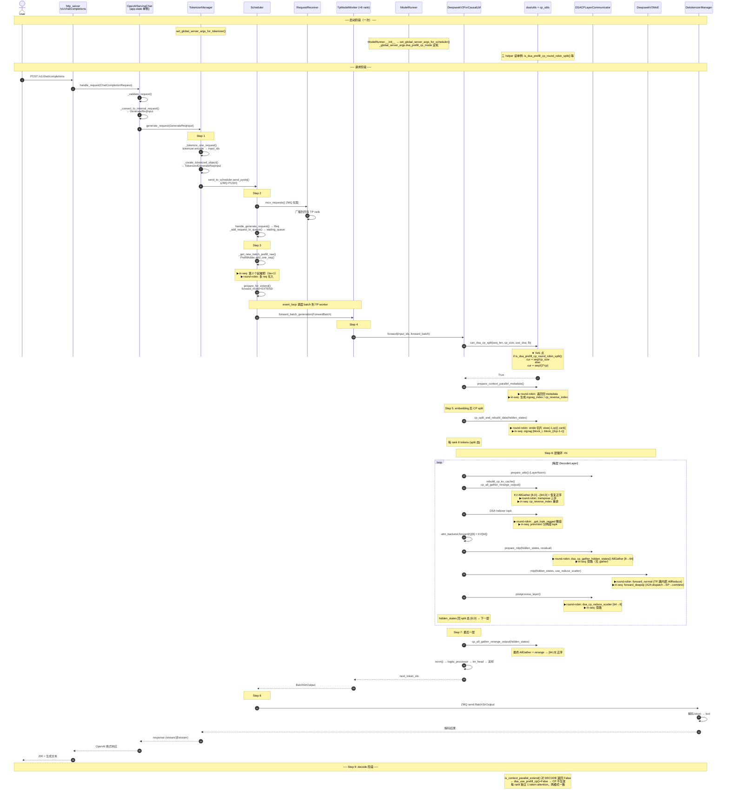

> SGLang DSA Prefill Context Parallel 完整流程（GLM 5.2 DSA）
>
> **适用模型**：GLM 5.2 DSA（`GlmMoeDsaForCausalLM`，[glm4_moe.py:1481](https://github.com/sgl-project/sglang/blob/d8487bad06eb305bcb1f1efcd5d89072b15bf0ec/python/sglang/srt/models/glm4_moe.py#L1481)）。
> 该类继承 `DeepseekV2ForCausalLM`，**走 V2 代码路径**（`deepseek_v2.py`），MoE 层为 `DeepseekV2MoE`（[deepseek_v2.py:1029](https://github.com/sgl-project/sglang/blob/d8487bad06eb305bcb1f1efcd5d89072b15bf0ec/python/sglang/srt/models/deepseek_v2.py#L1029)），
> 不是非 DSA 的 `Glm4MoeSparseMoeBlock`。本文只讲 GLM 5.2 DSA 路径，不含 DeepSeek V4。
>
> **两种 split 模式**（[server_args.py:1861-1875](https://github.com/sgl-project/sglang/blob/d8487bad06eb305bcb1f1efcd5d89072b15bf0ec/python/sglang/srt/server_args.py#L1861-L1875)）：
>
> | 模式 | 启动参数 | 自动配置 | MoE 后端 |
> |------|---------|---------|---------|
> | `round-robin-split` | `--dsa-prefill-cp-mode round-robin-split` | `enable_dp_attention=True`, `moe_dense_tp_size=1` | **TP-only**（`moe_a2a_backend=none`, `ep_size=1`） |
> | `in-seq-split` | `--dsa-prefill-cp-mode in-seq-split` | 上述 + 强制 `moe_a2a_backend=deepep`, `ep_size=tp_size` | **DeepEP（EP）** |
>
> 两种模式在启动参数解析阶段与 MoE 后端绑定，不可解耦。本文统一按 Step 0→9 描述，分歧点以
> **▶ round-robin-split** / **▶ in-seq-split** 内联标注。
>
> 注：`--enable-nsa-prefill-context-parallel` / `--nsa-prefill-cp-mode` 为已废弃别名
> （`DeprecatedStoreTrueAction`，[server_args.py:6820](https://github.com/sgl-project/sglang/blob/d8487bad06eb305bcb1f1efcd5d89072b15bf0ec/python/sglang/srt/server_args.py#L6820) / `DeprecatedAliasStoreAction`，[server_args.py:6835](https://github.com/sgl-project/sglang/blob/d8487bad06eb305bcb1f1efcd5d89072b15bf0ec/python/sglang/srt/server_args.py#L6835)），
> 推荐用 `--enable-dsa-prefill-context-parallel` / `--dsa-prefill-cp-mode`。

---

#### 进程拓扑与总执行逻辑

`Engine` 类（[engine.py:178](https://github.com/sgl-project/sglang/blob/d8487bad06eb305bcb1f1efcd5d89072b15bf0ec/python/sglang/srt/entrypoints/engine.py#L178)）是总指挥，编排**三进程模型**（注释见 [engine.py:182-189](https://github.com/sgl-project/sglang/blob/d8487bad06eb305bcb1f1efcd5d89072b15bf0ec/python/sglang/srt/entrypoints/engine.py#L182-L189)）：HTTP server + Engine + TokenizerManager 在主进程，Scheduler / DetokenizerManager 是子进程，用 ZMQ IPC 互连。

```
                        sglang.launch_server (CLI)
                                  │
                                  ↓
                         Engine(...)        engine.py:178  ← 总系统执行逻辑
                                  │
        ┌─────────────────────────┼──────────────────────────────┐
        │                         │                              │
   [主进程]                  [子进程 × tp_size]              [子进程]
   HTTP server (FastAPI)     run_scheduler_process          run_detokenizer_process
   + TokenizerManager        → Scheduler.run_event_loop     → DetokenizerManager
        │                    (每 TP rank 一个)               (解码)
        │                         │                              │
        │   ZMQ PUSH (ipc://)     │                              │
        └─────────→ waiting_queue  │                              │
                     + 组 batch    │ forward                      │
                                   │                              │
                                   └── ZMQ PUSH (BatchStrOutput) ─┘
                                                                   │
                                   ZMQ ←──────────────────────────┘
                                   ↓
                              回主进程 TokenizerManager → HTTP 返回用户
```

**Scheduler 子进程的启动调用链**：

1. 主进程 `Engine._launch_scheduler_processes()`（[engine.py:583](https://github.com/sgl-project/sglang/blob/d8487bad06eb305bcb1f1efcd5d89072b15bf0ec/python/sglang/srt/entrypoints/engine.py#L583)）按 TP/PP rank 循环，每 rank 用 `multiprocessing.Process` spawn 一个子进程：
   ```python
   # engine.py:627-641
   proc = mp.Process(
       target=run_scheduler_process_func,      # ← 子进程入口
       args=(server_args, port_args, gpu_id, tp_rank, ...),
   )
   ```
   `tp_size=8` → 8 个 Scheduler 子进程。DP 模式由 `DataParallelController` 代为 spawn（[data_parallel_controller.py:567](https://github.com/sgl-project/sglang/blob/d8487bad06eb305bcb1f1efcd5d89072b15bf0ec/python/sglang/srt/managers/data_parallel_controller.py#L567)）。

2. 子进程入口 `run_scheduler_process()`（[scheduler.py:3958](https://github.com/sgl-project/sglang/blob/d8487bad06eb305bcb1f1efcd5d89072b15bf0ec/python/sglang/srt/managers/scheduler.py#L3958)）：
   ```python
   def run_scheduler_process(server_args, port_args, gpu_id, tp_rank, ...):
       scheduler = Scheduler(...)              # 建 Scheduler
       pipe_writer.send(scheduler.get_init_info())  # 回报主进程
       scheduler.run_event_loop()              # 阻塞跑循环
   ```

3. `Scheduler.run_event_loop()`（[:1405](https://github.com/sgl-project/sglang/blob/d8487bad06eb305bcb1f1efcd5d89072b15bf0ec/python/sglang/srt/managers/scheduler.py#L1405)）→ `dispatch_event_loop()`（[:3870](https://github.com/sgl-project/sglang/blob/d8487bad06eb305bcb1f1efcd5d89072b15bf0ec/python/sglang/srt/managers/scheduler.py#L3870)）按配置选 `event_loop_normal` / `event_loop_overlap` / pp / disagg 变体，进入 `while True` 循环（见下文 Step 4 调用链）。

> 一句话：`scheduler.py` 的 `Scheduler` 在**每个 TP rank 一个的子进程**里跑，由主进程 `Engine` 用 `mp.Process` spawn，入口 `run_scheduler_process` → `run_event_loop`。总系统逻辑在 [engine.py:178](https://github.com/sgl-project/sglang/blob/d8487bad06eb305bcb1f1efcd5d89072b15bf0ec/python/sglang/srt/entrypoints/engine.py#L178) `Engine` 类。

---

#### 全流程总览（Step 0→9，单 prefill 请求，cp_size=8）

```
 ┌─────────────────────────────────────────────────────────────────┐
 │ Step 0  启动：CLI --dsa-prefill-cp-mode → ServerArgs 字段       │
 │         __post_init__ 派生 MoE 后端 → 写 _global_server_args 单例 │
 │         (set_global_server_args_for_scheduler, model_runner.py:512)│
 └─────────────────────────────────────────────────────────────────┘
                                   ↓
 ┌─────────────────────────────────────────────────────────────────┐
 │ Step 1  POST /v1/chat/completions                               │
 │         → OpenAIServingChat.handle_request → GenerateReqInput   │
 │         → TokenizerManager.generate_request                     │
 │         → tokenize → TokenizedGenerateReqInput                  │
 │         → ZMQ PUSH 发 Scheduler          (tokenizer_manager.py:552)│
 └─────────────────────────────────────────────────────────────────┘
                                   ↓ ZMQ
 ┌─────────────────────────────────────────────────────────────────┐
 │ Step 2  Scheduler.recv_requests 拉取 → 广播 TP rank             │
 │         handle_generate_request → Req → waiting_queue           │
 └─────────────────────────────────────────────────────────────────┘
                                   ↓
 ┌─────────────────────────────────────────────────────────────────┐
 │ Step 3  event_loop → get_next_batch_to_run → 组 batch           │
 │         PrefillAdder.add_one_req 判能否加入                     │
 │         ▶ round-robin: 多 req 可入 (multi-batch)                │
 │         ▶ in-seq:     can_run_list>=1 拒第 2 个 (bs=1)          │
 │         prepare_for_extend → forward_mode=EXTEND                │
 └─────────────────────────────────────────────────────────────────┘
                                   ↓ run_batch
 ┌─────────────────────────────────────────────────────────────────┐
 │ Step 4  TpModelWorker.forward_batch_generation                  │
 │         → ModelRunner.forward → _forward_raw → self.model.forward│
 │         = DeepseekV2ForCausalLM.forward (deepseek_v2.py:2633)   │
 │         can_dsa_cp_split 判 fork:                               │
 │           ★ if is_dsa_prefill_cp_round_robin_split():           │
 │               ▶ round-robin: cur = seq // cp                    │
 │               ▶ in-seq:     cur = seq // (2*cp)                 │
 │         prepare_context_parallel_metadata:                      │
 │           ▶ round-robin: 返回空 metadata                        │
 │           ▶ in-seq:     生成 zigzag_index / cp_reverse_index    │
 └─────────────────────────────────────────────────────────────────┘
                                   ↓ self.model(...)
 ┌─────────────────────────────────────────────────────────────────┐
 │ Step 5  DeepseekV2Model.forward (deepseek_v2.py:2337)           │
 │         embedding [64, D]                                       │
 │         cp_split_and_rebuild_data → 每 rank 8 tokens (split 态)  │
 │           ▶ round-robin: stride 切片 view(-1,cp)[:,rank]        │
 │           ▶ in-seq:     zigzag [block_r, block_{2cp-1-r}]       │
 └─────────────────────────────────────────────────────────────────┘
                                   ↓ 层循环 ×N
 ┌─────────────────────────────────────────────────────────────────┐
 │ Step 6  每层 DeepseekV2DecoderLayer (deepseek_v2.py:2054)       │
 │                                                                 │
 │   ┌─ Self-Attention (DSA MLA) ──────────────────────────────┐  │
 │   │  Q [8,D]  →  rebuild_cp_kv_cache                         │  │
 │   │             cp_all_gather_rerange_output → KV [64,D]     │  │
 │   │             ▶ round-robin: transpose 三步恢复正序        │  │
 │   │             ▶ in-seq:     cp_reverse_index 重排          │  │
 │   │  DSA Indexer topk:                                       │  │
 │   │    ▶ round-robin: _get_topk_ragged 整段                  │  │
 │   │    ▶ in-seq:     prev/next 分两段 topk                   │  │
 │   │  attn_backend.forward(Q[8] × KV[64]) → [8,D] (split)     │  │
 │   └──────────────────────────────────────────────────────────┘  │
 │                                   ↓                             │
 │   ┌─ MLP / MoE ─────────────────────────────────────────────┐  │
 │   │  prepare_mlp:                                             │  │
 │   │    ▶ round-robin: dsa_cp_gather_hidden_states AllGather  │  │
 │   │                    [8,D] → [64,D]                         │  │
 │   │    ▶ in-seq:     旁路 (无 gather)                         │  │
 │   │  MoE:                                                     │  │
 │   │    ▶ round-robin: forward_normal (TP, 跳内部 AllReduce)   │  │
 │   │    ▶ in-seq:     forward_deepep (A2A dispatch→EP→combine) │  │
 │   │  postprocess_layer:                                       │  │
 │   │    ▶ round-robin: dsa_cp_reduce_scatter [64,D] → [8,D]    │  │
 │   │    ▶ in-seq:     旁路                                     │  │
 │   └──────────────────────────────────────────────────────────┘  │
 │                                   ↓                             │
 │   hidden_states [8,D] (split) → 下一层                          │
 └─────────────────────────────────────────────────────────────────┘
                                   ↓ 最后一层后
 ┌─────────────────────────────────────────────────────────────────┐
 │ Step 7  DeepseekV2Model.forward 末尾                            │
 │                                                                 │
 │         各 rank [8,D] (split)                                   │
 │              └──── AllGather + rerange ────→ [64, D] (正序)     │
 │                                                   ↓             │
 │                                             norm() (V2 已 norm) │
 │                                                   ↓             │
 │   → DeepseekV2ForCausalLM.forward: logits_processor → lm_head   │
 │                                                   ↓             │
 │                                             采样 → next_token_ids│
 └─────────────────────────────────────────────────────────────────┘
                                   ↓ 返回调用链
 ┌─────────────────────────────────────────────────────────────────┐
 │ Step 8  process_batch_result → req.output_ids.append           │
 │         send_to_detokenizer.send_output (BatchStrOutput)        │
 │         → DetokenizerManager 解码 → TokenizerManager → HTTP     │
 └─────────────────────────────────────────────────────────────────┘
                                   ↓
 ┌─────────────────────────────────────────────────────────────────┐
 │ Step 9  后续 decode: ForwardMode.DECODE                         │
 │         is_context_parallel_extend()=False → CP 不生效          │
 │         每 rank 独立 1 token attention (完整 KV cache)          │
 │         两模式行为一致，直到 EOS 或 max_new_tokens              │
 └─────────────────────────────────────────────────────────────────┘
```

> 纵向箭头 = 数据/控制流；▶ 标两模式分歧点；★ 标 round-robin vs in-seq 的 fork 判定。各 Step 详见下文。

---

#### 模块层次树（DSA Prefill CP 相关）

仅列本文流程涉及的模块（非全仓库）。根为 `python/sglang/srt/`，★ 标记 CP 流程核心文件。按**职责分层**组织：配置层 → 协议入口层 → 调度核心层 → forward 执行层 → 分布式与算子层 → 模型层，对应数据流自上而下。

```
python/sglang/srt/
│
# ────────── 配置层（启动期：CLI 解析、模式派生、全局单例）──────────
├── server_args.py ★              # ServerArgs: CLI 解析 + 模式派生（0a/0b）
│                                 #   + 全局单例 _global_server_args (get/set_global_server_args)
├── configs/
│   └── model_config.py           # is_deepseek_dsa() 判 DSA 架构
└── environ.py                    # SGLANG_* env var（CP 流程不读，仅总开关别名）
│
# ────────── 协议入口层（主进程：HTTP → 内部请求格式）──────────
├── entrypoints/
│   ├── http_server.py            # /v1/chat/completions 路由 → openai_serving_chat
│   │                             #   + Engine 总指挥 (engine.py:178)
│   └── openai/
│       ├── serving_base.py       # handle_request(): 校验→转内部格式→分流 stream/非stream
│       └── serving_chat.py       # _convert_to_internal_request() → GenerateReqInput
│
# ────────── 调度核心层（Scheduler 子进程：收请求、组 batch、起 forward）──────────
├── managers/
│   ├── io_struct.py ★            # [IPC 消息体] TokenizedGenerateReqInput / BatchStrOutput
│   ├── tokenizer_manager.py ★    # [主进程] generate_request(): tokenize→构造→ZMQ 发 Scheduler
│   ├── detokenizer_manager.py    # [子进程] 解码输出 token → 文本
│   ├── scheduler.py ★            # [子进程] Scheduler: run_event_loop→recv_requests→组 batch→run_batch
│   ├── schedule_batch.py         #   └ Req / batch 构造，prepare_for_extend()
│   ├── schedule_policy.py        #   └ PrefillAdder: 能否加入 batch（in-seq 强制 bs=1）
│   ├── tp_worker.py ★            # [子进程] TpModelWorker.forward_batch_generation() → 模型 forward
│   ├── communicator.py           #   └ 进程间通信编排
│   └── scheduler_components/
│       ├── request_receiver.py   #       └ recv_requests() ZMQ 拉取 + 广播 TP rank
│       ├── ipc_channels.py       #       └ ZMQ socket 建立
│       └── output_sender.py      #       └ 结果回传
│
# ────────── forward 执行层（单步 forward：batch 包装 + 模型调用 + CUDA graph）──────────
├── model_executor/
│   ├── forward_batch_info.py     # ForwardBatch + is_context_parallel_extend()
│   ├── model_runner.py ★         # ModelRunner.forward→_forward_raw→self.model.forward
│   │                             #   + set_global_server_args_for_scheduler() (启动写单例)
│   └── cuda_graph_runner.py      # CUDA graph（CP 禁用 piecewise，Step 0）
│
# ────────── 分布式与算子层（CP 切分、通信、attention、MoE）──────────
├── distributed/
│   └── parallel_state.py         # attn_tp_size / moe_tp_size / cp_size 推导
│
├── layers/
│   ├── dp_attention.py           # [CP 元信息] get_attention_cp_rank() / get_attention_cp_size()
│   ├── communicator.py           # [MLP 通信模式] _compute_mlp_mode(): round-robin→FULL, in-seq→SCATTERED
│   ├── communicator_dsa_cp.py ★  # [层间通信] DSACPLayerCommunicator: MLP 前 AllGather / 后 ReduceScatter
│   ├── attention/
│   │   ├── dsa/
│   │   │   ├── utils.py ★        # [模式判定 + split] is_dsa_prefill_cp_round_robin_split()
│   │   │   │                     #   / can_dsa_cp_split() / dsa_cp_round_robin_split_data()
│   │   │   └── dsa_indexer.py ★  # [稀疏索引] DSA topk: in-seq prev/next 分段
│   │   └── dsa_backend.py        #   └ DSA attention backend
│   ├── utils/
│   │   └── cp_utils.py ★         # [CP 工具] prepare_context_parallel_metadata()
│   │                             #   / cp_split_and_rebuild_* / cp_all_gather_rerange_output()
│   │                             #   / get_cp_padding_align_size()
│   └── moe/
│       ├── token_dispatcher/
│       │   └── deepep.py         # [EP 通信] DeepEPBuffer: in-seq 路径 A2A dispatch/combine
│       └── utils.py              #   └ should_skip_post_experts_all_reduce()
│
# ────────── 模型层（GLM 5.2 DSA → V2 主路径 forward）──────────
└── models/
    ├── deepseek_v2.py ★          # V2 主路径: DeepseekV2ForCausalLM.forward (CP 元数据)
    │                             #   / DeepseekV2Model.forward (CP split + 层循环)
    │                             #   / DeepseekV2MoE / rebuild_cp_kv_cache
    └── glm4_moe.py               # GlmMoeDsaForCausalLM(DeepseekV2ForCausalLM) 入口
```

**层次职责对应数据流**：

| 层 | 职责 | 对应 Step |
|---|---|---|
| 配置层 | 启动期定 mode、写全局单例 | Step 0 |
| 协议入口层 | HTTP 收请求 → `GenerateReqInput` | Step 1 |
| 调度核心层 | tokenize → 组 batch → 起 forward | Step 1-3 |
| forward 执行层 | batch 包装 → 调模型 forward | Step 4 |
| 分布式与算子层 | CP split / KV AllGather / MoE 通信 / attention | Step 4-6 |
| 模型层 | V2 forward 主体（embedding + 层循环 + 最终 gather + logits） | Step 5-7 |

---

#### 运行时时序图（单 prefill 请求，cp_size=8）



---

#### Step 0: 参数初始化与校验

`ServerArgs.__post_init__()`（[server_args.py:887](https://github.com/sgl-project/sglang/blob/d8487bad06eb305bcb1f1efcd5d89072b15bf0ec/python/sglang/srt/server_args.py#L887)）在 [server_args.py:1000](https://github.com/sgl-project/sglang/blob/d8487bad06eb305bcb1f1efcd5d89072b15bf0ec/python/sglang/srt/server_args.py#L1000) 调 `_handle_context_parallelism()`（[server_args.py:3218](https://github.com/sgl-project/sglang/blob/d8487bad06eb305bcb1f1efcd5d89072b15bf0ec/python/sglang/srt/server_args.py#L3218)）校验：

- `attn_cp_size = 8`，要求 `tp_size % attn_cp_size == 0` 且 `tp_size % (dp_size * attn_cp_size) == 0`
- `enable_dsa_prefill_context_parallel = True`（字段 [server_args.py:803](https://github.com/sgl-project/sglang/blob/d8487bad06eb305bcb1f1efcd5d89072b15bf0ec/python/sglang/srt/server_args.py#L803)）
- `dsa_prefill_cp_mode ∈ ["in-seq-split", "round-robin-split"]`（[server_args.py:275](https://github.com/sgl-project/sglang/blob/d8487bad06eb305bcb1f1efcd5d89072b15bf0ec/python/sglang/srt/server_args.py#L275)）
- `enable_prefill_context_parallel` 与 `enable_dsa_prefill_context_parallel` 互斥

##### 0a. 模式自动配置（关键差异）

`_handle_model_specific_adjustments()` 的 DSA-CP 子块（[server_args.py:1857-1893](https://github.com/sgl-project/sglang/blob/d8487bad06eb305bcb1f1efcd5d89072b15bf0ec/python/sglang/srt/server_args.py#L1857-L1893)）：

```python
if self.enable_dsa_prefill_context_parallel:
    if self.dsa_prefill_cp_mode == "in-seq-split":
        # TODO Supports moe_dense_tp_size != 1, kv cache dtype = "fp8",
        #      moe_a2a_backend non-deepep and cross-machine operation.
        self.enable_dp_attention = True
        self.moe_dense_tp_size = 1
        self.moe_a2a_backend = "deepep"   # ★ 强制 DeepEP
        self.ep_size = self.tp_size        # ★ 强制 ep_size = tp_size = 8
        logger.warning("For in-seq split mode, ... batch_size == 1")
    else:                                  # round-robin-split
        self.enable_dp_attention = True
        self.moe_dense_tp_size = 1
        assert self.dp_size == 1, "For round-robin split mode, dp attention is not supported."
        # 注：不自动设 moe_a2a_backend / ep_size，保留默认 none / 1 → TP-only MoE
    assert self.tp_size <= 8, "Context parallel only supports single machine ..."
    self.attn_cp_size = self.tp_size // self.dp_size
    self.disable_piecewise_cuda_graph = True
```

由此推导并行参数（[parallel_state.py:1931](https://github.com/sgl-project/sglang/blob/d8487bad06eb305bcb1f1efcd5d89072b15bf0ec/python/sglang/srt/distributed/parallel_state.py#L1931) / [:2003](https://github.com/sgl-project/sglang/blob/d8487bad06eb305bcb1f1efcd5d89072b15bf0ec/python/sglang/srt/distributed/parallel_state.py#L2003)）：

```
attn_tp_size = tp_size // attn_cp_size // attn_dp_size = 8 // 8 // 1 = 1   # attention 权重不切分
```

- **▶ round-robin-split**：`moe_tp_size = 8 // 1 // 1 = 8`（expert 权重按 TP 切 8 份，每卡全 256 expert 的 1/8 权重）
- **▶ in-seq-split**：`moe_tp_size = 8 // 8 // 1 = 1`（expert 权重不切分，每卡 32 个完整 expert，EP 模式）

两模式 attention 侧完全相同（`attn_tp_size=1`，每卡持完整 attention 权重独立计算），差异仅在 MLP/MoE 部分。

##### 0b. 运行时如何按参数选择模式（关键）

模式在**启动时定死、请求时只读**，不在请求路径上重新决策：

1. **CLI 解析** → `ServerArgs` 字段 `dsa_prefill_cp_mode`（[server_args.py:275](https://github.com/sgl-project/sglang/blob/d8487bad06eb305bcb1f1efcd5d89072b15bf0ec/python/sglang/srt/server_args.py#L275)）赋值 `"round-robin-split"` / `"in-seq-split"`。
2. **`__post_init__` + 0a 派生** → mode 与 MoE 后端绑定死（in-seq 强制 `moe_a2a_backend="deepep"`/`ep_size=tp_size`；round-robin 不强制），不可解耦。
3. **写进进程级单例**：scheduler 进程在 `ModelRunner.__init__` 调 `set_global_server_args_for_scheduler(server_args)`（[model_runner.py:512](https://github.com/sgl-project/sglang/blob/d8487bad06eb305bcb1f1efcd5d89072b15bf0ec/python/sglang/srt/model_executor/model_runner.py#L512)），tokenizer 进程调 `set_global_server_args_for_tokenizer`（[tokenizer_manager.py:253](https://github.com/sgl-project/sglang/blob/d8487bad06eb305bcb1f1efcd5d89072b15bf0ec/python/sglang/srt/managers/tokenizer_manager.py#L253)，实为同一函数别名，[server_args.py:7896](https://github.com/sgl-project/sglang/blob/d8487bad06eb305bcb1f1efcd5d89072b15bf0ec/python/sglang/srt/server_args.py#L7896)）。二者都赋值模块级变量 `_global_server_args`（[server_args.py:7888-7903](https://github.com/sgl-project/sglang/blob/d8487bad06eb305bcb1f1efcd5d89072b15bf0ec/python/sglang/srt/server_args.py#L7888-L7903)），进程内常驻：
   ```python
   _global_server_args: Optional[ServerArgs] = None
   def set_global_server_args_for_scheduler(server_args):
       global _global_server_args
       _global_server_args = server_args       # 启动时写一次
   def get_global_server_args() -> ServerArgs:
       if _global_server_args is None:
           raise ValueError("Global server args is not set yet!")
       return _global_server_args              # 请求时只读
   ```
4. **请求到达**：代码不查 CLI、不查 env var、不查请求体，直接 `get_global_server_args().dsa_prefill_cp_mode` 读单例。**第一次触发模式判定**是 forward 入口门槛 `can_dsa_cp_split()`（[dsa/utils.py:175](https://github.com/sgl-project/sglang/blob/d8487bad06eb305bcb1f1efcd5d89072b15bf0ec/python/sglang/srt/layers/attention/dsa/utils.py#L175)，见 Step 4a）里的 `if is_dsa_prefill_cp_round_robin_split():` —— 这就是 round-robin vs in-seq 的 fork 点，返回 True 全程走 round-robin 分支，否则走 in-seq。后续每层每步调同一组 helper 读同一单例，结果必然一致。

读取入口三个 helper（[dsa/utils.py:67-82](https://github.com/sgl-project/sglang/blob/d8487bad06eb305bcb1f1efcd5d89072b15bf0ec/python/sglang/srt/layers/attention/dsa/utils.py#L67-L82)）：

```python
# dsa/utils.py:67-82
def is_dsa_enable_prefill_cp():
    return get_global_server_args().enable_dsa_prefill_context_parallel   # 总开关

def is_dsa_prefill_cp_in_seq_split():
    return (is_dsa_enable_prefill_cp()
            and get_global_server_args().dsa_prefill_cp_mode == "in-seq-split")

def is_dsa_prefill_cp_round_robin_split():
    return (is_dsa_enable_prefill_cp()
            and get_global_server_args().dsa_prefill_cp_mode == "round-robin-split")
```

后续每个分歧点都调上述 helper，而非各自重新解析参数：

| 分歧点 | 判定调用 | 位置 |
|--------|---------|------|
| CP split 门槛（seq 怎么切） | `is_dsa_prefill_cp_round_robin_split()` | [dsa/utils.py:175](https://github.com/sgl-project/sglang/blob/d8487bad06eb305bcb1f1efcd5d89072b15bf0ec/python/sglang/srt/layers/attention/dsa/utils.py#L175) `can_dsa_cp_split()` |
| padding 对齐大小 | `is_dsa_prefill_cp_round_robin_split()` | [cp_utils.py:73](https://github.com/sgl-project/sglang/blob/d8487bad06eb305bcb1f1efcd5d89072b15bf0ec/python/sglang/srt/layers/utils/cp_utils.py#L73) `get_cp_padding_align_size()` |
| hidden_states split（stride vs zigzag） | `is_dsa_prefill_cp_round_robin_split()` | [cp_utils.py:145](https://github.com/sgl-project/sglang/blob/d8487bad06eb305bcb1f1efcd5d89072b15bf0ec/python/sglang/srt/layers/utils/cp_utils.py#L145) `cp_split_and_rebuild_data()` |
| KV AllGather 后恢复顺序 | `is_dsa_prefill_cp_round_robin_split()` | [cp_utils.py:310](https://github.com/sgl-project/sglang/blob/d8487bad06eb305bcb1f1efcd5d89072b15bf0ec/python/sglang/srt/layers/utils/cp_utils.py#L310) `cp_all_gather_rerange_output()` |
| DSA indexer topk（是否分 prev/next） | `is_dsa_prefill_cp_round_robin_split()` | [dsa_indexer.py:1484](https://github.com/sgl-project/sglang/blob/d8487bad06eb305bcb1f1efcd5d89072b15bf0ec/python/sglang/srt/layers/attention/dsa/dsa_indexer.py#L1484) `_get_topk_ragged()` CP 分支 |
| MLP 通信模式（FULL vs SCATTERED） | `moe_a2a_backend == "deepep"`（由 0a 强制设） | [communicator.py:378](https://github.com/sgl-project/sglang/blob/d8487bad06eb305bcb1f1efcd5d89072b15bf0ec/python/sglang/srt/layers/communicator.py#L378) `_compute_mlp_mode()` |
| multi-batch 拒绝（batch_size==1） | `is_dsa_prefill_cp_in_seq_split()` | [schedule_policy.py:845](https://github.com/sgl-project/sglang/blob/d8487bad06eb305bcb1f1efcd5d89072b15bf0ec/python/sglang/srt/managers/schedule_policy.py#L845) `PrefillAdder.add_one_req()` |

> 注意 MLP 那一行：in-seq 模式在 0a 强制把 `moe_a2a_backend="deepep"`，所以 `_compute_mlp_mode()` 判的是 **`moe_a2a_backend`**（间接由 mode 决定），而非直接判 `dsa_prefill_cp_mode`。其余 6 处都直接读 mode helper。

> **▶ in-seq-split 限制**：`batch_size == 1`（单序列 extend），不支持 FP8 KV cache（TODO，[server_args.py:1862](https://github.com/sgl-project/sglang/blob/d8487bad06eb305bcb1f1efcd5d89072b15bf0ec/python/sglang/srt/server_args.py#L1862)）。round-robin-split 无此约束，支持 multi-batch。

每个 `TpModelWorker` 通过 `get_attention_cp_rank()`（[dp_attention.py:338](https://github.com/sgl-project/sglang/blob/d8487bad06eb305bcb1f1efcd5d89072b15bf0ec/python/sglang/srt/layers/dp_attention.py#L338)）/ `get_attention_cp_size()`（[dp_attention.py:342](https://github.com/sgl-project/sglang/blob/d8487bad06eb305bcb1f1efcd5d89072b15bf0ec/python/sglang/srt/layers/dp_attention.py#L342)）获取 CP rank（0~7）与 CP size（8）。

---

#### Step 1: HTTP 请求到达 TokenizerManager

用户 → `POST /v1/chat/completions`（[http_server.py:1510](https://github.com/sgl-project/sglang/blob/d8487bad06eb305bcb1f1efcd5d89072b15bf0ec/python/sglang/srt/entrypoints/http_server.py#L1510)）→ `openai_v1_chat_completions()` → `OpenAIServingChat.handle_request()` 内部构造 `GenerateReqInput`，最终调 `tokenizer_manager.generate_request()`（[http_server.py:557](https://github.com/sgl-project/sglang/blob/d8487bad06eb305bcb1f1efcd5d89072b15bf0ec/python/sglang/srt/entrypoints/http_server.py#L557)）。

`TokenizerManager.generate_request()`（[tokenizer_manager.py:552](https://github.com/sgl-project/sglang/blob/d8487bad06eb305bcb1f1efcd5d89072b15bf0ec/python/sglang/srt/managers/tokenizer_manager.py#L552)）串起 tokenize → 构造 → 发送三步：

```python
# tokenizer_manager.py:589-597 (单请求路径)
# Tokenize the request and send it to the scheduler
if obj.is_single:
    tokenized_obj = await self._tokenize_one_request(obj)   # ① tokenize
    ...
    self._send_one_request(tokenized_obj)                    # ②+③ 构造+发送
    async for response in self._wait_one_response(obj, request):
        yield response
```

1. **tokenize 得 `input_ids`**：`_tokenize_one_request()`（[tokenizer_manager.py:747](https://github.com/sgl-project/sglang/blob/d8487bad06eb305bcb1f1efcd5d89072b15bf0ec/python/sglang/srt/managers/tokenizer_manager.py#L747)）→ 内部调 `_tokenize_texts()`（[tokenizer_manager.py:660](https://github.com/sgl-project/sglang/blob/d8487bad06eb305bcb1f1efcd5d89072b15bf0ec/python/sglang/srt/managers/tokenizer_manager.py#L660)，纯文本走 `self.tokenizer.encode(...)`，[tokenizer_manager.py:733](https://github.com/sgl-project/sglang/blob/d8487bad06eb305bcb1f1efcd5d89072b15bf0ec/python/sglang/srt/managers/tokenizer_manager.py#L733)）→ `_create_tokenized_object()`（[tokenizer_manager.py:1045](https://github.com/sgl-project/sglang/blob/d8487bad06eb305bcb1f1efcd5d89072b15bf0ec/python/sglang/srt/managers/tokenizer_manager.py#L1045)）把 `input_ids` 包成 `array("q", input_ids)`（[tokenizer_manager.py:1055](https://github.com/sgl-project/sglang/blob/d8487bad06eb305bcb1f1efcd5d89072b15bf0ec/python/sglang/srt/managers/tokenizer_manager.py#L1055)）。
2. **构造 `TokenizedGenerateReqInput`**（[io_struct.py:733](https://github.com/sgl-project/sglang/blob/d8487bad06eb305bcb1f1efcd5d89072b15bf0ec/python/sglang/srt/managers/io_struct.py#L733)）：在 `_create_tokenized_object()` 内 `TokenizedGenerateReqInput(input_text, input_ids_arr, mm_inputs, sampling_params, ...)`（[tokenizer_manager.py:1083](https://github.com/sgl-project/sglang/blob/d8487bad06eb305bcb1f1efcd5d89072b15bf0ec/python/sglang/srt/managers/tokenizer_manager.py#L1083)），字段含 `input_ids: Optional[array[int]]`（[io_struct.py:737](https://github.com/sgl-project/sglang/blob/d8487bad06eb305bcb1f1efcd5d89072b15bf0ec/python/sglang/srt/managers/io_struct.py#L737)）、`sampling_params`、`stream` 等。
3. **ZMQ 发给 Scheduler**：`_send_one_request()`（[tokenizer_manager.py:1262](https://github.com/sgl-project/sglang/blob/d8487bad06eb305bcb1f1efcd5d89072b15bf0ec/python/sglang/srt/managers/tokenizer_manager.py#L1262)）调 `self.send_to_scheduler.send_pyobj(tokenized_obj)`（[tokenizer_manager.py:1268](https://github.com/sgl-project/sglang/blob/d8487bad06eb305bcb1f1efcd5d89072b15bf0ec/python/sglang/srt/managers/tokenizer_manager.py#L1268)）。`send_to_scheduler` 是 `init_ipc_channels()` 里建的 ZMQ PUSH socket，连 `scheduler_input_ipc_name`（[tokenizer_manager.py:368-376](https://github.com/sgl-project/sglang/blob/d8487bad06eb305bcb1f1efcd5d89072b15bf0ec/python/sglang/srt/managers/tokenizer_manager.py#L368-L376)）。批量路径走 `_send_batch_request()`（[tokenizer_manager.py:1271](https://github.com/sgl-project/sglang/blob/d8487bad06eb305bcb1f1efcd5d89072b15bf0ec/python/sglang/srt/managers/tokenizer_manager.py#L1271)）包成 `BatchTokenizedGenerateReqInput` 再发。

> 多 tokenizer worker 场景（`tokenizer_worker_num > 1`）由 `multi_tokenizer_mixin.py:569` 的 `TokenizerWorker(TokenizerManager)` 接管，但 tokenize→构造→ZMQ 发送三步逻辑一致。

---

#### Step 2: Scheduler 接收请求

承接 Step 1：`TokenizerManager._send_one_request()` 把 `TokenizedGenerateReqInput` 经 ZMQ PUSH 发到 `scheduler_input_ipc_name`。Scheduler 侧由 `RequestReceiver.recv_requests()`（[request_receiver.py:65](https://github.com/sgl-project/sglang/blob/d8487bad06eb305bcb1f1efcd5d89072b15bf0ec/python/sglang/srt/managers/scheduler_components/request_receiver.py#L65)）从该 ZMQ socket 拉取请求，广播到所有 TP rank。`handle_generate_request()`（[scheduler.py:1899](https://github.com/sgl-project/sglang/blob/d8487bad06eb305bcb1f1efcd5d89072b15bf0ec/python/sglang/srt/managers/scheduler.py#L1899)）构造 `Req` 对象，`_add_request_to_queue()`（[scheduler.py:2157](https://github.com/sgl-project/sglang/blob/d8487bad06eb305bcb1f1efcd5d89072b15bf0ec/python/sglang/srt/managers/scheduler.py#L2157)）加入 `waiting_queue`。

---

#### Step 3: Scheduler 组 Batch

`_get_new_batch_prefill_raw()`（[scheduler.py:2553](https://github.com/sgl-project/sglang/blob/d8487bad06eb305bcb1f1efcd5d89072b15bf0ec/python/sglang/srt/managers/scheduler.py#L2553)）从 `waiting_queue` 取请求，`PrefillAdder.add_one_req()`（[schedule_policy.py:845](https://github.com/sgl-project/sglang/blob/d8487bad06eb305bcb1f1efcd5d89072b15bf0ec/python/sglang/srt/managers/schedule_policy.py#L845)）判断能否加入 batch。`PrefillAdder.__init__` 读一次全局单例缓存字段 `self.dsa_prefill_cp_in_seq_split = is_dsa_prefill_cp_in_seq_split()`（[schedule_policy.py:489](https://github.com/sgl-project/sglang/blob/d8487bad06eb305bcb1f1efcd5d89072b15bf0ec/python/sglang/srt/managers/schedule_policy.py#L489)），组 batch 时检查 `can_run_list` 长度：

```python
# schedule_policy.py:857-861
# TODO support cp with multiple requests  (精度问题，暂限 bs=1)
if (self.dsa_prefill_cp_in_seq_split) and len(self.can_run_list) >= 1:
    return AddReqResult.OTHER      # 已收 1 个，第 2 个起拒入 batch
```

判的是 `can_run_list` 长度（本 batch 已收几个），不看请求内容。第 1 个进，第 2 个起返回 `OTHER` 留 `waiting_queue` 等下个 batch → prefill batch_size 上限 1。round-robin 不触发此 if，可收多个（multi-batch）。

- **▶ round-robin-split**：支持 multi-batch，`PrefillAdder` 可加多个请求
- **▶ in-seq-split**：强制 `batch_size == 1`（[schedule_policy.py:845-861](https://github.com/sgl-project/sglang/blob/d8487bad06eb305bcb1f1efcd5d89072b15bf0ec/python/sglang/srt/managers/schedule_policy.py#L845-L861)），第 2 个起被拒（zigzag prev/next 分段 topk 的多 batch 支持有精度问题，[dsa_indexer.py:1497](https://github.com/sgl-project/sglang/blob/d8487bad06eb305bcb1f1efcd5d89072b15bf0ec/python/sglang/srt/layers/attention/dsa/dsa_indexer.py#L1497) `# TODO support mutil-batch`）

##### 3a. 为什么 in-seq 必须 bs=1（根因）

in-seq 把每 rank 的 Q 按 zigzag 分 **prev / next 两段**分别做 sparse topk（[dsa_indexer.py:1501-1526](https://github.com/sgl-project/sglang/blob/d8487bad06eb305bcb1f1efcd5d89072b15bf0ec/python/sglang/srt/layers/attention/dsa/dsa_indexer.py#L1501-L1526)）。这个“分段 topk”的多 batch 聚合**未实现**，硬上多 batch 会算在错的 KV 范围上 → 精度崩。三处证据：

1. **metadata 侧数据齐**：`prepare_context_parallel_metadata()` 用 `for s in range(bs)` 把每个 seq 的 prev/next 段长都填进 list（[cp_utils.py:620-633](https://github.com/sgl-project/sglang/blob/d8487bad06eb305bcb1f1efcd5d89072b15bf0ec/python/sglang/srt/layers/utils/cp_utils.py#L620-L633)），`kv_len_prev_list` / `actual_seq_q_prev_list` 等长度 = bs。**多 seq 的段长数据是有的**。

2. **indexer 消费侧只取 `[0]`**：DSA indexer 硬编码读第 0 个 seq 的元数据：
   ```python
   # dsa_indexer.py:1488-1495
   kv_len_prev = forward_batch.attn_cp_metadata.kv_len_prev_list[0]      # ★ 只取 seq 0
   kv_len_next = forward_batch.attn_cp_metadata.kv_len_next_list[0]      # ★
   actual_seq_q_prev = ...actual_seq_q_prev_list[0]                      # ★
   actual_seq_q_next = ...actual_seq_q_next_list[0]                      # ★
   ```
   bs>1 时 seq 1+ 的 prev/next 段长被丢弃，topk 在 seq 0 的 KV 范围上算所有 seq 的 Q → 越界/错位。

3. **Q 按“对半切”分 prev/next，不分 seq**：
   ```python
   # dsa_indexer.py:1501-1506
   q_fp8_prev, q_fp8_next = torch.split(q_fp8, (q_fp8.shape[0] + 1) // 2, dim=0)
   ```
   整批 Q 简单按行数对半，假设“前半 = prev、后半 = next”。单 seq 时 prev/next 等长成立；多 seq 时各 seq 的 prev/next 边界与这个全局对半点对不上，切错段。

注释 `# TODO prev, next, combined into a single call`（[dsa_indexer.py:1500](https://github.com/sgl-project/sglang/blob/d8487bad06eb305bcb1f1efcd5d89072b15bf0ec/python/sglang/srt/layers/attention/dsa/dsa_indexer.py#L1500)）也表明 prev/next 两次 topk 调用本应合并处理多 seq，目前未做。

**对比 round-robin**：不分 prev/next，整段 Q 走单路径 `_get_topk_ragged`（[dsa_indexer.py:509](https://github.com/sgl-project/sglang/blob/d8487bad06eb305bcb1f1efcd5d89072b15bf0ec/python/sglang/srt/layers/attention/dsa/dsa_indexer.py#L509)），多 seq 自然聚合到 ragged offset，无分段边界问题 → multi-batch 无碍。

> 结论：bs=1 不是调度层的任意限制，是 in-seq zigzag 分段 topk 的**消费侧多 batch 逻辑未实现**的硬约束。metadata 已备多 seq 数据，但 indexer 消费侧（`[0]` 取值 + Q 对半切）只认单 seq，故 Scheduler 在组 batch 阶段提前拦截，避免 forward 时精度出错。

`prepare_for_extend()`（[schedule_batch.py:1823](https://github.com/sgl-project/sglang/blob/d8487bad06eb305bcb1f1efcd5d89072b15bf0ec/python/sglang/srt/managers/schedule_batch.py#L1823)）设置 `forward_mode = ForwardMode.EXTEND`，构建 `input_ids` / `extend_seq_lens` 等 tensor。

---

#### Step 4: CP 元数据准备（forward 入口）

Scheduler event_loop（[scheduler.py:1426](https://github.com/sgl-project/sglang/blob/d8487bad06eb305bcb1f1efcd5d89072b15bf0ec/python/sglang/srt/managers/scheduler.py#L1426) `event_loop_normal` / [:1453](https://github.com/sgl-project/sglang/blob/d8487bad06eb305bcb1f1efcd5d89072b15bf0ec/python/sglang/srt/managers/scheduler.py#L1453) `event_loop_overlap`，由 [:3884](https://github.com/sgl-project/sglang/blob/d8487bad06eb305bcb1f1efcd5d89072b15bf0ec/python/sglang/srt/managers/scheduler.py#L3884) 按是否 overlap 选择）每轮循环：`recv_requests()` → `get_next_batch_to_run()` 组 batch → `run_batch(batch)`（[:1441](https://github.com/sgl-project/sglang/blob/d8487bad06eb305bcb1f1efcd5d89072b15bf0ec/python/sglang/srt/managers/scheduler.py#L1441)）。`run_batch()`（[scheduler.py:2972](https://github.com/sgl-project/sglang/blob/d8487bad06eb305bcb1f1efcd5d89072b15bf0ec/python/sglang/srt/managers/scheduler.py#L2972)）内调 `model_worker.forward_batch_generation(batch)`（[:3072](https://github.com/sgl-project/sglang/blob/d8487bad06eb305bcb1f1efcd5d89072b15bf0ec/python/sglang/srt/managers/scheduler.py#L3072)），`model_worker` 即 `TpModelWorker`。`TpModelWorker.forward_batch_generation()`（[tp_worker.py:447](https://github.com/sgl-project/sglang/blob/d8487bad06eb305bcb1f1efcd5d89072b15bf0ec/python/sglang/srt/managers/tp_worker.py#L447)）把 `ScheduleBatch` 转成 `ForwardBatch`（[tp_worker.py:460](https://github.com/sgl-project/sglang/blob/d8487bad06eb305bcb1f1efcd5d89072b15bf0ec/python/sglang/srt/managers/tp_worker.py#L460)），再委托 `ModelRunner` 执行模型 forward：

```python
# tp_worker.py:471-475  (TpModelWorker → ModelRunner)
if self.pp_group.is_last_rank:
    out = self.model_runner.forward(forward_batch, pp_proxy_tensors=pp_proxy_tensors)
```

`ModelRunner.forward()`（[model_runner.py:3247](https://github.com/sgl-project/sglang/blob/d8487bad06eb305bcb1f1efcd5d89072b15bf0ec/python/sglang/srt/model_executor/model_runner.py#L3247)）→ `_forward_raw()`（[:3294](https://github.com/sgl-project/sglang/blob/d8487bad06eb305bcb1f1efcd5d89072b15bf0ec/python/sglang/srt/model_executor/model_runner.py#L3294) → [:3342](https://github.com/sgl-project/sglang/blob/d8487bad06eb305bcb1f1efcd5d89072b15bf0ec/python/sglang/srt/model_executor/model_runner.py#L3342)）。`_forward_raw` 内分两条路径：

- **cuda graph 路径**：`graph_runner.replay()`（[:3378](https://github.com/sgl-project/sglang/blob/d8487bad06eb305bcb1f1efcd5d89072b15bf0ec/python/sglang/srt/model_executor/model_runner.py#L3378)）——DSA CP 在 Step 0 设了 `disable_piecewise_cuda_graph=True`，prefill 期此路径不走。
- **普通路径**：`self.model.forward(input_ids, positions, forward_batch, **kwargs)`（[:3181-3186](https://github.com/sgl-project/sglang/blob/d8487bad06eb305bcb1f1efcd5d89072b15bf0ec/python/sglang/srt/model_executor/model_runner.py#L3181-L3186)），`self.model` 即 `GlmMoeDsaForCausalLM`（继承 `DeepseekV2ForCausalLM`），故进入 `DeepseekV2ForCausalLM.forward()`（[deepseek_v2.py:2633](https://github.com/sgl-project/sglang/blob/d8487bad06eb305bcb1f1efcd5d89072b15bf0ec/python/sglang/srt/models/deepseek_v2.py#L2633)）。

调用链总览（Step 4→5 衔接）：

```
Scheduler event_loop_normal()                scheduler.py:1426  (while True 循环)
  ├─ request_receiver.recv_requests()        :1430
  ├─ get_next_batch_to_run()                 :1436  ← Step 3 组 batch
  └─ run_batch(batch)                        :1441 / scheduler.py:2972
       └─ model_worker.forward_batch_generation(batch)   :3072
            = TpModelWorker.forward_batch_generation()   tp_worker.py:447
                 ├─ ForwardBatch.init_new()              :460
                 └─ model_runner.forward()               :472
                      └─ ModelRunner._forward_raw()      model_runner.py:3342
                           ├─ [cuda graph] graph_runner.replay()  :3378  (CP prefill 不走)
                           └─ self.model.forward(...)             :3181
                                = DeepseekV2ForCausalLM.forward()  deepseek_v2.py:2633  ← Step 4 CP 元数据
                                     └─ self.model(...)            :2667
                                          = DeepseekV2Model.forward() deepseek_v2.py:2337 ← Step 5 CP split
```

`DeepseekV2ForCausalLM.forward()` 顶部准备 CP 元数据（Step 4 主体），随后调 `self.model(...)` 进入 `DeepseekV2Model.forward()`（Step 5 做 embedding 后 CP split）：

```python
if self.dsa_enable_prefill_cp:
    if can_dsa_cp_split(len_input_ids, self.cp_size, self.use_dsa, forward_batch):
        forward_batch.attn_cp_metadata = prepare_context_parallel_metadata(
            len_input_ids, self.cp_rank, self.cp_size,
            forward_batch.seq_lens_cpu.tolist(),
            extend_seqs_len=forward_batch.extend_seq_lens_cpu,
        )
```

##### 4a. `can_dsa_cp_split()` 门槛（[dsa/utils.py:175](https://github.com/sgl-project/sglang/blob/d8487bad06eb305bcb1f1efcd5d89072b15bf0ec/python/sglang/srt/layers/attention/dsa/utils.py#L175)）

```python
if is_dsa_prefill_cp_round_robin_split():
    cur_cp_seq_len = seq_len // cp_size
    assert seq_len % cp_size == 0
else:                                  # in-seq-split
    cur_cp_seq_len = seq_len // (cp_size * 2)   # zigzag 按 2*cp_size 切
if (cur_cp_seq_len != 0 and cp_size > 1 and use_dsa
    and forward_mode.is_context_parallel_extend()
    and is_dsa_enable_prefill_cp()
    and sum(extend_seq_lens_cpu) >= cp_size):
    return True
```

- **▶ round-robin-split**：门槛 `seq_len // cp_size`，要求 `seq_len ≥ cp_size` 且被 `cp_size` 整除
- **▶ in-seq-split**：门槛 `seq_len // (cp_size * 2)`，要求 `seq_len > 2 * cp_size`

padding 对齐 `get_cp_padding_align_size()`（[cp_utils.py:73](https://github.com/sgl-project/sglang/blob/d8487bad06eb305bcb1f1efcd5d89072b15bf0ec/python/sglang/srt/layers/utils/cp_utils.py#L73)）：round-robin 返回 `cp_size`，in-seq 返回 `2 * cp_size`。

##### 4b. `prepare_context_parallel_metadata()`（[cp_utils.py:491](https://github.com/sgl-project/sglang/blob/d8487bad06eb305bcb1f1efcd5d89072b15bf0ec/python/sglang/srt/layers/utils/cp_utils.py#L491)）

- **▶ round-robin-split**：直接返回空 `ContextParallelMetadata()`（[cp_utils.py:503-504](https://github.com/sgl-project/sglang/blob/d8487bad06eb305bcb1f1efcd5d89072b15bf0ec/python/sglang/srt/layers/utils/cp_utils.py#L503-L504)）——不需要 zigzag 索引，split 由 stride 切片完成
- **▶ in-seq-split**：走完整 zigzag 路径，`cp_segment_num = cp_size * 2`，生成：
  - `split_list`：各 block 大小（`bs * 2*cp_size` 段）
  - `zigzag_index`：本 rank 持有 `[block_r, block_{2*cp_size-1-r}]`
  - `cp_reverse_index`：AllGather 后恢复 block 序的排列
  - `reverse_split_len`：AllGather 后各段大小
  - `kv_len_prev_list` / `kv_len_next_list`：prev/next 段 q 的 KV 右端点
  - `actual_seq_q_prev_list` / `actual_seq_q_next_list`：prev/next 段 q 长度

> GLM 5.2 DSA（V2 路径）**不调用** `apply_cp_reindex()` / `init_flashmla_related()`（那两个是 DeepSeek V4 round-robin-split 专属，V2 不做）。

`dsa_use_prefill_cp()`（[dsa/utils.py:265](https://github.com/sgl-project/sglang/blob/d8487bad06eb305bcb1f1efcd5d89072b15bf0ec/python/sglang/srt/layers/attention/dsa/utils.py#L265)）后续各层判断是否启用 CP：`attn_cp_metadata is not None and dsa_enable_prefill_cp and is_context_parallel_extend()` 三条件。

---

#### Step 5: CP Token 分发

承接 Step 4：`DeepseekV2ForCausalLM.forward()`（[deepseek_v2.py:2633](https://github.com/sgl-project/sglang/blob/d8487bad06eb305bcb1f1efcd5d89072b15bf0ec/python/sglang/srt/models/deepseek_v2.py#L2633)）在顶部备好 `attn_cp_metadata` 后，调 `self.model(...)`（[deepseek_v2.py:2667](https://github.com/sgl-project/sglang/blob/d8487bad06eb305bcb1f1efcd5d89072b15bf0ec/python/sglang/srt/models/deepseek_v2.py#L2667)）进入 `DeepseekV2Model.forward()`（[deepseek_v2.py:2337](https://github.com/sgl-project/sglang/blob/d8487bad06eb305bcb1f1efcd5d89072b15bf0ec/python/sglang/srt/models/deepseek_v2.py#L2337)）。CP split 发生在这里，embedding 之后：

假设 prompt tokenize 后 64 个 token：`[t0, t1, ..., t63]`。CP split 发生在 `DeepseekV2Model.forward()`，embedding 之后：

```python
# deepseek_v2.py:2346-2348 (embedding，2D，无 mHC)
if self.pp_group.is_first_rank:
    if input_embeds is None:
        hidden_states = self.embed_tokens(input_ids)   # [64, hidden_dim]

# deepseek_v2.py:2378-2383 (CP split)
if dsa_use_prefill_cp(forward_batch, self.dsa_enable_prefill_cp) or mla_use_prefill_cp(...):
    if self.pp_group.is_first_rank:
        hidden_states = cp_split_and_rebuild_data(forward_batch, hidden_states)
    positions = cp_split_and_rebuild_position(forward_batch, positions)
```

> V2 路径**不调用** `cp_round_robin_input_ids()`，**不设** `input_ids_global`（那两个是 DeepSeek V4 专属，V2 的 MoE routing 依赖 hidden_states 本身而非 input_ids）。

##### 5a. `cp_split_and_rebuild_data()`（[cp_utils.py:145](https://github.com/sgl-project/sglang/blob/d8487bad06eb305bcb1f1efcd5d89072b15bf0ec/python/sglang/srt/layers/utils/cp_utils.py#L145)）

- **▶ round-robin-split**：`dsa_cp_round_robin_split_data(input_)`（[dsa/utils.py:98](https://github.com/sgl-project/sglang/blob/d8487bad06eb305bcb1f1efcd5d89072b15bf0ec/python/sglang/srt/layers/attention/dsa/utils.py#L98)）→ stride 切片：
  ```python
  return input_.view(-1, cp_size, *input_.shape[1:])[:, cp_rank].contiguous()
  # [64, D] → view[8, 8, D] → [:, cp_rank] → [8, D]
  ```
  rank r 拿 `t_r, t_{r+8}, t_{r+16}, ...`（stride = cp_size 的交错切片）。

- **▶ in-seq-split**：zigzag 分割
  ```python
  input_list = list(torch.split(input_, attn_cp_metadata.split_list, dim=0))  # 切成 2*cp_size 个 block
  result = torch.cat([input_list[i] for i in attn_cp_metadata.zigzag_index], dim=0)  # 取 [block_r, block_{2*cp-1-r}] cat
  ```
  rank r 拿 `[block_r | block_{2*cp-1-r}]`（zigzag 两端的两整块，连续的 4+4 tokens）。

##### 5b. 矩阵变换示意（64 tokens, cp_size=8）

**▶ round-robin-split**（stride 切片）：

```
view(-1, 8, D) → [:, cp_rank]

         cp_rank →  0     1     2     3     4     5     6     7
组 0   │  t0  │  t1  │  t2  │  t3  │  t4  │  t5  │  t6  │  t7  │
组 1   │  t8  │  t9  │ t10  │ t11  │ t12  │ t13  │ t14  │ t15  │
  ...                                                          
组 7   │ t56  │ t57  │ t58  │ t59  │ t60  │ t61  │ t62  │ t63  │

rank 0 取第 0 列: [t0, t8, t16, t24, t32, t40, t48, t56]
rank 7 取第 7 列: [t7, t15, t23, t31, t39, t47, t55, t63]
```

**▶ in-seq-split**（zigzag 两端，每 block = 64/16 = 4 tokens）：

```
split_list=[4,4,...,4] (16 段) → block0..block15
zigzag_index (rank 0) = [0, 15]

rank 0: [t0,t1,t2,t3,   t60,t61,t62,t63]   ← block0 + block15 (prev + next)
rank 1: [t4,t5,t6,t7,   t56,t57,t58,t59]   ← block1 + block14
rank 2: [t8,t9,t10,t11, t52,t53,t54,t55]
  ...
rank 7: [t28,t29,t30,t31, t32,t33,t34,t35] ← block7 + block8

每 rank 8 tokens：前 4 = prev（block_r），后 4 = next（block_{15-r}）
```

`cp_split_and_rebuild_position()`（[cp_utils.py:167](https://github.com/sgl-project/sglang/blob/d8487bad06eb305bcb1f1efcd5d89072b15bf0ec/python/sglang/srt/layers/utils/cp_utils.py#L167)）对 position_ids 做同样 split（round-robin 走 `dsa_cp_round_robin_split_data`，in-seq 按 `zigzag_index` cat，`dim=-1`）。

##### 5c. round-robin-split 的 q 序列长度（multi-batch）

`dsa_cp_round_robin_split_q_seqs_cpu()`（[dsa/utils.py:221](https://github.com/sgl-project/sglang/blob/d8487bad06eb305bcb1f1efcd5d89072b15bf0ec/python/sglang/srt/layers/attention/dsa/utils.py#L221)）计算每 rank 的 q 长度（multi-batch 时跨 seq 累积余量分配）：

```python
for bs, cur_len in enumerate(extend_seqs):
    cur_len += extra_seq
    cur_seq = cur_len // cp_size + int(cur_len % cp_size > cp_rank)  # 前 remainder 个 rank 多分 1
    q_seqs.append(cur_seq)
    extra_seq = cur_len - cur_seq * cp_size
```

单序列 64 token、cp_size=8：所有 rank 各 8 个 q token。in-seq-split 无此函数（强制 batch_size=1，每 rank 固定 `seq_len / (2*cp_size) * 2` tokens）。

---

#### Step 6: 每层 Transformer Block 计算

`DeepseekV2ForCausalLM.forward()` 调 `self.model(...)`（[deepseek_v2.py:2667](https://github.com/sgl-project/sglang/blob/d8487bad06eb305bcb1f1efcd5d89072b15bf0ec/python/sglang/srt/models/deepseek_v2.py#L2667)）进入 `DeepseekV2Model.forward()`，对每层调 `DeepseekV2DecoderLayer.forward()`（[deepseek_v2.py:2054](https://github.com/sgl-project/sglang/blob/d8487bad06eb305bcb1f1efcd5d89072b15bf0ec/python/sglang/srt/models/deepseek_v2.py#L2054)）。

**单层数据流总览**（每 rank 视角，cp_size=8, 64 tokens，split 后每 rank 8 tokens）：

```
输入: hidden_states [8, D]（split 状态）

  ┌──────────────────────────────────────────────────────────────────┐
  │  Self-Attention（DSA MLA）                                        │
  │  Q: 本 rank 8 tokens                  shape = [8, heads, d]      │
  │  KV: AllGather+Rerange 后完整 64 tokens  shape = [64, ...]       │
  │  → 每 rank 独立算 8 个 Q 对 64 KV 的 attention（attn_tp_size=1） │
  │  → 输出仍 split 状态                  shape = [8, D]             │
  └──────────────────────┬───────────────────────────────────────────┘
                         ↓
  ┌──────────────────────────────────────────────────────────────────┐
  │  MLP / MoE                                                       │
  │  ▶ round-robin: AllGather → MoE(TP partial) → ReduceScatter     │
  │  ▶ in-seq:     A2A dispatch → MoE(EP) → A2A combine              │
  └──────────────────────┬───────────────────────────────────────────┘
                         ↓
输出: hidden_states [8, D]（split 状态，传入下一层）
```

##### 6a. `prepare_attn`（输入 LayerNorm + 通信）

`layer_communicator.prepare_attn()`（[communicator.py:509](https://github.com/sgl-project/sglang/blob/d8487bad06eb305bcb1f1efcd5d89072b15bf0ec/python/sglang/srt/layers/communicator.py#L509)）做 `input_layernorm` + residual 管理。CP 启用时 `DSACPLayerCommunicator`（[communicator_dsa_cp.py:79](https://github.com/sgl-project/sglang/blob/d8487bad06eb305bcb1f1efcd5d89072b15bf0ec/python/sglang/srt/layers/communicator_dsa_cp.py#L79)）接管。

##### 6b. Self-Attention（KV AllGather + DSA Indexer + Attention）

`DeepseekV2AttentionMLA`（[deepseek_v2.py:1425](https://github.com/sgl-project/sglang/blob/d8487bad06eb305bcb1f1efcd5d89072b15bf0ec/python/sglang/srt/models/deepseek_v2.py#L1425)）。CP 初始化（[deepseek_v2.py:1469-1477](https://github.com/sgl-project/sglang/blob/d8487bad06eb305bcb1f1efcd5d89072b15bf0ec/python/sglang/srt/models/deepseek_v2.py#L1469-L1477)）保存 `cp_size`，不强制 TP=1（但 `get_attention_tp_size()` 在 CP 启用时返回 1）。

**KV AllGather**（CP 关键）：MLA forward 路径（[forward_mla.py:384-388](https://github.com/sgl-project/sglang/blob/d8487bad06eb305bcb1f1efcd5d89072b15bf0ec/python/sglang/srt/models/deepseek_common/attention_forward_methods/forward_mla.py#L384-L388)）：

```python
if dsa_use_prefill_cp(forward_batch) or mla_use_prefill_cp(forward_batch):
    k_nope, k_pe = self.rebuild_cp_kv_cache(latent_cache, forward_batch, k_nope, k_pe)
```

`rebuild_cp_kv_cache()`（[deepseek_v2.py:1874](https://github.com/sgl-project/sglang/blob/d8487bad06eb305bcb1f1efcd5d89072b15bf0ec/python/sglang/srt/models/deepseek_v2.py#L1874)）：把 `[k_nope, k_pe]` 拼成 latent_cache → `cp_all_gather_rerange_output` 跨 rank 收集并恢复顺序 → 拆回 `k_nope` / `k_pe`：

```python
latent_cache[..., :self.kv_lora_rank] = k_nope.squeeze(1)
latent_cache[..., self.kv_lora_rank:] = k_pe.squeeze(1)
latent_cache_output = cp_all_gather_rerange_output(
    latent_cache.contiguous(), self.cp_size, forward_batch, torch.cuda.current_stream())
k_nope = latent_cache_output[..., :self.kv_lora_rank].unsqueeze(1)
k_pe = latent_cache_output[..., self.kv_lora_rank:].unsqueeze(1)
```

`cp_all_gather_rerange_output()`（[cp_utils.py:310](https://github.com/sgl-project/sglang/blob/d8487bad06eb305bcb1f1efcd5d89072b15bf0ec/python/sglang/srt/layers/utils/cp_utils.py#L310)）两模式分支：

- **▶ round-robin-split**（[cp_utils.py:341-358](https://github.com/sgl-project/sglang/blob/d8487bad06eb305bcb1f1efcd5d89072b15bf0ec/python/sglang/srt/layers/utils/cp_utils.py#L341-L358)）：NCCL AllGather 后简单 `view(cp_size, -1, ...).transpose(0,1).reshape(...)` 三步矩阵变换恢复顺序：
  ```
  AllGather: [rank0: t0,t8,..,t56 | rank1: t1,t9,..,t57 | ... | rank7: t7,..,t63]
  view(8,8,...).transpose(0,1).reshape(64,...) → [t0,t1,t2,...,t63]  ✓ 正序
  ```

- **▶ in-seq-split**（[cp_utils.py:360-378](https://github.com/sgl-project/sglang/blob/d8487bad06eb305bcb1f1efcd5d89072b15bf0ec/python/sglang/srt/layers/utils/cp_utils.py#L360-L378)）：`cp_all_gather_reorganized_into_tensor`（[cp_utils.py:215](https://github.com/sgl-project/sglang/blob/d8487bad06eb305bcb1f1efcd5d89072b15bf0ec/python/sglang/srt/layers/utils/cp_utils.py#L215)，AllGather + pad/截取）→ 按 `reverse_split_len` 切段 → 按 `cp_reverse_index` 重排段：
  ```
  各 rank [prev|next] → AllGather 拼接 → split 16 段 → cp_reverse_index 重排
  = [seg0,seg2,...,seg14, seg15,seg13,...,seg1]
  = block0,block1,...,block7, block8,...,block15 = t0..t63  ✓ 正序
  ```

> Q 只有 1/8，但 KV 是完整 64 tokens。每 rank 算一部分 Q 的 attention，需看到所有 KV。`attn_tp_size=1` 无需 TP 通信。

**DSA Indexer**（稀疏 attention 索引，[dsa_indexer.py:1484](https://github.com/sgl-project/sglang/blob/d8487bad06eb305bcb1f1efcd5d89072b15bf0ec/python/sglang/srt/layers/attention/dsa/dsa_indexer.py#L1484)）：

- **▶ round-robin-split**：走正常 `_get_topk_ragged` 路径（内部也调 `cp_all_gather_rerange_output`，[dsa_indexer.py:509](https://github.com/sgl-project/sglang/blob/d8487bad06eb305bcb1f1efcd5d89072b15bf0ec/python/sglang/srt/layers/attention/dsa/dsa_indexer.py#L509)/[:523](https://github.com/sgl-project/sglang/blob/d8487bad06eb305bcb1f1efcd5d89072b15bf0ec/python/sglang/srt/layers/attention/dsa/dsa_indexer.py#L523)），不分 prev/next
- **▶ in-seq-split**：把本 rank Q 按 prev/next 分两段分别 topk（[dsa_indexer.py:1501-1526](https://github.com/sgl-project/sglang/blob/d8487bad06eb305bcb1f1efcd5d89072b15bf0ec/python/sglang/srt/layers/attention/dsa/dsa_indexer.py#L1501-L1526)）：
  ```python
  q_fp8_prev, q_fp8_next = torch.split(q_fp8, (q_fp8.shape[0]+1)//2, dim=0)
  topk_prev = self._get_topk_ragged_with_cp(..., kv_len_prev, actual_seq_q_prev)
  topk_next = self._get_topk_ragged_with_cp(..., kv_len_next, actual_seq_q_next)
  topk_result = torch.cat([topk_prev, topk_next], dim=0)
  ```
  断言禁用 piecewise CUDA graph（[dsa_indexer.py:971-973](https://github.com/sgl-project/sglang/blob/d8487bad06eb305bcb1f1efcd5d89072b15bf0ec/python/sglang/srt/layers/attention/dsa/dsa_indexer.py#L971-L973)，对应 Step 0 `disable_piecewise_cuda_graph=True`）。

**Attention forward**：`attn_backend.forward(q, ...)`，Q=[8, heads, d] 对 KV=[64, ...] 算 attention，输出保持 split 状态 [8, D]。

##### 6c. MLP 通信（`prepare_mlp` + `postprocess_layer`）

`DeepseekV2DecoderLayer.forward()`（[deepseek_v2.py:2088-2135](https://github.com/sgl-project/sglang/blob/d8487bad06eb305bcb1f1efcd5d89072b15bf0ec/python/sglang/srt/models/deepseek_v2.py#L2088-L2135)）通过 `DSACPLayerCommunicator` 隐式处理 MLP 通信：

```python
hidden_states, residual = self.layer_communicator.prepare_mlp(hidden_states, residual, forward_batch)
use_reduce_scatter = self.layer_communicator.should_use_reduce_scatter(forward_batch)
hidden_states = self.mlp(hidden_states, forward_batch, should_allreduce_fusion, use_reduce_scatter, ...)
if not should_allreduce_fusion:
    hidden_states, residual = self.layer_communicator.postprocess_layer(hidden_states, residual, forward_batch)
```

MLP 模式由 `_compute_mlp_mode()`（[communicator.py:378](https://github.com/sgl-project/sglang/blob/d8487bad06eb305bcb1f1efcd5d89072b15bf0ec/python/sglang/srt/layers/communicator.py#L378)）决定：

- **▶ round-robin-split**：`moe_a2a_backend=none` → sparse 层走 `ScatterMode.FULL`（[communicator.py:391](https://github.com/sgl-project/sglang/blob/d8487bad06eb305bcb1f1efcd5d89072b15bf0ec/python/sglang/srt/layers/communicator.py#L391)）
  - `prepare_mlp` → `_gather_hidden_states_and_residual`（[communicator_dsa_cp.py:170](https://github.com/sgl-project/sglang/blob/d8487bad06eb305bcb1f1efcd5d89072b15bf0ec/python/sglang/srt/layers/communicator_dsa_cp.py#L170)）→ `dsa_cp_gather_hidden_states`（[communicator_dsa_cp.py:55](https://github.com/sgl-project/sglang/blob/d8487bad06eb305bcb1f1efcd5d89072b15bf0ec/python/sglang/srt/layers/communicator_dsa_cp.py#L55)）：**MLP 前 AllGather** [8,D]→[64,D]（无 rerange，per-token 操作不关心顺序）
  - `postprocess_layer` → `_scatter_hidden_states`（[communicator_dsa_cp.py:220](https://github.com/sgl-project/sglang/blob/d8487bad06eb305bcb1f1efcd5d89072b15bf0ec/python/sglang/srt/layers/communicator_dsa_cp.py#L220)）→ `dsa_cp_reduce_scatter_hidden_states`（[communicator_dsa_cp.py:67](https://github.com/sgl-project/sglang/blob/d8487bad06eb305bcb1f1efcd5d89072b15bf0ec/python/sglang/srt/layers/communicator_dsa_cp.py#L67)）：**MLP 后 ReduceScatter** [64,D]→[8,D]（sum + 按 rank 分割）

- **▶ in-seq-split**：`moe_a2a_backend=deepep` → sparse 层走 `ScatterMode.SCATTERED`（[communicator.py:382-385](https://github.com/sgl-project/sglang/blob/d8487bad06eb305bcb1f1efcd5d89072b15bf0ec/python/sglang/srt/layers/communicator.py#L382-L385)）
  - `prepare_mlp` / `postprocess_layer` 走 `_simple`/`_trivial` 旁路，**不 gather/scatter**——跨 rank token 流动由 DeepEP A2A 处理

`dsa_cp_gather_hidden_states`（[communicator_dsa_cp.py:55-64](https://github.com/sgl-project/sglang/blob/d8487bad06eb305bcb1f1efcd5d89072b15bf0ec/python/sglang/srt/layers/communicator_dsa_cp.py#L55-L64)）：

```python
def dsa_cp_gather_hidden_states(hidden_states):
    assert get_attention_dp_size() == 1 and get_attention_tp_size() == 1
    hidden_states, local_hidden_states = get_local_dp_buffer(get_attention_cp_group()), hidden_states
    attn_cp_all_gather_into_tensor(hidden_states, local_hidden_states)  # NCCL AllGather
    return hidden_states
```

`dsa_cp_reduce_scatter_hidden_states`（[communicator_dsa_cp.py:67-76](https://github.com/sgl-project/sglang/blob/d8487bad06eb305bcb1f1efcd5d89072b15bf0ec/python/sglang/srt/layers/communicator_dsa_cp.py#L67-L76)）：`tensor_split(cp_size)[cp_rank]` 取本 rank 分片 + `attn_cp_reduce_scatter_tensor`（NCCL ReduceScatter）。

##### 6d. MoE 计算

`self.mlp` 是 `DeepseekV2MoE`（[deepseek_v2.py:1029](https://github.com/sgl-project/sglang/blob/d8487bad06eb305bcb1f1efcd5d89072b15bf0ec/python/sglang/srt/models/deepseek_v2.py#L1029)）。`use_reduce_scatter=True` 使 `should_skip_post_experts_all_reduce()`（[moe/utils.py:422](https://github.com/sgl-project/sglang/blob/d8487bad06eb305bcb1f1efcd5d89072b15bf0ec/python/sglang/srt/layers/moe/utils.py#L422)）返回 True，跳过 MoE 内部 post-experts AllReduce。

- **▶ round-robin-split**（TP MoE，`moe_tp_size=8`）：每卡持全部 routed expert 的 1/8 权重（按 intermediate 维度 TP 切分），算 TP partial result。`self.tp_size > 1`（[deepseek_v2.py:526](https://github.com/sgl-project/sglang/blob/d8487bad06eb305bcb1f1efcd5d89072b15bf0ec/python/sglang/srt/models/deepseek_v2.py#L526) `= get_tensor_model_parallel_world_size() = 8`）但 `should_skip_post_experts_all_reduce(use_reduce_scatter=True)` → 跳过 AllReduce（[deepseek_v2.py:1029-1034](https://github.com/sgl-project/sglang/blob/d8487bad06eb305bcb1f1efcd5d89072b15bf0ec/python/sglang/srt/models/deepseek_v2.py#L1029-L1034)），由后续 CP ReduceScatter 统一完成 TP reduce + CP scatter：
  ```python
  if self.tp_size > 1 and not should_skip_post_experts_all_reduce(
      is_tp_path=True, use_reduce_scatter=use_reduce_scatter, ...):
      final_hidden_states = tensor_model_parallel_all_reduce(final_hidden_states)  # CP 下被跳过
  ```
  通信流程：
  ```
  Attn 输出 [8,D] (split)
    → AllGather [64,D]
    → MoE per-token (TP partial, 无内部 AllReduce)
    → ReduceScatter [8,D] (同时完成 TP reduce + CP scatter)
  ```
  入口为 `forward_normal`（[deepseek_v2.py:927](https://github.com/sgl-project/sglang/blob/d8487bad06eb305bcb1f1efcd5d89072b15bf0ec/python/sglang/srt/models/deepseek_v2.py#L927)），非 `forward_normal_dual_stream`（后者要求 `num_fused_shared_experts == 0` + capture mode，[deepseek_v2.py:829-840](https://github.com/sgl-project/sglang/blob/d8487bad06eb305bcb1f1efcd5d89072b15bf0ec/python/sglang/srt/models/deepseek_v2.py#L829-L840)，DSA CP 默认 fusion-on + `disable_piecewise_cuda_graph` 不满足）。

- **▶ in-seq-split**（DeepEP EP，`moe_tp_size=1`）：走 `forward_deepep`（[deepseek_v2.py:1097](https://github.com/sgl-project/sglang/blob/d8487bad06eb305bcb1f1efcd5d89072b15bf0ec/python/sglang/srt/models/deepseek_v2.py#L1097)）。每卡 `n_routed/ep_size` 个完整 expert（EP），无 TP partial，无 AllReduce。DeepEP A2A dispatch/combine 处理跨 rank token 流动：
  ```
  Attn 输出 [8,D] (split)
    → A2A dispatch (token → expert 所在卡)
    → MoE per-token (moe_tp_size=1, 完整 expert 权重)
    → A2A combine (结果 → 原卡)
  ```
  DeepEP 不走 NCCL，用自研 RDMA+NVLink 拓扑感知 kernel（`DeepEPBuffer`，[deepep.py:150](https://github.com/sgl-project/sglang/blob/d8487bad06eb305bcb1f1efcd5d89072b15bf0ec/python/sglang/srt/layers/moe/token_dispatcher/deepep.py#L150)）。

> **shared expert fusion（两路径共用）**：默认 `disable_shared_experts_fusion=False`（[server_args.py:783](https://github.com/sgl-project/sglang/blob/d8487bad06eb305bcb1f1efcd5d89072b15bf0ec/python/sglang/srt/server_args.py#L783)）→ `num_fused_shared_experts = n_shared_experts`（[deepseek_v2.py:538](https://github.com/sgl-project/sglang/blob/d8487bad06eb305bcb1f1efcd5d89072b15bf0ec/python/sglang/srt/models/deepseek_v2.py#L538)），shared expert 融进 MoE kernel（expert 数 `n_routed + n_shared`，top_k `+1`），`_forward_shared_experts` 返回 None（[deepseek_v2.py:1322-1327](https://github.com/sgl-project/sglang/blob/d8487bad06eb305bcb1f1efcd5d89072b15bf0ec/python/sglang/srt/models/deepseek_v2.py#L1322-L1327)）。两路径都如此，与 CP 流程正交。

##### 6e. 进入下一层

MLP 后 `hidden_states` 回到 split 状态（[8, D]），传入下一层重复 6a-6d。

---

#### Step 7: 最后一层 → Logits → Sampling

承接 Step 6：`DeepseekV2Model.forward()` 的层循环（[:2337](https://github.com/sgl-project/sglang/blob/d8487bad06eb305bcb1f1efcd5d89072b15bf0ec/python/sglang/srt/models/deepseek_v2.py#L2337)）跑完所有 `DeepseekV2DecoderLayer` 后，到 forward 末尾（[deepseek_v2.py:2458-2475](https://github.com/sgl-project/sglang/blob/d8487bad06eb305bcb1f1efcd5d89072b15bf0ec/python/sglang/srt/models/deepseek_v2.py#L2458-L2475)）做最终 norm + AllGather 恢复完整序列：

```python
# V2 顺序：先 norm，后 allgather（RMSNorm 是 per-token，等价）
if self.pp_group.is_last_rank:
    if not forward_batch.forward_mode.is_idle():
        if residual is None:
            hidden_states = self.norm(hidden_states)
        else:
            hidden_states, _ = self.norm(hidden_states, residual)

    if dsa_use_prefill_cp(forward_batch, self.dsa_enable_prefill_cp) or mla_use_prefill_cp(...):
        hidden_states = cp_all_gather_rerange_output(  # 最终 AllGather + rerange
            hidden_states, self.cp_size, forward_batch, torch.cuda.current_stream())
```

`hidden_states` 恢复完整 [64, D] 正序，回 `DeepseekV2ForCausalLM.forward()`（[deepseek_v2.py:2674-2677](https://github.com/sgl-project/sglang/blob/d8487bad06eb305bcb1f1efcd5d89072b15bf0ec/python/sglang/srt/models/deepseek_v2.py#L2674-L2677)）：

```python
if self.pp_group.is_last_rank:
    return self.logits_processor(input_ids, hidden_states, self.lm_head, forward_batch, aux_hidden_states)
```

```
最终恢复流程:
  各 rank [8,D] (split)
       └──── AllGather + rerange ────→ [64, D] (正序 t0..t63)
                                          ↓
                                    norm() (V2 已 norm, V4 此处才 norm)
                                          ↓
                                    logits_processor → 采样
```

---

#### Step 8: 结果回传

承接 Step 7：`DeepseekV2ForCausalLM.forward()` 经 `logits_processor` + 采样得 `next_token_ids`，作为 `ModelRunnerOutput` 沿调用链返回 `TpModelWorker.forward_batch_generation()` → `Scheduler.run_batch()` → `process_batch_result()`（[scheduler.py:3174](https://github.com/sgl-project/sglang/blob/d8487bad06eb305bcb1f1efcd5d89072b15bf0ec/python/sglang/srt/managers/scheduler.py#L3174)）。prefill 走 `batch_result_processor.process_batch_result_prefill()`（[batch_result_processor.py:178](https://github.com/sgl-project/sglang/blob/d8487bad06eb305bcb1f1efcd5d89072b15bf0ec/python/sglang/srt/managers/scheduler_components/batch_result_processor.py#L178)），把 `next_token_id` 追加到 `req.output_ids`（[:227](https://github.com/sgl-project/sglang/blob/d8487bad06eb305bcb1f1efcd5d89072b15bf0ec/python/sglang/srt/managers/scheduler_components/batch_result_processor.py#L227)），再经 `ipc_channels.send_to_detokenizer.send_output()`（[scheduler.py:3139](https://github.com/sgl-project/sglang/blob/d8487bad06eb305bcb1f1efcd5d89072b15bf0ec/python/sglang/srt/managers/scheduler.py#L3139)）ZMQ 发 `BatchStrOutput` 给 DetokenizerManager：

1. `TpModelWorker` logits 经采样得 `next_token_ids`
2. Scheduler 追加到 `req.output_ids`
3. ZMQ 发 `BatchStrOutput` 给 DetokenizerManager → 解码
4. 经 TokenizerManager HTTP 返回用户

---

#### Step 9: Decode 阶段

后续 decode step 用 `ForwardMode.DECODE`，`is_context_parallel_extend()`（[forward_batch_info.py:125](https://github.com/sgl-project/sglang/blob/d8487bad06eb305bcb1f1efcd5d89072b15bf0ec/python/sglang/srt/model_executor/forward_batch_info.py#L125)）对 DECODE 返回 False → `dsa_use_prefill_cp()` 返回 False → **CP 不生效**。每 rank 独立处理 1 token attention（用完整 KV cache），直到 EOS 或 `max_new_tokens`。两模式行为一致。

---

#### 附录 A：每层通信次数对比

| | ▶ round-robin-split（TP） | ▶ in-seq-split（DeepEP） |
|---|---|---|
| KV AllGather | 1 次（`rebuild_cp_kv_cache` → `cp_all_gather_rerange_output`） | 1 次（同左） |
| MLP 前 AllGather | 1 次（`dsa_cp_gather_hidden_states`） | 0（`mlp_mode=SCATTERED` 旁路） |
| MoE 内部 AllReduce | 0（`use_reduce_scatter=True` 跳过） | 0（`moe_tp_size=1`，无 TP partial） |
| MLP 后 ReduceScatter | 1 次（`dsa_cp_reduce_scatter_hidden_states`） | 0（旁路） |
| A2A dispatch/combine | 0 | 2 次（DeepEP `buffer.dispatch`/`combine`） |
| **每层集合通信** | **3 次同步**（KV AG + MLP AG + MLP RS） | **1 次同步 + 2 A2A**（KV AG + A2A×2） |

---

#### 附录 B：关键函数索引

| 函数 | 位置 | 作用 |
|------|------|------|
| `_handle_context_parallelism` | [server_args.py:3218](https://github.com/sgl-project/sglang/blob/d8487bad06eb305bcb1f1efcd5d89072b15bf0ec/python/sglang/srt/server_args.py#L3218) | CP 参数校验 |
| 模式自动配置 | [server_args.py:1861-1875](https://github.com/sgl-project/sglang/blob/d8487bad06eb305bcb1f1efcd5d89072b15bf0ec/python/sglang/srt/server_args.py#L1861-L1875) | in-seq 强制 deepep+ep=tp；round-robin 不强制 |
| `is_dsa_prefill_cp_round_robin_split` | [dsa/utils.py:78](https://github.com/sgl-project/sglang/blob/d8487bad06eb305bcb1f1efcd5d89072b15bf0ec/python/sglang/srt/layers/attention/dsa/utils.py#L78) | 判断 round-robin 模式 |
| `is_dsa_prefill_cp_in_seq_split` | [dsa/utils.py:71](https://github.com/sgl-project/sglang/blob/d8487bad06eb305bcb1f1efcd5d89072b15bf0ec/python/sglang/srt/layers/attention/dsa/utils.py#L71) | 判断 in-seq 模式 |
| `can_dsa_cp_split` | [dsa/utils.py:175](https://github.com/sgl-project/sglang/blob/d8487bad06eb305bcb1f1efcd5d89072b15bf0ec/python/sglang/srt/layers/attention/dsa/utils.py#L175) | CP split 门槛（round-robin `seq//cp`，in-seq `seq//(2*cp)`） |
| `dsa_use_prefill_cp` | [dsa/utils.py:265](https://github.com/sgl-project/sglang/blob/d8487bad06eb305bcb1f1efcd5d89072b15bf0ec/python/sglang/srt/layers/attention/dsa/utils.py#L265) | 当前 forward 是否用 CP |
| `dsa_cp_round_robin_split_data` | [dsa/utils.py:98](https://github.com/sgl-project/sglang/blob/d8487bad06eb305bcb1f1efcd5d89072b15bf0ec/python/sglang/srt/layers/attention/dsa/utils.py#L98) | round-robin stride 切片 |
| `dsa_cp_round_robin_split_q_seqs_cpu` | [dsa/utils.py:221](https://github.com/sgl-project/sglang/blob/d8487bad06eb305bcb1f1efcd5d89072b15bf0ec/python/sglang/srt/layers/attention/dsa/utils.py#L221) | round-robin 每 rank q 长度（multi-batch） |
| `get_cp_padding_align_size` | [cp_utils.py:73](https://github.com/sgl-project/sglang/blob/d8487bad06eb305bcb1f1efcd5d89072b15bf0ec/python/sglang/srt/layers/utils/cp_utils.py#L73) | round-robin 返回 `cp_size`，in-seq 返回 `2*cp_size` |
| `prepare_context_parallel_metadata` | [cp_utils.py:491](https://github.com/sgl-project/sglang/blob/d8487bad06eb305bcb1f1efcd5d89072b15bf0ec/python/sglang/srt/layers/utils/cp_utils.py#L491) | round-robin 返回空；in-seq 生成 zigzag 索引 |
| `cp_split_and_rebuild_data` | [cp_utils.py:145](https://github.com/sgl-project/sglang/blob/d8487bad06eb305bcb1f1efcd5d89072b15bf0ec/python/sglang/srt/layers/utils/cp_utils.py#L145) | hidden_states CP split（stride 或 zigzag） |
| `cp_split_and_rebuild_position` | [cp_utils.py:167](https://github.com/sgl-project/sglang/blob/d8487bad06eb305bcb1f1efcd5d89072b15bf0ec/python/sglang/srt/layers/utils/cp_utils.py#L167) | position_ids CP split |
| `cp_all_gather_rerange_output` | [cp_utils.py:310](https://github.com/sgl-project/sglang/blob/d8487bad06eb305bcb1f1efcd5d89072b15bf0ec/python/sglang/srt/layers/utils/cp_utils.py#L310) | AllGather + 恢复顺序（round-robin transpose / in-seq cp_reverse_index） |
| `cp_all_gather_reorganized_into_tensor` | [cp_utils.py:215](https://github.com/sgl-project/sglang/blob/d8487bad06eb305bcb1f1efcd5d89072b15bf0ec/python/sglang/srt/layers/utils/cp_utils.py#L215) | in-seq AllGather + pad/截取（rerange 前置） |
| `dsa_cp_gather_hidden_states` | [communicator_dsa_cp.py:55](https://github.com/sgl-project/sglang/blob/d8487bad06eb305bcb1f1efcd5d89072b15bf0ec/python/sglang/srt/layers/communicator_dsa_cp.py#L55) | MLP 前 AllGather（round-robin TP 路径） |
| `dsa_cp_reduce_scatter_hidden_states` | [communicator_dsa_cp.py:67](https://github.com/sgl-project/sglang/blob/d8487bad06eb305bcb1f1efcd5d89072b15bf0ec/python/sglang/srt/layers/communicator_dsa_cp.py#L67) | MLP 后 ReduceScatter（round-robin TP 路径） |
| `DSACPLayerCommunicator` | [communicator_dsa_cp.py:79](https://github.com/sgl-project/sglang/blob/d8487bad06eb305bcb1f1efcd5d89072b15bf0ec/python/sglang/srt/layers/communicator_dsa_cp.py#L79) | CP 层间通信管理器（prepare_mlp/postprocess_layer） |
| `_compute_mlp_mode` | [communicator.py:378](https://github.com/sgl-project/sglang/blob/d8487bad06eb305bcb1f1efcd5d89072b15bf0ec/python/sglang/srt/layers/communicator.py#L378) | round-robin→FULL，in-seq(deepep)→SCATTERED |
| `should_skip_post_experts_all_reduce` | [moe/utils.py:422](https://github.com/sgl-project/sglang/blob/d8487bad06eb305bcb1f1efcd5d89072b15bf0ec/python/sglang/srt/layers/moe/utils.py#L422) | CP 下跳过 MoE 内部 AllReduce |
| `rebuild_cp_kv_cache` | [deepseek_v2.py:1874](https://github.com/sgl-project/sglang/blob/d8487bad06eb305bcb1f1efcd5d89072b15bf0ec/python/sglang/srt/models/deepseek_v2.py#L1874) | KV latent cache AllGather（两模式共用） |
| `_get_topk_ragged_with_cp` | [dsa_indexer.py:960](https://github.com/sgl-project/sglang/blob/d8487bad06eb305bcb1f1efcd5d89072b15bf0ec/python/sglang/srt/layers/attention/dsa/dsa_indexer.py#L960) | in-seq prev/next 分段 topk |
| `_get_topk_ragged`（CP 分支） | [dsa_indexer.py:1484](https://github.com/sgl-project/sglang/blob/d8487bad06eb305bcb1f1efcd5d89072b15bf0ec/python/sglang/srt/layers/attention/dsa/dsa_indexer.py#L1484) | in-seq prev/next 分段入口 |
| `DeepseekV2ForCausalLM.forward` | [deepseek_v2.py:2633](https://github.com/sgl-project/sglang/blob/d8487bad06eb305bcb1f1efcd5d89072b15bf0ec/python/sglang/srt/models/deepseek_v2.py#L2633) | 顶层 forward（CP 元数据 + logits） |
| `DeepseekV2Model.forward` | [deepseek_v2.py:2337](https://github.com/sgl-project/sglang/blob/d8487bad06eb305bcb1f1efcd5d89072b15bf0ec/python/sglang/srt/models/deepseek_v2.py#L2337) | 模型 forward（embedding + CP split + 层循环 + 最终 gather） |
| `DeepseekV2DecoderLayer.forward` | [deepseek_v2.py:2054](https://github.com/sgl-project/sglang/blob/d8487bad06eb305bcb1f1efcd5d89072b15bf0ec/python/sglang/srt/models/deepseek_v2.py#L2054) | 单层 forward（attn + MLP，通信经 communicator） |
| `DeepseekV2AttentionMLA` | [deepseek_v2.py:1425](https://github.com/sgl-project/sglang/blob/d8487bad06eb305bcb1f1efcd5d89072b15bf0ec/python/sglang/srt/models/deepseek_v2.py#L1425) | MLA 注意力层（含 CP KV gather） |
| `DeepseekV2MoE.forward_normal` | [deepseek_v2.py:927](https://github.com/sgl-project/sglang/blob/d8487bad06eb305bcb1f1efcd5d89072b15bf0ec/python/sglang/srt/models/deepseek_v2.py#L927) | TP MoE 前向（round-robin 路径，:1029 AllReduce 被跳过） |
| `DeepseekV2MoE.forward_deepep` | [deepseek_v2.py:1097](https://github.com/sgl-project/sglang/blob/d8487bad06eb305bcb1f1efcd5d89072b15bf0ec/python/sglang/srt/models/deepseek_v2.py#L1097) | DeepEP EP MoE 前向（in-seq 路径） |
| `GlmMoeDsaForCausalLM` | [glm4_moe.py:1481](https://github.com/sgl-project/sglang/blob/d8487bad06eb305bcb1f1efcd5d89072b15bf0ec/python/sglang/srt/models/glm4_moe.py#L1481) | GLM 5.2 DSA 入口（继承 `DeepseekV2ForCausalLM`） |
| `is_deepseek_dsa` | [model_config.py:102](https://github.com/sgl-project/sglang/blob/d8487bad06eb305bcb1f1efcd5d89072b15bf0ec/python/sglang/srt/configs/model_config.py#L102) | 判断 DSA 架构（需 `index_topk`） |
